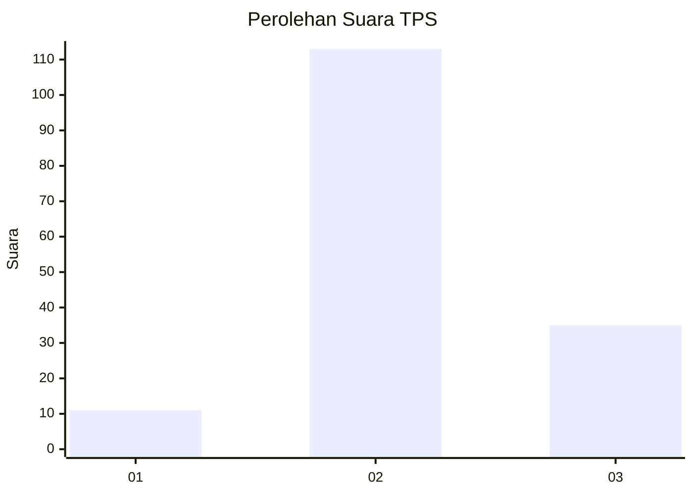
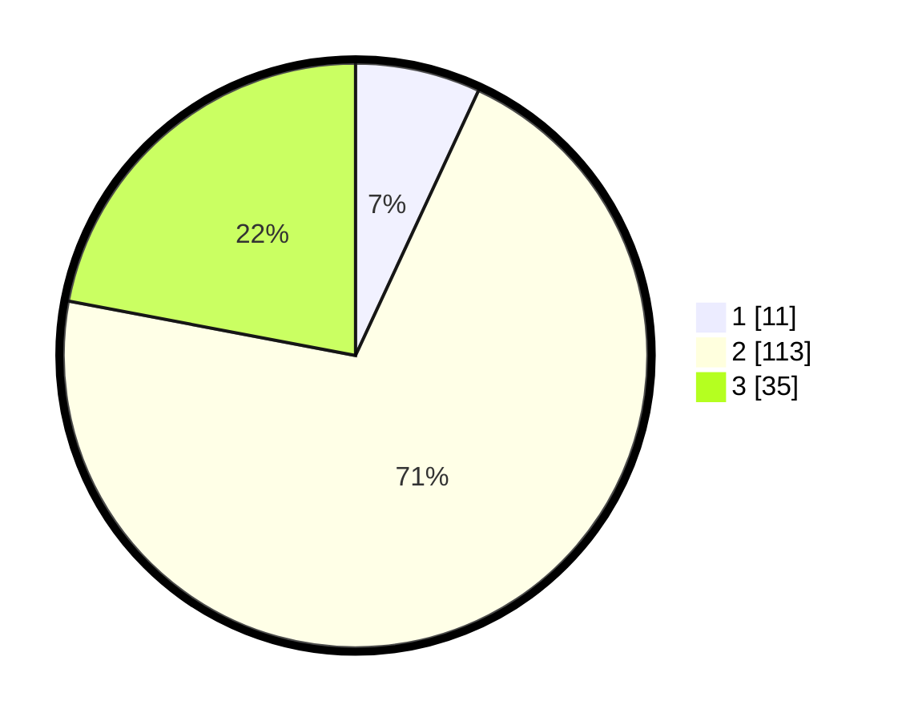

# Hasil

## Grafik

## Tabel

| No. | Nama Paslon    | Suara | Suara (raw) | Persentase |
|:--- |:-------------- | -----:| -----------:| ----------:|
| 1   | ANIES MUHAIMIN | 11    | [11][p-1]   | 6,92       |
| 2   | PRABOWO GIBRAN | 113   | [113][p-2]  | 71,07      |
| 3   | GANJAR MAHFUD  | 35    | [35][p-3]   | 22,01      |

[p-1]: https://github.com/gigit-pemilu/pemilu-2024-35-jawa-timur/blob/main/pilpres/hitung-suara/sub/35-jawa-timur/sub/07-malang/sub/31-kromengan/sub/2003-ngadirejo/sub/003-tps/sub/paslon-1.txt
[p-2]: https://github.com/gigit-pemilu/pemilu-2024-35-jawa-timur/blob/main/pilpres/hitung-suara/sub/35-jawa-timur/sub/07-malang/sub/31-kromengan/sub/2003-ngadirejo/sub/003-tps/sub/paslon-2.txt
[p-3]: https://github.com/gigit-pemilu/pemilu-2024-35-jawa-timur/blob/main/pilpres/hitung-suara/sub/35-jawa-timur/sub/07-malang/sub/31-kromengan/sub/2003-ngadirejo/sub/003-tps/sub/paslon-3.txt

## Foto C Plano

https://sirekap-obj-formc.kpu.go.id/3b4d/pemilu/ppwp/35/07/31/20/03/3507312003003-20240220-193954--92e1ae9b-a674-4afc-99b9-5db3cc475240.jpg

https://sirekap-obj-formc.kpu.go.id/3b4d/pemilu/ppwp/35/07/31/20/03/3507312003003-20240220-194043--4af3f1b9-833d-4b0f-b593-52a200289a0b.jpg

https://sirekap-obj-formc.kpu.go.id/3b4d/pemilu/ppwp/35/07/31/20/03/3507312003003-20240220-194119--3f15eb80-65cf-4745-bb49-7d4fe254f6a2.jpg

## Metadata

| Key        | Value               |
| ---------- | ------------------- |
| Time Stamp | 2024-02-24 22:31:28 |

