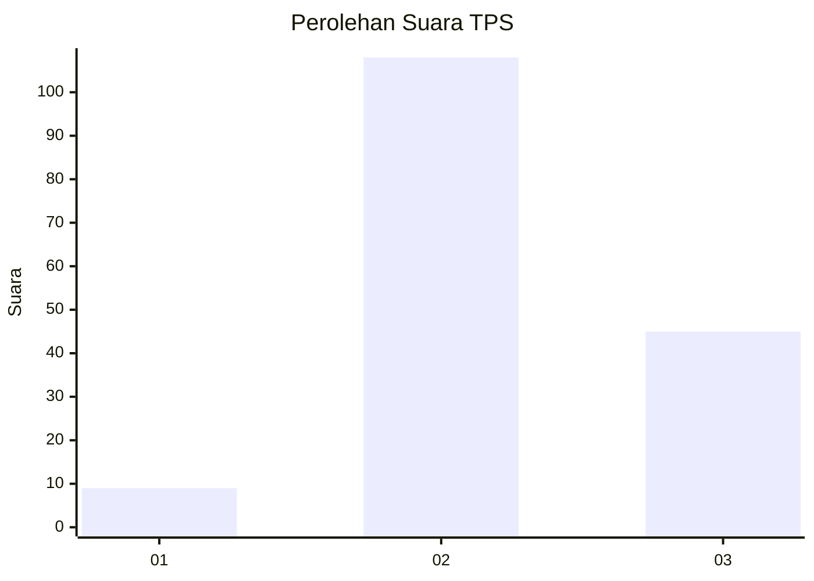
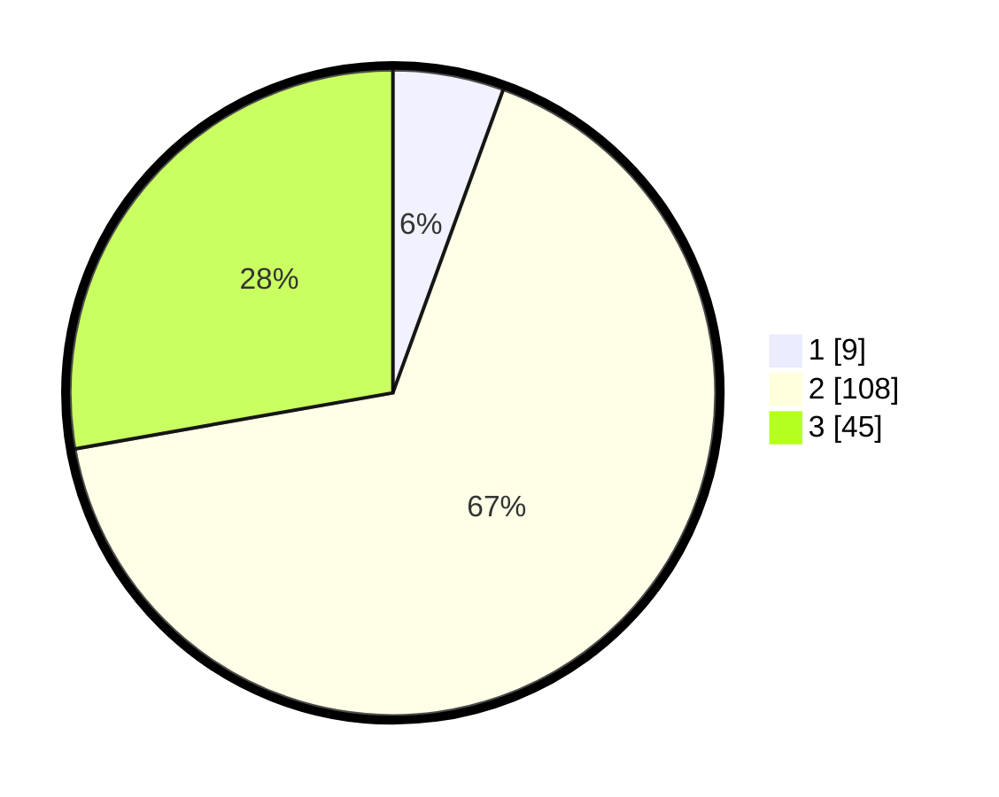

# Hasil

## Grafik

## Tabel

| No. | Nama Paslon    | Suara | Suara (raw) | Persentase |
|:--- |:-------------- | -----:| -----------:| ----------:|
| 1   | ANIES MUHAIMIN | 9     | [9][p-1]    | 5,56       |
| 2   | PRABOWO GIBRAN | 108   | [108][p-2]  | 66,67      |
| 3   | GANJAR MAHFUD  | 45    | [45][p-3]   | 27,78      |

[p-1]: https://github.com/gigit-pemilu/pemilu-2024-35-jawa-timur/blob/main/pilpres/hitung-suara/sub/35-jawa-timur/sub/07-malang/sub/31-kromengan/sub/2004-kromengan/sub/011-tps/sub/paslon-1.txt
[p-2]: https://github.com/gigit-pemilu/pemilu-2024-35-jawa-timur/blob/main/pilpres/hitung-suara/sub/35-jawa-timur/sub/07-malang/sub/31-kromengan/sub/2004-kromengan/sub/011-tps/sub/paslon-2.txt
[p-3]: https://github.com/gigit-pemilu/pemilu-2024-35-jawa-timur/blob/main/pilpres/hitung-suara/sub/35-jawa-timur/sub/07-malang/sub/31-kromengan/sub/2004-kromengan/sub/011-tps/sub/paslon-3.txt

## Foto C Plano

https://sirekap-obj-formc.kpu.go.id/e70d/pemilu/ppwp/35/07/31/20/04/3507312004011-20240215-022020--804c3ddf-0f0d-44da-82fc-785df1b6f26d.jpg

https://sirekap-obj-formc.kpu.go.id/e70d/pemilu/ppwp/35/07/31/20/04/3507312004011-20240215-022228--22daa85a-1bee-4eee-9984-5099c7942e19.jpg

https://sirekap-obj-formc.kpu.go.id/e70d/pemilu/ppwp/35/07/31/20/04/3507312004011-20240215-022551--863fef37-6925-4984-92c5-58d866077e5a.jpg

## Metadata

| Key        | Value               |
| ---------- | ------------------- |
| Time Stamp | 2024-02-17 09:00:02 |

