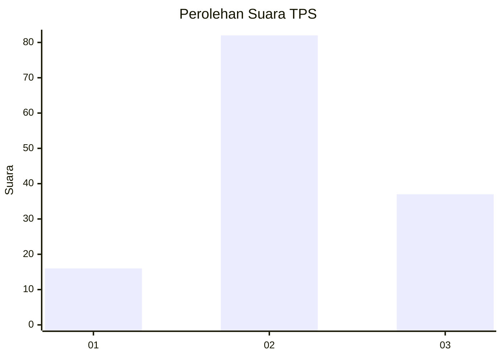
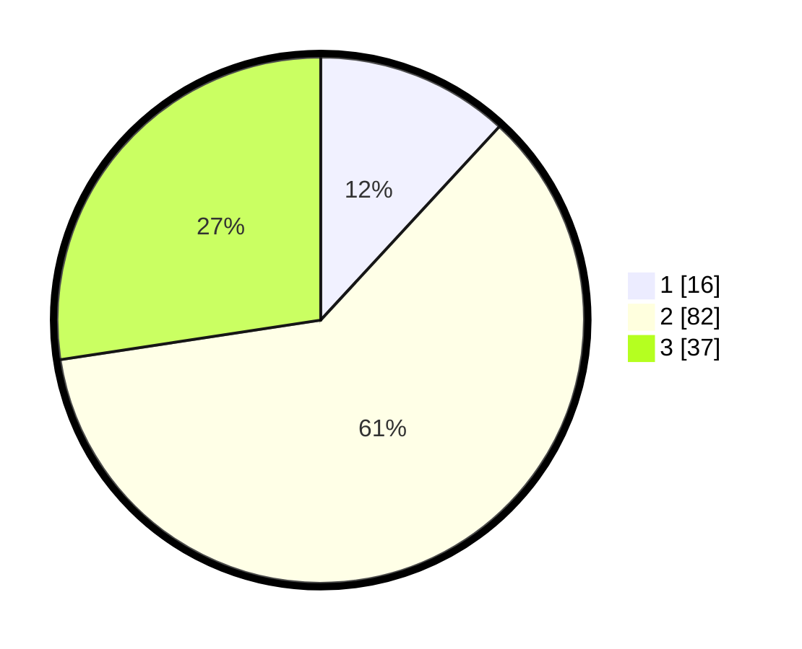

# Hasil

## Grafik

## Tabel

| No. | Nama Paslon    | Suara | Suara (raw) | Persentase |
|:--- |:-------------- | -----:| -----------:| ----------:|
| 1   | ANIES MUHAIMIN | 16    | [16][p-1]   | 11,85      |
| 2   | PRABOWO GIBRAN | 82    | [82][p-2]   | 60,74      |
| 3   | GANJAR MAHFUD  | 37    | [37][p-3]   | 27,41      |

[p-1]: https://github.com/gigit-pemilu/pemilu-2024/blob/main/pilpres/hitung-suara/sub/35-jawa-timur/sub/07-malang/sub/31-kromengan/sub/2004-kromengan/sub/020-tps/sub/paslon-1.txt
[p-2]: https://github.com/gigit-pemilu/pemilu-2024/blob/main/pilpres/hitung-suara/sub/35-jawa-timur/sub/07-malang/sub/31-kromengan/sub/2004-kromengan/sub/020-tps/sub/paslon-2.txt
[p-3]: https://github.com/gigit-pemilu/pemilu-2024/blob/main/pilpres/hitung-suara/sub/35-jawa-timur/sub/07-malang/sub/31-kromengan/sub/2004-kromengan/sub/020-tps/sub/paslon-3.txt

## Foto C Plano

https://sirekap-obj-formc.kpu.go.id/ec11/pemilu/ppwp/35/07/31/20/04/3507312004020-20240214-232418--d0ee1f2e-11ac-4167-b7d5-75577c68338a.jpg

https://sirekap-obj-formc.kpu.go.id/ec11/pemilu/ppwp/35/07/31/20/04/3507312004020-20240214-232526--cc2ffea7-de37-4b1d-9a52-5c7b9c89371d.jpg

https://sirekap-obj-formc.kpu.go.id/ec11/pemilu/ppwp/35/07/31/20/04/3507312004020-20240214-232559--3eb2b314-3ed2-43ee-9d72-e4ad4f2633a7.jpg

## Metadata

| Key        | Value               |
| ---------- | ------------------- |
| Time Stamp | 2024-02-17 09:00:02 |

