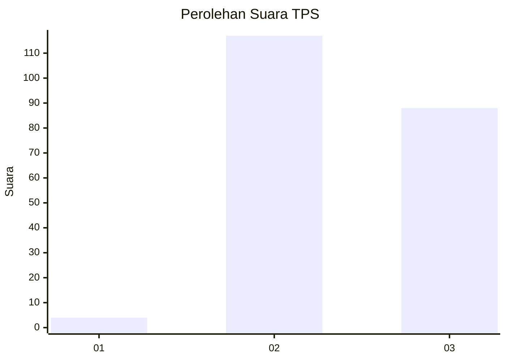
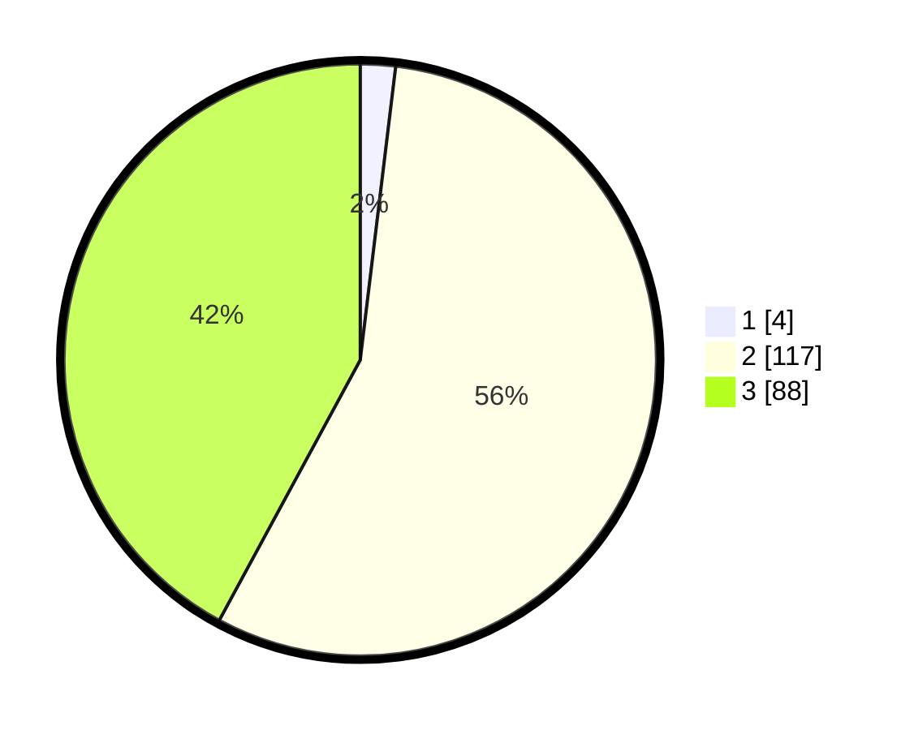

# Hasil

## Grafik

## Tabel

| No. | Nama Paslon    | Suara | Suara (raw) | Persentase |
|:--- |:-------------- | -----:| -----------:| ----------:|
| 1   | ANIES MUHAIMIN | 4     | [4][p-1]    | 1,91       |
| 2   | PRABOWO GIBRAN | 117   | [117][p-2]  | 55,98      |
| 3   | GANJAR MAHFUD  | 88    | [88][p-3]   | 42,11      |

[p-1]: https://github.com/gigit-pemilu/pemilu-2024/blob/main/pilpres/hitung-suara/sub/35-jawa-timur/sub/07-malang/sub/31-kromengan/sub/2005-peniwen/sub/007-tps/sub/paslon-1.txt
[p-2]: https://github.com/gigit-pemilu/pemilu-2024/blob/main/pilpres/hitung-suara/sub/35-jawa-timur/sub/07-malang/sub/31-kromengan/sub/2005-peniwen/sub/007-tps/sub/paslon-2.txt
[p-3]: https://github.com/gigit-pemilu/pemilu-2024/blob/main/pilpres/hitung-suara/sub/35-jawa-timur/sub/07-malang/sub/31-kromengan/sub/2005-peniwen/sub/007-tps/sub/paslon-3.txt

## Foto C Plano

https://sirekap-obj-formc.kpu.go.id/7492/pemilu/ppwp/35/07/31/20/05/3507312005007-20240215-011343--72c449d4-ee1c-4da0-a3c4-ba49dcb9a649.jpg

https://sirekap-obj-formc.kpu.go.id/7492/pemilu/ppwp/35/07/31/20/05/3507312005007-20240215-011346--aeba9404-8f89-4e09-8492-c99e953b6972.jpg

https://sirekap-obj-formc.kpu.go.id/7492/pemilu/ppwp/35/07/31/20/05/3507312005007-20240215-011349--c84562db-3b64-41f7-8caf-064c8f6cc95b.jpg

## Metadata

| Key        | Value               |
| ---------- | ------------------- |
| Time Stamp | 2024-02-17 09:00:02 |

