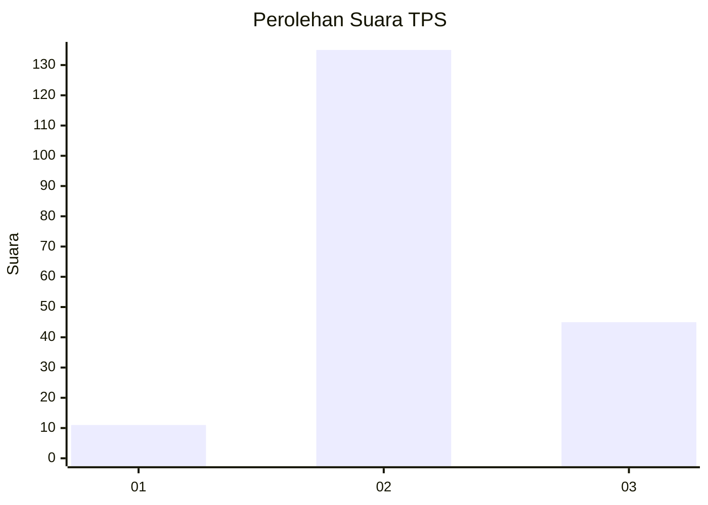
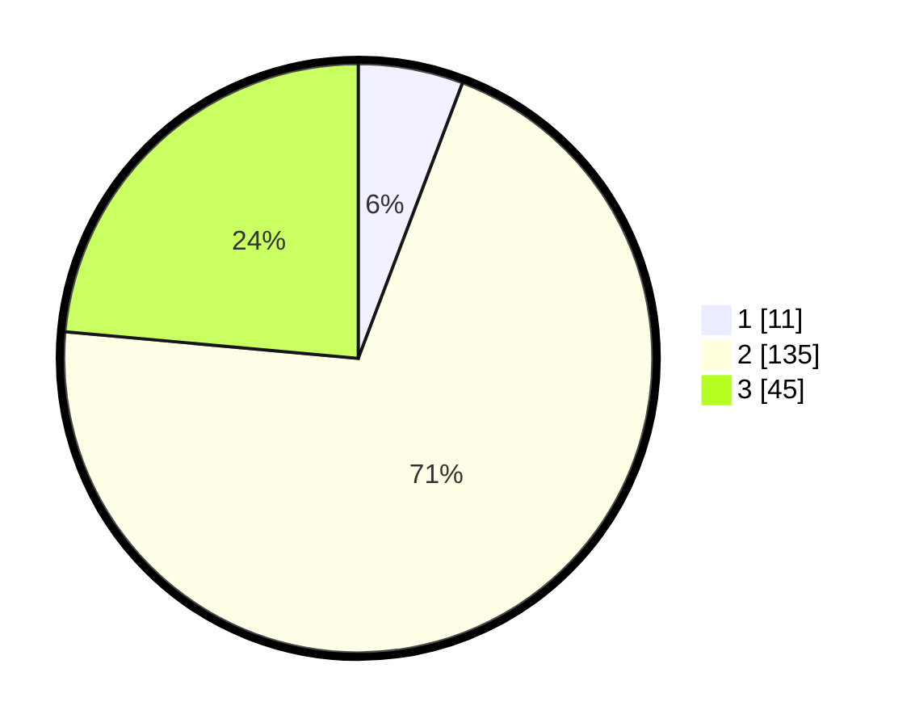

# Hasil

## Grafik

## Tabel

| No. | Nama Paslon    | Suara | Suara (raw) | Persentase |
|:--- |:-------------- | -----:| -----------:| ----------:|
| 1   | ANIES MUHAIMIN | 11    | [11][p-1]   | 5,76       |
| 2   | PRABOWO GIBRAN | 135   | [135][p-2]  | 70,68      |
| 3   | GANJAR MAHFUD  | 45    | [45][p-3]   | 23,56      |

[p-1]: https://github.com/gigit-pemilu/pemilu-2024/blob/main/pilpres/hitung-suara/sub/35-jawa-timur/sub/07-malang/sub/31-kromengan/sub/2007-karangrejo/sub/002-tps/sub/paslon-1.txt
[p-2]: https://github.com/gigit-pemilu/pemilu-2024/blob/main/pilpres/hitung-suara/sub/35-jawa-timur/sub/07-malang/sub/31-kromengan/sub/2007-karangrejo/sub/002-tps/sub/paslon-2.txt
[p-3]: https://github.com/gigit-pemilu/pemilu-2024/blob/main/pilpres/hitung-suara/sub/35-jawa-timur/sub/07-malang/sub/31-kromengan/sub/2007-karangrejo/sub/002-tps/sub/paslon-3.txt

## Foto C Plano

https://sirekap-obj-formc.kpu.go.id/b59e/pemilu/ppwp/35/07/31/20/07/3507312007002-20240214-155914--902eda9a-0563-452c-9f5d-c6beb9b44ac3.jpg

https://sirekap-obj-formc.kpu.go.id/b59e/pemilu/ppwp/35/07/31/20/07/3507312007002-20240214-160057--10fa226f-3e17-42d7-b453-edc723b42bb8.jpg

https://sirekap-obj-formc.kpu.go.id/b59e/pemilu/ppwp/35/07/31/20/07/3507312007002-20240214-160157--3f5bd927-2b7f-45d8-9217-7d7ab4bf45bc.jpg

## Metadata

| Key        | Value               |
| ---------- | ------------------- |
| Time Stamp | 2024-02-17 09:30:03 |

