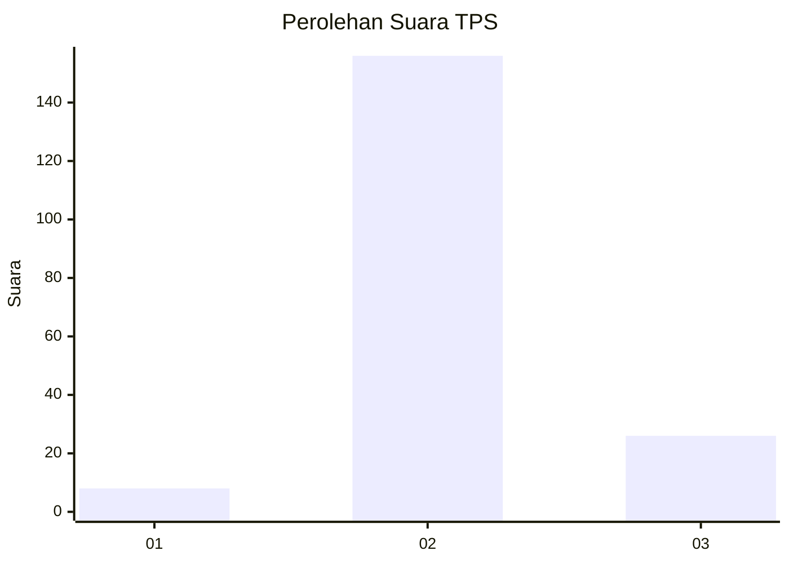
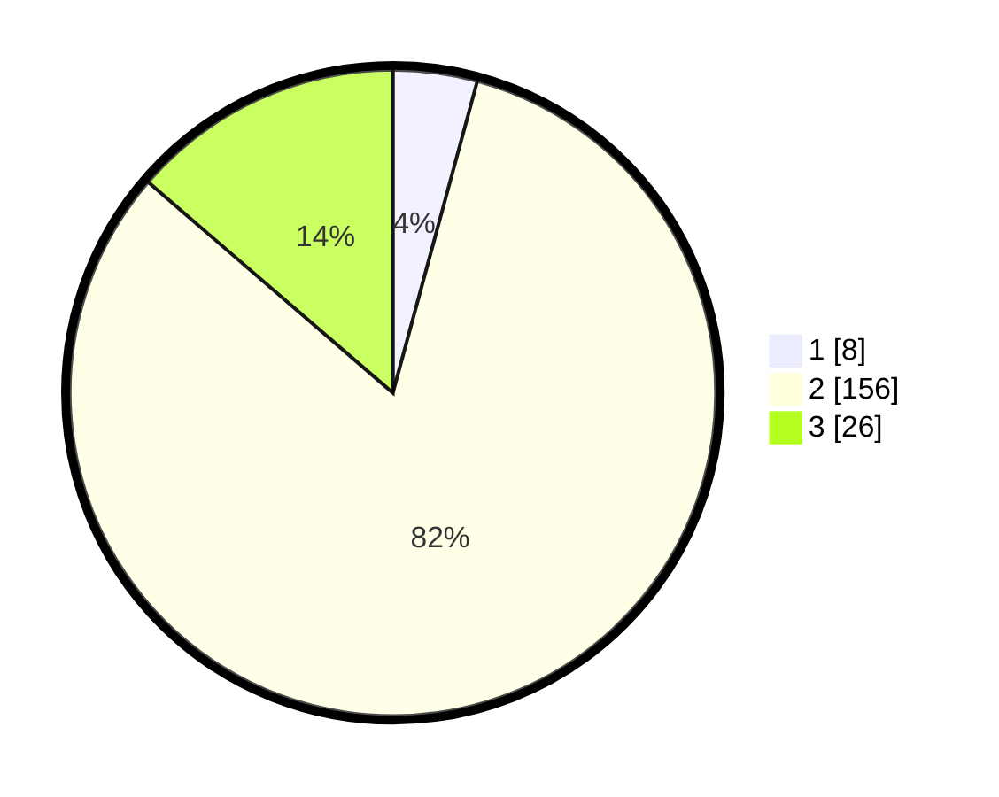

# Hasil

## Grafik

## Tabel

| No. | Nama Paslon    | Suara | Suara (raw) | Persentase |
|:--- |:-------------- | -----:| -----------:| ----------:|
| 1   | ANIES MUHAIMIN | 8     | [8][p-1]    | 4,21       |
| 2   | PRABOWO GIBRAN | 156   | [156][p-2]  | 82,11      |
| 3   | GANJAR MAHFUD  | 26    | [26][p-3]   | 13,68      |

[p-1]: https://github.com/gigit-pemilu/pemilu-2024/blob/main/pilpres/hitung-suara/sub/35-jawa-timur/sub/07-malang/sub/32-wonosari/sub/2001-kluwut/sub/003-tps/sub/paslon-1.txt
[p-2]: https://github.com/gigit-pemilu/pemilu-2024/blob/main/pilpres/hitung-suara/sub/35-jawa-timur/sub/07-malang/sub/32-wonosari/sub/2001-kluwut/sub/003-tps/sub/paslon-2.txt
[p-3]: https://github.com/gigit-pemilu/pemilu-2024/blob/main/pilpres/hitung-suara/sub/35-jawa-timur/sub/07-malang/sub/32-wonosari/sub/2001-kluwut/sub/003-tps/sub/paslon-3.txt

## Foto C Plano

https://sirekap-obj-formc.kpu.go.id/8768/pemilu/ppwp/35/07/32/20/01/3507322001003-20240214-205640--b086637d-b4e3-423e-8dd2-40866d33ad75.jpg

https://sirekap-obj-formc.kpu.go.id/8768/pemilu/ppwp/35/07/32/20/01/3507322001003-20240214-205823--065eaec5-a139-4826-b3df-2de2ac98d284.jpg

https://sirekap-obj-formc.kpu.go.id/8768/pemilu/ppwp/35/07/32/20/01/3507322001003-20240214-234753--cc0c8dab-6f1f-4e4f-9d3a-2af9f87ba5a6.jpg

## Metadata

| Key        | Value               |
| ---------- | ------------------- |
| Time Stamp | 2024-02-15 12:00:28 |

