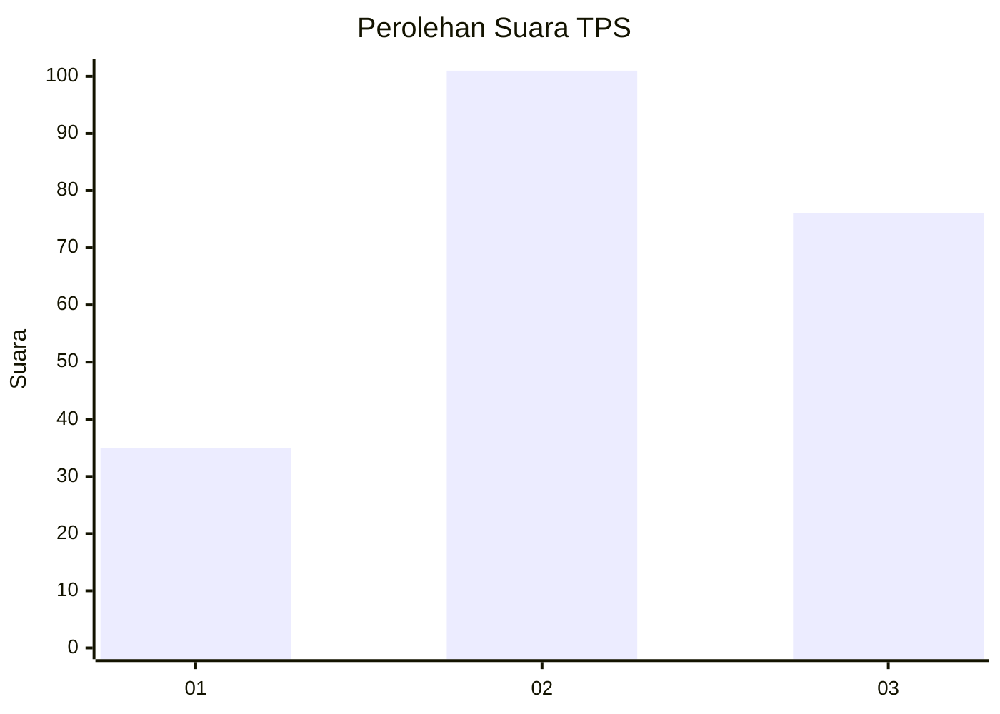
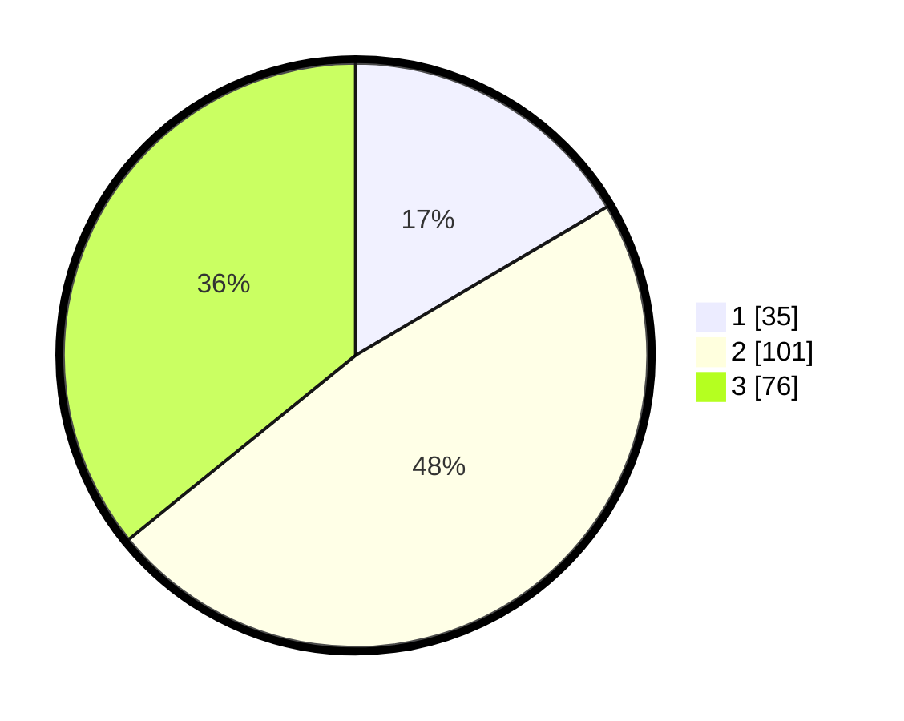

# Hasil

## Grafik

## Tabel

| No. | Nama Paslon    | Suara | Suara (raw) | Persentase |
|:--- |:-------------- | -----:| -----------:| ----------:|
| 1   | ANIES MUHAIMIN | 35    | [35][p-1]   | 16,51      |
| 2   | PRABOWO GIBRAN | 101   | [101][p-2]  | 47,64      |
| 3   | GANJAR MAHFUD  | 76    | [76][p-3]   | 35,85      |

[p-1]: https://github.com/gigit-pemilu/pemilu-2024/blob/main/pilpres/hitung-suara/sub/35-jawa-timur/sub/07-malang/sub/32-wonosari/sub/2002-plandi/sub/003-tps/sub/paslon-1.txt
[p-2]: https://github.com/gigit-pemilu/pemilu-2024/blob/main/pilpres/hitung-suara/sub/35-jawa-timur/sub/07-malang/sub/32-wonosari/sub/2002-plandi/sub/003-tps/sub/paslon-2.txt
[p-3]: https://github.com/gigit-pemilu/pemilu-2024/blob/main/pilpres/hitung-suara/sub/35-jawa-timur/sub/07-malang/sub/32-wonosari/sub/2002-plandi/sub/003-tps/sub/paslon-3.txt

## Foto C Plano

https://sirekap-obj-formc.kpu.go.id/0f16/pemilu/ppwp/35/07/32/20/02/3507322002003-20240215-042936--d2506d63-01c3-48e8-bd3f-a45ff71e55da.jpg

https://sirekap-obj-formc.kpu.go.id/0f16/pemilu/ppwp/35/07/32/20/02/3507322002003-20240215-043527--c1f073b8-bfa5-4ca5-85ea-b91427b7be5d.jpg

https://sirekap-obj-formc.kpu.go.id/0f16/pemilu/ppwp/35/07/32/20/02/3507322002003-20240215-043126--3af69e31-8b7a-4c80-a2ff-7129f653e335.jpg

## Metadata

| Key        | Value               |
| ---------- | ------------------- |
| Time Stamp | 2024-02-25 12:00:00 |

