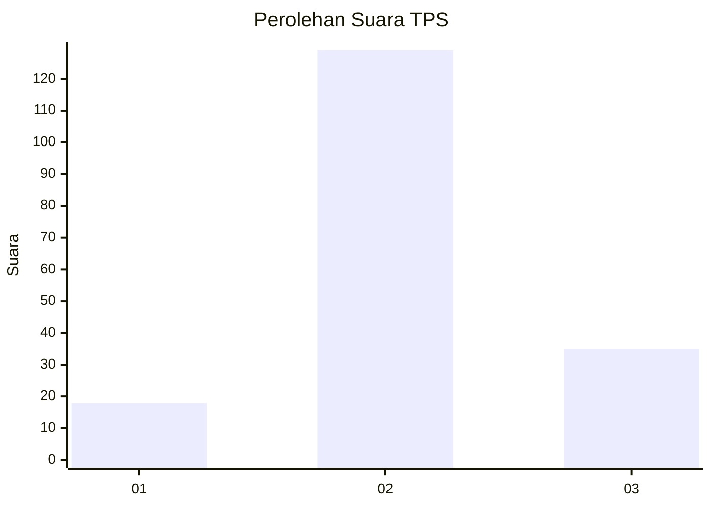
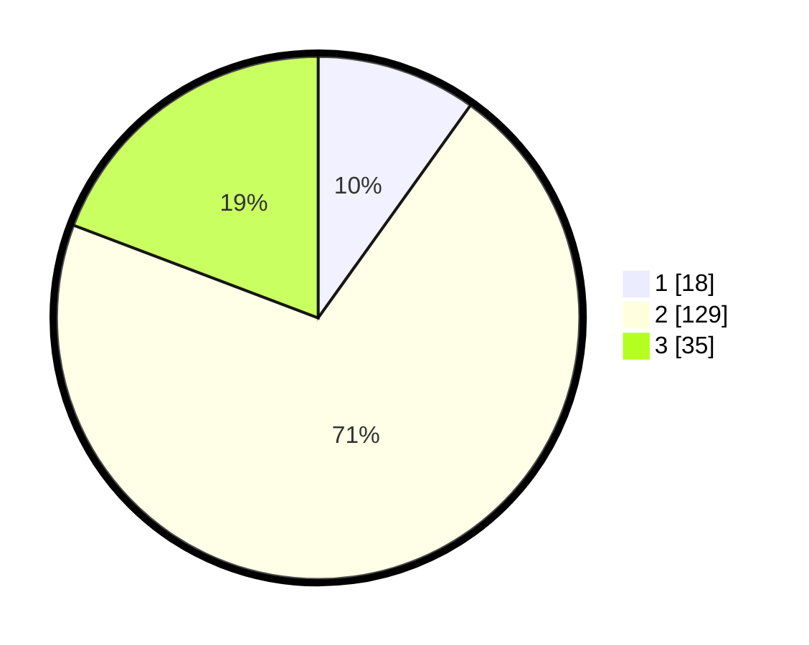

# Hasil

## Grafik

## Tabel

| No. | Nama Paslon    | Suara | Suara (raw) | Persentase |
|:--- |:-------------- | -----:| -----------:| ----------:|
| 1   | ANIES MUHAIMIN | 18    | [18][p-1]   | 9,89       |
| 2   | PRABOWO GIBRAN | 129   | [129][p-2]  | 70,88      |
| 3   | GANJAR MAHFUD  | 35    | [35][p-3]   | 19,23      |

[p-1]: https://github.com/gigit-pemilu/pemilu-2024-35-jawa-timur/blob/main/pilpres/hitung-suara/sub/35-jawa-timur/sub/07-malang/sub/32-wonosari/sub/2002-plandi/sub/006-tps/sub/paslon-1.txt
[p-2]: https://github.com/gigit-pemilu/pemilu-2024-35-jawa-timur/blob/main/pilpres/hitung-suara/sub/35-jawa-timur/sub/07-malang/sub/32-wonosari/sub/2002-plandi/sub/006-tps/sub/paslon-2.txt
[p-3]: https://github.com/gigit-pemilu/pemilu-2024-35-jawa-timur/blob/main/pilpres/hitung-suara/sub/35-jawa-timur/sub/07-malang/sub/32-wonosari/sub/2002-plandi/sub/006-tps/sub/paslon-3.txt

## Foto C Plano

https://sirekap-obj-formc.kpu.go.id/bc43/pemilu/ppwp/35/07/32/20/02/3507322002006-20240215-004152--ef791c18-d40e-4f2c-a369-493f270caa93.jpg

https://sirekap-obj-formc.kpu.go.id/bc43/pemilu/ppwp/35/07/32/20/02/3507322002006-20240215-004300--667b1ed9-0550-4c88-a8fd-3f8e71ed1988.jpg

https://sirekap-obj-formc.kpu.go.id/bc43/pemilu/ppwp/35/07/32/20/02/3507322002006-20240215-004403--5df20ecf-b05b-4f71-b830-303f3f68d6b5.jpg

## Metadata

| Key        | Value               |
| ---------- | ------------------- |
| Time Stamp | 2024-02-16 13:30:32 |

