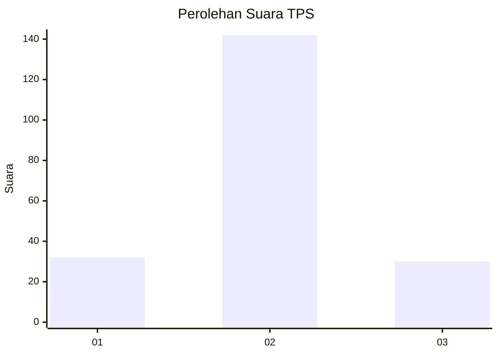

# Hasil

## Grafik

## Tabel

| No. | Nama Paslon    | Suara | Suara (raw) | Persentase |
|:--- |:-------------- | -----:| -----------:| ----------:|
| 1   | ANIES MUHAIMIN | 32    | [32][p-1]   | 15,69      |
| 2   | PRABOWO GIBRAN | 142   | [142][p-2]  | 69,61      |
| 3   | GANJAR MAHFUD  | 30    | [30][p-3]   | 14,71      |

[p-1]: https://github.com/gigit-pemilu/pemilu-2024/blob/main/pilpres/hitung-suara/sub/35-jawa-timur/sub/07-malang/sub/32-wonosari/sub/2002-plandi/sub/007-tps/sub/paslon-1.txt
[p-2]: https://github.com/gigit-pemilu/pemilu-2024/blob/main/pilpres/hitung-suara/sub/35-jawa-timur/sub/07-malang/sub/32-wonosari/sub/2002-plandi/sub/007-tps/sub/paslon-2.txt
[p-3]: https://github.com/gigit-pemilu/pemilu-2024/blob/main/pilpres/hitung-suara/sub/35-jawa-timur/sub/07-malang/sub/32-wonosari/sub/2002-plandi/sub/007-tps/sub/paslon-3.txt

## Foto C Plano

https://sirekap-obj-formc.kpu.go.id/dbf5/pemilu/ppwp/35/07/32/20/02/3507322002007-20240215-060323--4ee651dc-ac85-48a7-98e8-9f6e6a2eb844.jpg

https://sirekap-obj-formc.kpu.go.id/dbf5/pemilu/ppwp/35/07/32/20/02/3507322002007-20240215-060415--3f4664fc-29ed-4057-92e9-1f31360336c1.jpg

https://sirekap-obj-formc.kpu.go.id/dbf5/pemilu/ppwp/35/07/32/20/02/3507322002007-20240215-060505--ff166210-2707-4261-a22d-9d3bde10dcf8.jpg

## Metadata

| Key        | Value               |
| ---------- | ------------------- |
| Time Stamp | 2024-02-25 21:00:00 |

