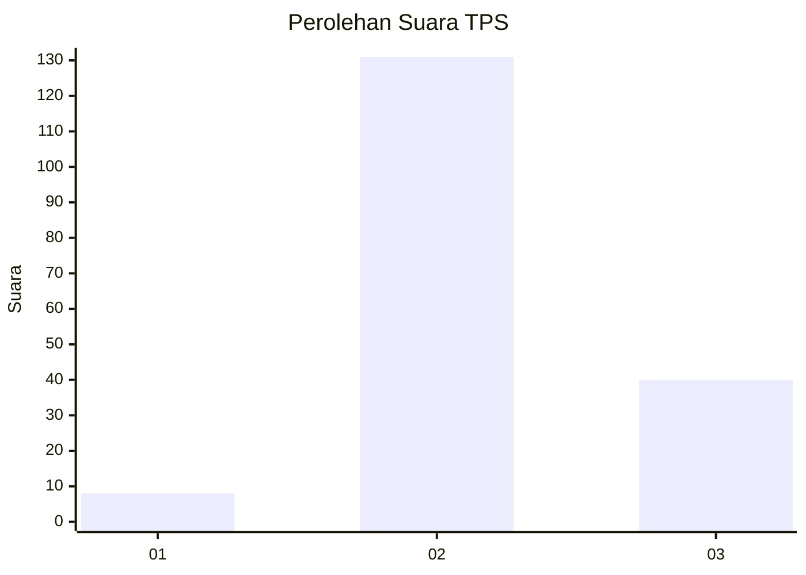
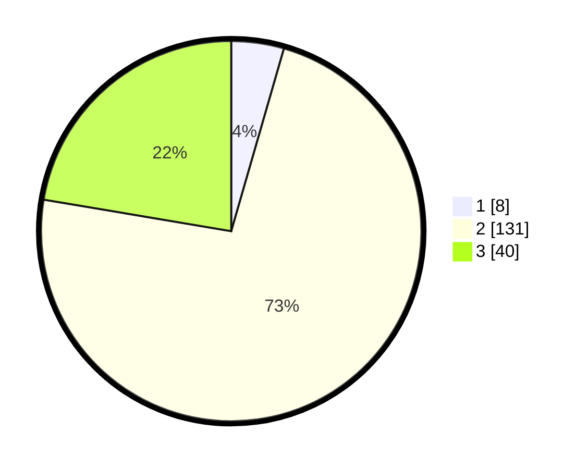

# Hasil

## Grafik

## Tabel

| No. | Nama Paslon    | Suara | Suara (raw) | Persentase |
|:--- |:-------------- | -----:| -----------:| ----------:|
| 1   | ANIES MUHAIMIN | 8     | [8][p-1]    | 4,47       |
| 2   | PRABOWO GIBRAN | 131   | [131][p-2]  | 73,18      |
| 3   | GANJAR MAHFUD  | 40    | [40][p-3]   | 22,35      |

[p-1]: https://github.com/gigit-pemilu/pemilu-2024/blob/main/pilpres/hitung-suara/sub/35-jawa-timur/sub/07-malang/sub/32-wonosari/sub/2003-plaosan/sub/019-tps/sub/paslon-1.txt
[p-2]: https://github.com/gigit-pemilu/pemilu-2024/blob/main/pilpres/hitung-suara/sub/35-jawa-timur/sub/07-malang/sub/32-wonosari/sub/2003-plaosan/sub/019-tps/sub/paslon-2.txt
[p-3]: https://github.com/gigit-pemilu/pemilu-2024/blob/main/pilpres/hitung-suara/sub/35-jawa-timur/sub/07-malang/sub/32-wonosari/sub/2003-plaosan/sub/019-tps/sub/paslon-3.txt

## Foto C Plano

https://sirekap-obj-formc.kpu.go.id/80fd/pemilu/ppwp/35/07/32/20/03/3507322003019-20240214-224142--0d2d04b7-8c51-4c23-966e-f0ce7e9a1d71.jpg

https://sirekap-obj-formc.kpu.go.id/80fd/pemilu/ppwp/35/07/32/20/03/3507322003019-20240214-224310--69d1186c-ca7e-434c-baaa-141e1956d0b6.jpg

https://sirekap-obj-formc.kpu.go.id/80fd/pemilu/ppwp/35/07/32/20/03/3507322003019-20240215-025501--01d5ee49-6556-4f28-8ca9-9e5ae1ea346f.jpg

## Metadata

| Key        | Value               |
| ---------- | ------------------- |
| Time Stamp | 2024-02-24 22:31:28 |

