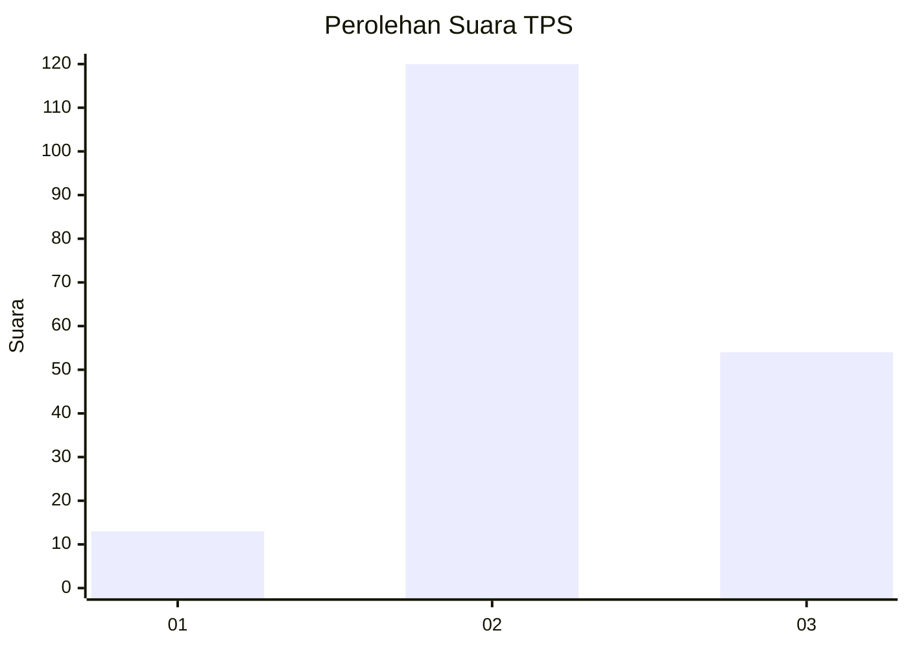
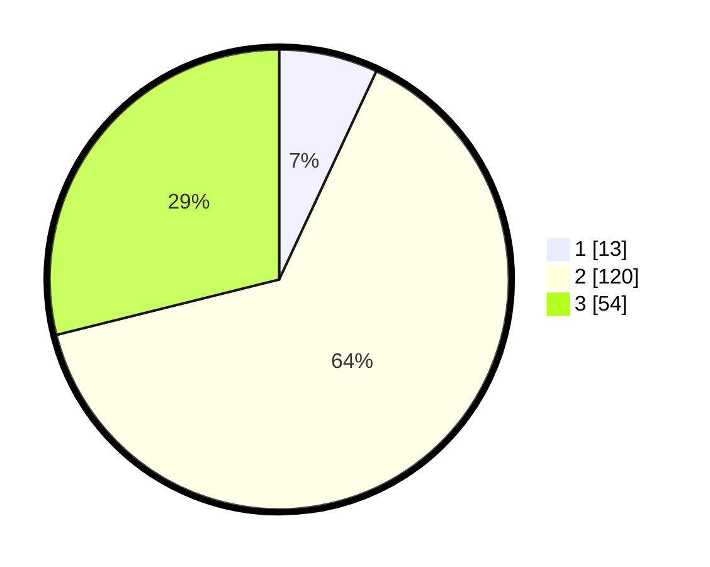

# Hasil

## Grafik

## Tabel

| No. | Nama Paslon    | Suara | Suara (raw) | Persentase |
|:--- |:-------------- | -----:| -----------:| ----------:|
| 1   | ANIES MUHAIMIN | 13    | [13][p-1]   | 6,95       |
| 2   | PRABOWO GIBRAN | 120   | [120][p-2]  | 64,17      |
| 3   | GANJAR MAHFUD  | 54    | [54][p-3]   | 28,88      |

[p-1]: https://github.com/gigit-pemilu/pemilu-2024-35-jawa-timur/blob/main/pilpres/hitung-suara/sub/35-jawa-timur/sub/07-malang/sub/32-wonosari/sub/2004-kebobang/sub/001-tps/sub/paslon-1.txt
[p-2]: https://github.com/gigit-pemilu/pemilu-2024-35-jawa-timur/blob/main/pilpres/hitung-suara/sub/35-jawa-timur/sub/07-malang/sub/32-wonosari/sub/2004-kebobang/sub/001-tps/sub/paslon-2.txt
[p-3]: https://github.com/gigit-pemilu/pemilu-2024-35-jawa-timur/blob/main/pilpres/hitung-suara/sub/35-jawa-timur/sub/07-malang/sub/32-wonosari/sub/2004-kebobang/sub/001-tps/sub/paslon-3.txt

## Foto C Plano

https://sirekap-obj-formc.kpu.go.id/8910/pemilu/ppwp/35/07/32/20/04/3507322004001-20240214-235634--aaf20598-7cfc-47db-ac9e-e3f957dee374.jpg

https://sirekap-obj-formc.kpu.go.id/8910/pemilu/ppwp/35/07/32/20/04/3507322004001-20240215-000334--87341e11-6432-43c4-ab00-02378751e053.jpg

https://sirekap-obj-formc.kpu.go.id/8910/pemilu/ppwp/35/07/32/20/04/3507322004001-20240215-000543--ec0ee12d-81cb-4ed7-a1fa-2db171b5e832.jpg

## Metadata

| Key        | Value               |
| ---------- | ------------------- |
| Time Stamp | 2024-02-25 22:00:00 |

