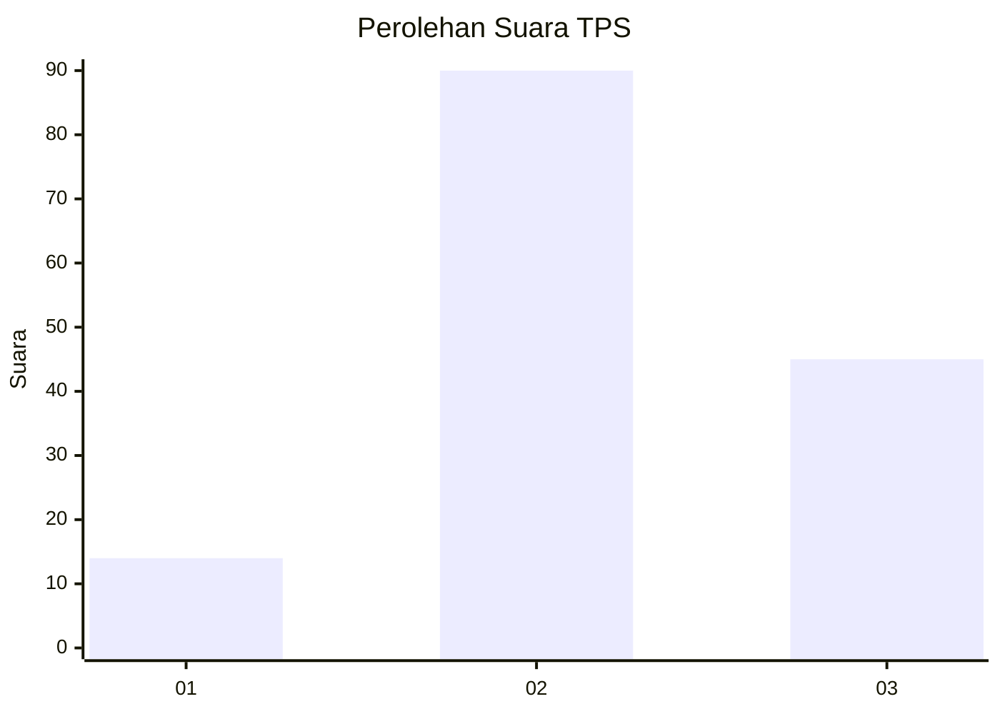
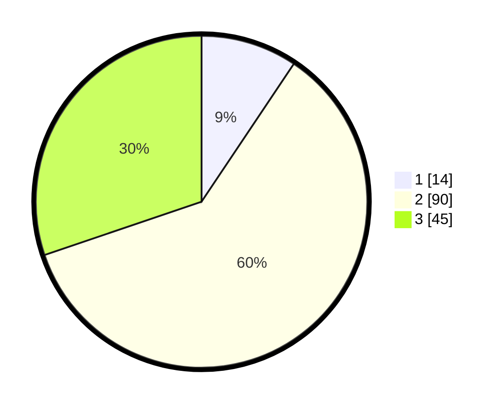

# Hasil

## Grafik

## Tabel

| No. | Nama Paslon    | Suara | Suara (raw) | Persentase |
|:--- |:-------------- | -----:| -----------:| ----------:|
| 1   | ANIES MUHAIMIN | 14    | [14][p-1]   | 9,40       |
| 2   | PRABOWO GIBRAN | 90    | [90][p-2]   | 60,40      |
| 3   | GANJAR MAHFUD  | 45    | [45][p-3]   | 30,20      |

[p-1]: https://github.com/gigit-pemilu/pemilu-2024-35-jawa-timur/blob/main/pilpres/hitung-suara/sub/35-jawa-timur/sub/07-malang/sub/32-wonosari/sub/2004-kebobang/sub/022-tps/sub/paslon-1.txt
[p-2]: https://github.com/gigit-pemilu/pemilu-2024-35-jawa-timur/blob/main/pilpres/hitung-suara/sub/35-jawa-timur/sub/07-malang/sub/32-wonosari/sub/2004-kebobang/sub/022-tps/sub/paslon-2.txt
[p-3]: https://github.com/gigit-pemilu/pemilu-2024-35-jawa-timur/blob/main/pilpres/hitung-suara/sub/35-jawa-timur/sub/07-malang/sub/32-wonosari/sub/2004-kebobang/sub/022-tps/sub/paslon-3.txt

## Foto C Plano

https://sirekap-obj-formc.kpu.go.id/8ad6/pemilu/ppwp/35/07/32/20/04/3507322004022-20240214-224306--178df98f-65ba-465d-a945-66e74eb14ffe.jpg

https://sirekap-obj-formc.kpu.go.id/8ad6/pemilu/ppwp/35/07/32/20/04/3507322004022-20240214-224334--55632d71-4f4e-4858-a800-cc6e4b970314.jpg

https://sirekap-obj-formc.kpu.go.id/8ad6/pemilu/ppwp/35/07/32/20/04/3507322004022-20240214-224432--e13a8aff-3517-4a1c-9b5e-8053ceb9709a.jpg

## Metadata

| Key        | Value               |
| ---------- | ------------------- |
| Time Stamp | 2024-02-25 22:00:00 |

