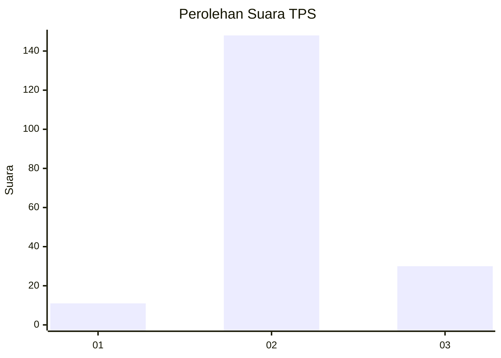
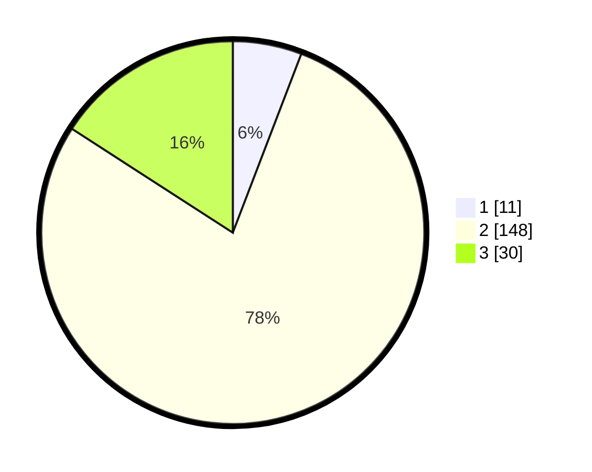

# Hasil

## Grafik

## Tabel

| No. | Nama Paslon    | Suara | Suara (raw) | Persentase |
|:--- |:-------------- | -----:| -----------:| ----------:|
| 1   | ANIES MUHAIMIN | 11    | [11][p-1]   | 5,82       |
| 2   | PRABOWO GIBRAN | 148   | [148][p-2]  | 78,31      |
| 3   | GANJAR MAHFUD  | 30    | [30][p-3]   | 15,87      |

[p-1]: https://github.com/gigit-pemilu/pemilu-2024-35-jawa-timur/blob/main/pilpres/hitung-suara/sub/35-jawa-timur/sub/07-malang/sub/32-wonosari/sub/2005-sumbertempur/sub/014-tps/sub/paslon-1.txt
[p-2]: https://github.com/gigit-pemilu/pemilu-2024-35-jawa-timur/blob/main/pilpres/hitung-suara/sub/35-jawa-timur/sub/07-malang/sub/32-wonosari/sub/2005-sumbertempur/sub/014-tps/sub/paslon-2.txt
[p-3]: https://github.com/gigit-pemilu/pemilu-2024-35-jawa-timur/blob/main/pilpres/hitung-suara/sub/35-jawa-timur/sub/07-malang/sub/32-wonosari/sub/2005-sumbertempur/sub/014-tps/sub/paslon-3.txt

## Foto C Plano

https://sirekap-obj-formc.kpu.go.id/9f0b/pemilu/ppwp/35/07/32/20/05/3507322005014-20240215-015447--ae1e6d89-a542-489b-977d-a198b24dbe13.jpg

https://sirekap-obj-formc.kpu.go.id/9f0b/pemilu/ppwp/35/07/32/20/05/3507322005014-20240215-015646--2f61ecb1-0946-4cf3-9dae-82cdd31e566f.jpg

https://sirekap-obj-formc.kpu.go.id/9f0b/pemilu/ppwp/35/07/32/20/05/3507322005014-20240215-015902--a4eda1eb-0677-4921-8037-3849652cf13a.jpg

## Metadata

| Key        | Value               |
| ---------- | ------------------- |
| Time Stamp | 2024-02-17 18:00:00 |

