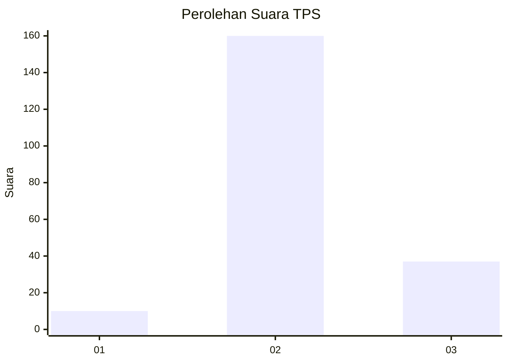

# Hasil

## Grafik

## Tabel

| No. | Nama Paslon    | Suara | Suara (raw) | Persentase |
|:--- |:-------------- | -----:| -----------:| ----------:|
| 1   | ANIES MUHAIMIN | 10    | [10][p-1]   | 4,83       |
| 2   | PRABOWO GIBRAN | 160   | [160][p-2]  | 77,29      |
| 3   | GANJAR MAHFUD  | 37    | [37][p-3]   | 17,87      |

[p-1]: https://github.com/gigit-pemilu/pemilu-2024-35-jawa-timur/blob/main/pilpres/hitung-suara/sub/35-jawa-timur/sub/07-malang/sub/32-wonosari/sub/2007-wonosari/sub/003-tps/sub/paslon-1.txt
[p-2]: https://github.com/gigit-pemilu/pemilu-2024-35-jawa-timur/blob/main/pilpres/hitung-suara/sub/35-jawa-timur/sub/07-malang/sub/32-wonosari/sub/2007-wonosari/sub/003-tps/sub/paslon-2.txt
[p-3]: https://github.com/gigit-pemilu/pemilu-2024-35-jawa-timur/blob/main/pilpres/hitung-suara/sub/35-jawa-timur/sub/07-malang/sub/32-wonosari/sub/2007-wonosari/sub/003-tps/sub/paslon-3.txt

## Foto C Plano

https://sirekap-obj-formc.kpu.go.id/af86/pemilu/ppwp/35/07/32/20/07/3507322007003-20240218-155858--ee13fd29-76bf-4637-865c-1cffe37ce2c7.jpg

https://sirekap-obj-formc.kpu.go.id/af86/pemilu/ppwp/35/07/32/20/07/3507322007003-20240218-155914--484be0bb-c9d8-4ec3-b4ed-464fb9ca11b7.jpg

https://sirekap-obj-formc.kpu.go.id/af86/pemilu/ppwp/35/07/32/20/07/3507322007003-20240218-155921--af26ad0d-b557-4f1e-bf84-6a3d365a49d0.jpg

## Metadata

| Key        | Value               |
| ---------- | ------------------- |
| Time Stamp | 2024-02-24 22:31:28 |

