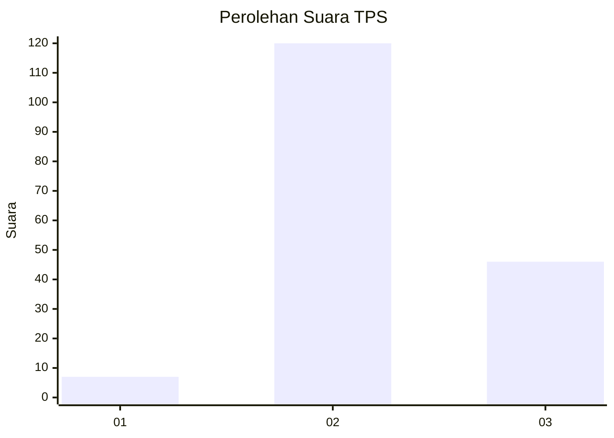

# Hasil

## Grafik

## Tabel

| No. | Nama Paslon    | Suara | Suara (raw) | Persentase |
|:--- |:-------------- | -----:| -----------:| ----------:|
| 1   | ANIES MUHAIMIN | 7     | [7][p-1]    | 4,05       |
| 2   | PRABOWO GIBRAN | 120   | [120][p-2]  | 69,36      |
| 3   | GANJAR MAHFUD  | 46    | [46][p-3]   | 26,59      |

[p-1]: https://github.com/gigit-pemilu/pemilu-2024-35-jawa-timur/blob/main/pilpres/hitung-suara/sub/35-jawa-timur/sub/07-malang/sub/32-wonosari/sub/2007-wonosari/sub/005-tps/sub/paslon-1.txt
[p-2]: https://github.com/gigit-pemilu/pemilu-2024-35-jawa-timur/blob/main/pilpres/hitung-suara/sub/35-jawa-timur/sub/07-malang/sub/32-wonosari/sub/2007-wonosari/sub/005-tps/sub/paslon-2.txt
[p-3]: https://github.com/gigit-pemilu/pemilu-2024-35-jawa-timur/blob/main/pilpres/hitung-suara/sub/35-jawa-timur/sub/07-malang/sub/32-wonosari/sub/2007-wonosari/sub/005-tps/sub/paslon-3.txt

## Foto C Plano

https://sirekap-obj-formc.kpu.go.id/1d77/pemilu/ppwp/35/07/32/20/07/3507322007005-20240214-204614--5c5abbb4-8ff6-4a01-81c4-1540d22040d3.jpg

https://sirekap-obj-formc.kpu.go.id/1d77/pemilu/ppwp/35/07/32/20/07/3507322007005-20240214-204729--227c36ff-3922-439b-8665-f214ced0ebb1.jpg

https://sirekap-obj-formc.kpu.go.id/1d77/pemilu/ppwp/35/07/32/20/07/3507322007005-20240218-171909--865b3cd0-b0ed-49f3-9ed8-3e1bc95bc20e.jpg

## Metadata

| Key        | Value               |
| ---------- | ------------------- |
| Time Stamp | 2024-02-24 22:31:28 |

