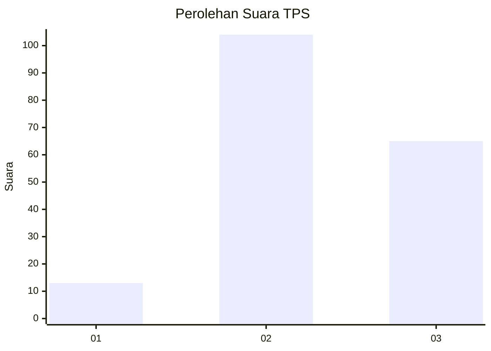
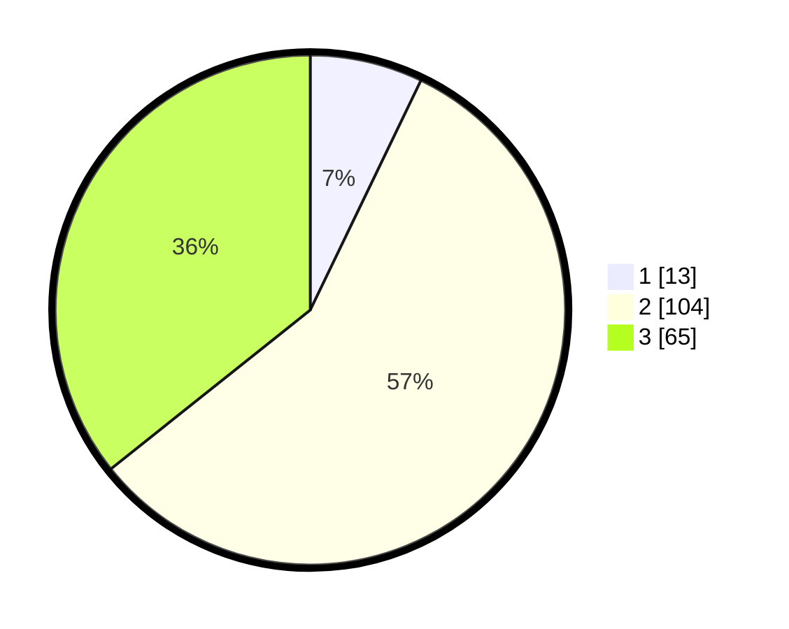

# Hasil

## Grafik

## Tabel

| No. | Nama Paslon    | Suara | Suara (raw) | Persentase |
|:--- |:-------------- | -----:| -----------:| ----------:|
| 1   | ANIES MUHAIMIN | 13    | [13][p-1]   | 7,14       |
| 2   | PRABOWO GIBRAN | 104   | [104][p-2]  | 57,14      |
| 3   | GANJAR MAHFUD  | 65    | [65][p-3]   | 35,71      |

[p-1]: https://github.com/gigit-pemilu/pemilu-2024-35-jawa-timur/blob/main/pilpres/hitung-suara/sub/35-jawa-timur/sub/07-malang/sub/32-wonosari/sub/2008-bangelan/sub/005-tps/sub/paslon-1.txt
[p-2]: https://github.com/gigit-pemilu/pemilu-2024-35-jawa-timur/blob/main/pilpres/hitung-suara/sub/35-jawa-timur/sub/07-malang/sub/32-wonosari/sub/2008-bangelan/sub/005-tps/sub/paslon-2.txt
[p-3]: https://github.com/gigit-pemilu/pemilu-2024-35-jawa-timur/blob/main/pilpres/hitung-suara/sub/35-jawa-timur/sub/07-malang/sub/32-wonosari/sub/2008-bangelan/sub/005-tps/sub/paslon-3.txt

## Foto C Plano

https://sirekap-obj-formc.kpu.go.id/5e5d/pemilu/ppwp/35/07/32/20/08/3507322008005-20240215-032949--b7115c93-fe84-4a0c-9676-689510eba345.jpg

https://sirekap-obj-formc.kpu.go.id/5e5d/pemilu/ppwp/35/07/32/20/08/3507322008005-20240215-034008--88e29579-d958-4594-843d-1f2cf1f327da.jpg

https://sirekap-obj-formc.kpu.go.id/5e5d/pemilu/ppwp/35/07/32/20/08/3507322008005-20240215-034529--b2d5d827-6daf-4676-92fe-12d0e9c78b72.jpg

## Metadata

| Key        | Value               |
| ---------- | ------------------- |
| Time Stamp | 2024-02-24 22:31:28 |

