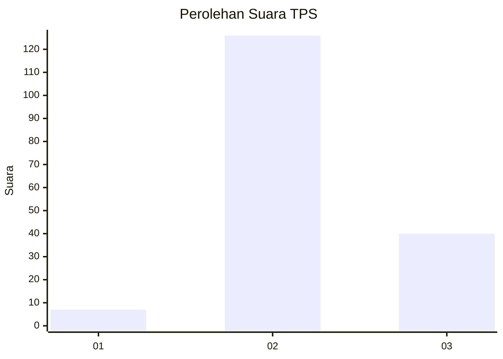
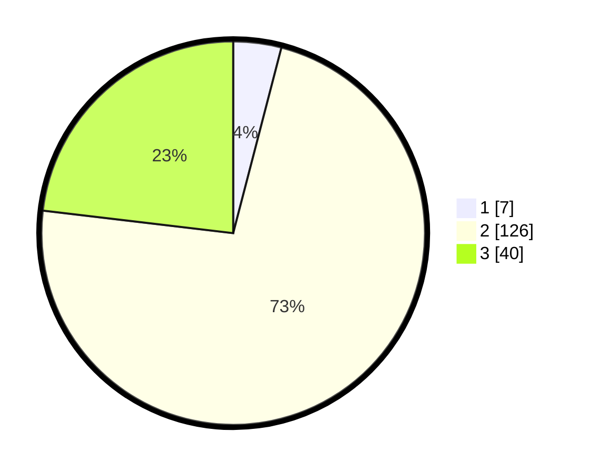

# Hasil

## Grafik

## Tabel

| No. | Nama Paslon    | Suara | Suara (raw) | Persentase |
|:--- |:-------------- | -----:| -----------:| ----------:|
| 1   | ANIES MUHAIMIN | 7     | [7][p-1]    | 4,05       |
| 2   | PRABOWO GIBRAN | 126   | [126][p-2]  | 72,83      |
| 3   | GANJAR MAHFUD  | 40    | [40][p-3]   | 23,12      |

[p-1]: https://github.com/gigit-pemilu/pemilu-2024/blob/main/pilpres/hitung-suara/sub/35-jawa-timur/sub/07-malang/sub/32-wonosari/sub/2008-bangelan/sub/006-tps/sub/paslon-1.txt
[p-2]: https://github.com/gigit-pemilu/pemilu-2024/blob/main/pilpres/hitung-suara/sub/35-jawa-timur/sub/07-malang/sub/32-wonosari/sub/2008-bangelan/sub/006-tps/sub/paslon-2.txt
[p-3]: https://github.com/gigit-pemilu/pemilu-2024/blob/main/pilpres/hitung-suara/sub/35-jawa-timur/sub/07-malang/sub/32-wonosari/sub/2008-bangelan/sub/006-tps/sub/paslon-3.txt

## Foto C Plano

https://sirekap-obj-formc.kpu.go.id/3f1d/pemilu/ppwp/35/07/32/20/08/3507322008006-20240217-142242--b1d2c810-a1ab-4662-bd7a-b18803db3d76.jpg

https://sirekap-obj-formc.kpu.go.id/3f1d/pemilu/ppwp/35/07/32/20/08/3507322008006-20240217-142253--8409c2e7-d24e-4435-8f6d-83b7628018f3.jpg

https://sirekap-obj-formc.kpu.go.id/3f1d/pemilu/ppwp/35/07/32/20/08/3507322008006-20240217-142309--ebadce8b-a044-4263-916e-8294e8770635.jpg

## Metadata

| Key        | Value               |
| ---------- | ------------------- |
| Time Stamp | 2024-02-25 17:00:00 |

