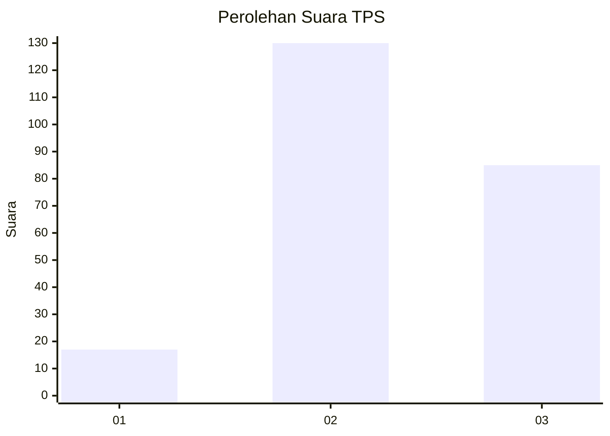
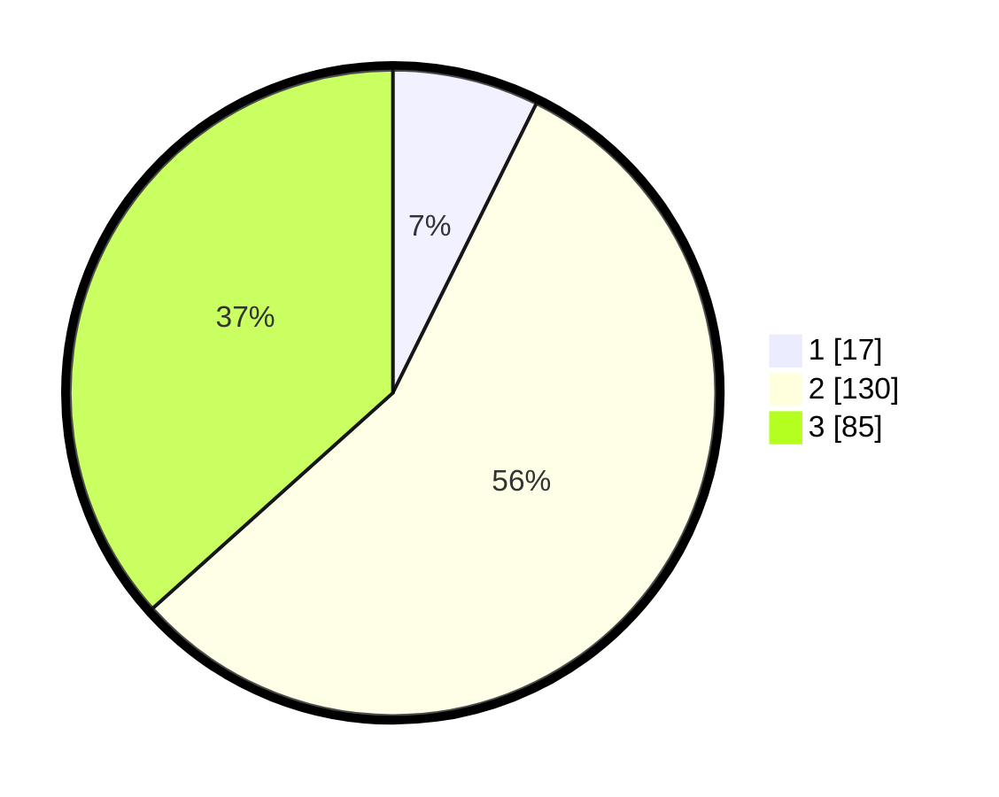

# Hasil

## Grafik

## Tabel

| No. | Nama Paslon    | Suara | Suara (raw) | Persentase |
|:--- |:-------------- | -----:| -----------:| ----------:|
| 1   | ANIES MUHAIMIN | 17    | [17][p-1]   | 7,33       |
| 2   | PRABOWO GIBRAN | 130   | [130][p-2]  | 56,03      |
| 3   | GANJAR MAHFUD  | 85    | [85][p-3]   | 36,64      |

[p-1]: https://github.com/gigit-pemilu/pemilu-2024/blob/main/pilpres/hitung-suara/sub/35-jawa-timur/sub/07-malang/sub/32-wonosari/sub/2008-bangelan/sub/007-tps/sub/paslon-1.txt
[p-2]: https://github.com/gigit-pemilu/pemilu-2024/blob/main/pilpres/hitung-suara/sub/35-jawa-timur/sub/07-malang/sub/32-wonosari/sub/2008-bangelan/sub/007-tps/sub/paslon-2.txt
[p-3]: https://github.com/gigit-pemilu/pemilu-2024/blob/main/pilpres/hitung-suara/sub/35-jawa-timur/sub/07-malang/sub/32-wonosari/sub/2008-bangelan/sub/007-tps/sub/paslon-3.txt

## Foto C Plano

https://sirekap-obj-formc.kpu.go.id/c59d/pemilu/ppwp/35/07/32/20/08/3507322008007-20240215-035509--be151c23-8916-4ad1-a5a3-be50562d2ab2.jpg

https://sirekap-obj-formc.kpu.go.id/c59d/pemilu/ppwp/35/07/32/20/08/3507322008007-20240215-042842--6b2ac51c-3342-48fd-8d9c-0d0db5d31309.jpg

https://sirekap-obj-formc.kpu.go.id/c59d/pemilu/ppwp/35/07/32/20/08/3507322008007-20240215-043158--6594db77-f604-426f-9de6-4a69589a026e.jpg

## Metadata

| Key        | Value               |
| ---------- | ------------------- |
| Time Stamp | 2024-02-24 22:31:28 |

