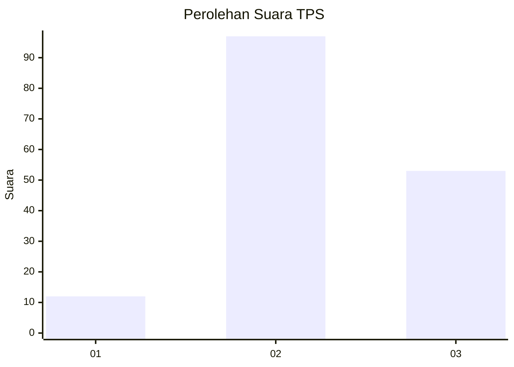
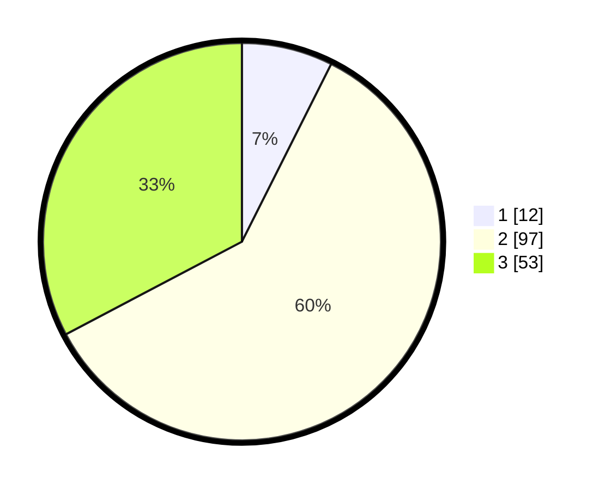

# Hasil

## Grafik

## Tabel

| No. | Nama Paslon    | Suara | Suara (raw) | Persentase |
|:--- |:-------------- | -----:| -----------:| ----------:|
| 1   | ANIES MUHAIMIN | 12    | [12][p-1]   | 7,41       |
| 2   | PRABOWO GIBRAN | 97    | [97][p-2]   | 59,88      |
| 3   | GANJAR MAHFUD  | 53    | [53][p-3]   | 32,72      |

[p-1]: https://github.com/gigit-pemilu/pemilu-2024/blob/main/pilpres/hitung-suara/sub/35-jawa-timur/sub/07-malang/sub/32-wonosari/sub/2008-bangelan/sub/012-tps/sub/paslon-1.txt
[p-2]: https://github.com/gigit-pemilu/pemilu-2024/blob/main/pilpres/hitung-suara/sub/35-jawa-timur/sub/07-malang/sub/32-wonosari/sub/2008-bangelan/sub/012-tps/sub/paslon-2.txt
[p-3]: https://github.com/gigit-pemilu/pemilu-2024/blob/main/pilpres/hitung-suara/sub/35-jawa-timur/sub/07-malang/sub/32-wonosari/sub/2008-bangelan/sub/012-tps/sub/paslon-3.txt

## Foto C Plano

https://sirekap-obj-formc.kpu.go.id/4dd7/pemilu/ppwp/35/07/32/20/08/3507322008012-20240215-014147--2e68fc3c-9a58-4318-8c82-0835c8d4d5a8.jpg

https://sirekap-obj-formc.kpu.go.id/4dd7/pemilu/ppwp/35/07/32/20/08/3507322008012-20240215-014159--080c7e73-25aa-4ab1-9f1e-f0ca3c9a4d0c.jpg

https://sirekap-obj-formc.kpu.go.id/4dd7/pemilu/ppwp/35/07/32/20/08/3507322008012-20240215-014215--0060c36e-067d-4389-913f-b86b5c79ded5.jpg

## Metadata

| Key        | Value               |
| ---------- | ------------------- |
| Time Stamp | 2024-02-15 16:30:25 |

