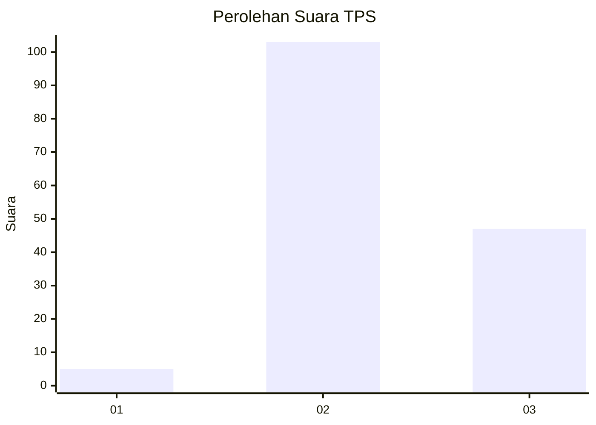

# Hasil

## Grafik

## Tabel

| No. | Nama Paslon    | Suara | Suara (raw) | Persentase |
|:--- |:-------------- | -----:| -----------:| ----------:|
| 1   | ANIES MUHAIMIN | 5     | [5][p-1]    | 3,23       |
| 2   | PRABOWO GIBRAN | 103   | [103][p-2]  | 66,45      |
| 3   | GANJAR MAHFUD  | 47    | [47][p-3]   | 30,32      |

[p-1]: https://github.com/gigit-pemilu/pemilu-2024/blob/main/pilpres/hitung-suara/sub/35-jawa-timur/sub/07-malang/sub/32-wonosari/sub/2008-bangelan/sub/014-tps/sub/paslon-1.txt
[p-2]: https://github.com/gigit-pemilu/pemilu-2024/blob/main/pilpres/hitung-suara/sub/35-jawa-timur/sub/07-malang/sub/32-wonosari/sub/2008-bangelan/sub/014-tps/sub/paslon-2.txt
[p-3]: https://github.com/gigit-pemilu/pemilu-2024/blob/main/pilpres/hitung-suara/sub/35-jawa-timur/sub/07-malang/sub/32-wonosari/sub/2008-bangelan/sub/014-tps/sub/paslon-3.txt

## Foto C Plano

https://sirekap-obj-formc.kpu.go.id/4a0b/pemilu/ppwp/35/07/32/20/08/3507322008014-20240215-050903--f1b743b1-67a9-435c-bb10-6ee7efa45a3f.jpg

https://sirekap-obj-formc.kpu.go.id/4a0b/pemilu/ppwp/35/07/32/20/08/3507322008014-20240215-004122--0db0528e-672c-4425-9f47-9eddd1c48d41.jpg

https://sirekap-obj-formc.kpu.go.id/4a0b/pemilu/ppwp/35/07/32/20/08/3507322008014-20240215-004140--c3ce9cd2-6b41-4b7b-8d26-49ecf07eec6c.jpg

## Metadata

| Key        | Value               |
| ---------- | ------------------- |
| Time Stamp | 2024-02-15 15:00:29 |

