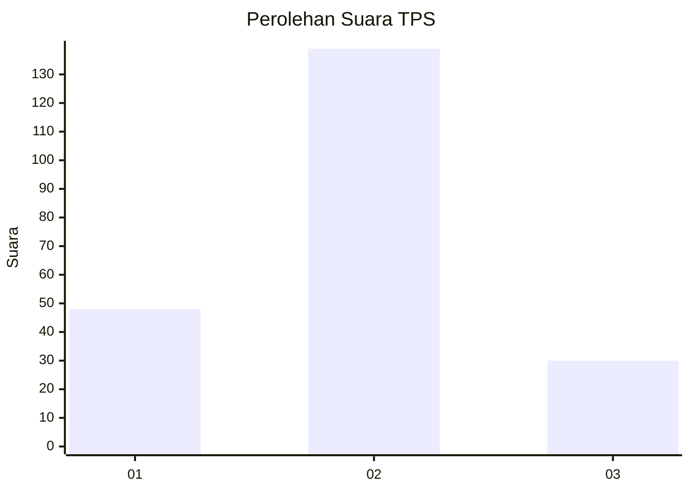
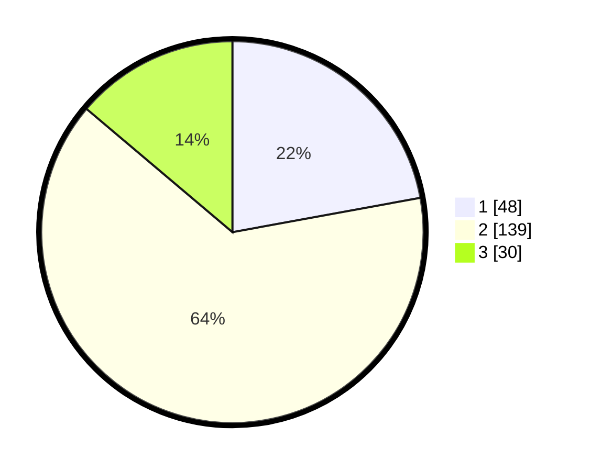

# Hasil

## Grafik

## Tabel

| No. | Nama Paslon    | Suara | Suara (raw) | Persentase |
|:--- |:-------------- | -----:| -----------:| ----------:|
| 1   | ANIES MUHAIMIN | 48    | [48][p-1]   | 22,12      |
| 2   | PRABOWO GIBRAN | 139   | [139][p-2]  | 64,06      |
| 3   | GANJAR MAHFUD  | 30    | [30][p-3]   | 13,82      |

[p-1]: https://github.com/gigit-pemilu/pemilu-2024/blob/main/pilpres/hitung-suara/sub/35-jawa-timur/sub/07-malang/sub/33-pagelaran/sub/2005-kanigoro/sub/003-tps/sub/paslon-1.txt
[p-2]: https://github.com/gigit-pemilu/pemilu-2024/blob/main/pilpres/hitung-suara/sub/35-jawa-timur/sub/07-malang/sub/33-pagelaran/sub/2005-kanigoro/sub/003-tps/sub/paslon-2.txt
[p-3]: https://github.com/gigit-pemilu/pemilu-2024/blob/main/pilpres/hitung-suara/sub/35-jawa-timur/sub/07-malang/sub/33-pagelaran/sub/2005-kanigoro/sub/003-tps/sub/paslon-3.txt

## Foto C Plano

https://sirekap-obj-formc.kpu.go.id/6f7c/pemilu/ppwp/35/07/33/20/05/3507332005003-20240221-102139--14827fc4-5f46-4f99-9d64-85f08ca71993.jpg

https://sirekap-obj-formc.kpu.go.id/6f7c/pemilu/ppwp/35/07/33/20/05/3507332005003-20240221-102617--da498781-57cf-49b3-b77c-6e98c2495d6a.jpg

https://sirekap-obj-formc.kpu.go.id/6f7c/pemilu/ppwp/35/07/33/20/05/3507332005003-20240221-102333--ee8c4ef8-ed75-4afb-9957-a5c85e9e1b91.jpg

## Metadata

| Key        | Value               |
| ---------- | ------------------- |
| Time Stamp | 2024-02-21 12:00:00 |

