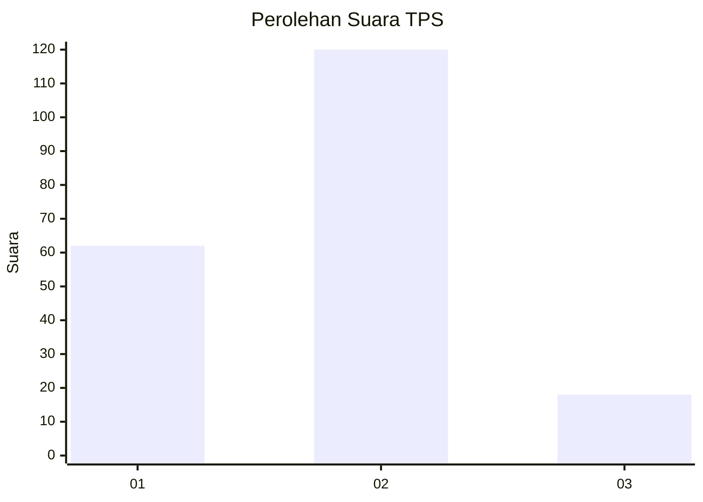
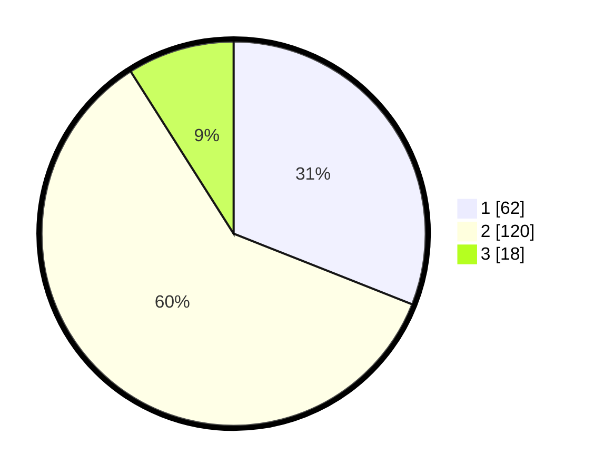

# Hasil

## Grafik

## Tabel

| No. | Nama Paslon    | Suara | Suara (raw) | Persentase |
|:--- |:-------------- | -----:| -----------:| ----------:|
| 1   | ANIES MUHAIMIN | 62    | [62][p-1]   | 31,00      |
| 2   | PRABOWO GIBRAN | 120   | [120][p-2]  | 60,00      |
| 3   | GANJAR MAHFUD  | 18    | [18][p-3]   | 9,00       |

[p-1]: https://github.com/gigit-pemilu/pemilu-2024/blob/main/pilpres/hitung-suara/sub/35-jawa-timur/sub/07-malang/sub/33-pagelaran/sub/2005-kanigoro/sub/007-tps/sub/paslon-1.txt
[p-2]: https://github.com/gigit-pemilu/pemilu-2024/blob/main/pilpres/hitung-suara/sub/35-jawa-timur/sub/07-malang/sub/33-pagelaran/sub/2005-kanigoro/sub/007-tps/sub/paslon-2.txt
[p-3]: https://github.com/gigit-pemilu/pemilu-2024/blob/main/pilpres/hitung-suara/sub/35-jawa-timur/sub/07-malang/sub/33-pagelaran/sub/2005-kanigoro/sub/007-tps/sub/paslon-3.txt

## Foto C Plano

https://sirekap-obj-formc.kpu.go.id/95de/pemilu/ppwp/35/07/33/20/05/3507332005007-20240220-130413--f953dd09-0a41-4cd9-9b94-45faa64b9a10.jpg

https://sirekap-obj-formc.kpu.go.id/95de/pemilu/ppwp/35/07/33/20/05/3507332005007-20240220-130448--9f95f4a3-984e-4b98-b6b1-9fc16a99cca1.jpg

https://sirekap-obj-formc.kpu.go.id/95de/pemilu/ppwp/35/07/33/20/05/3507332005007-20240220-130520--635ea901-843d-4a9f-ad29-d583c54f23c7.jpg

## Metadata

| Key        | Value               |
| ---------- | ------------------- |
| Time Stamp | 2024-02-21 12:00:00 |

