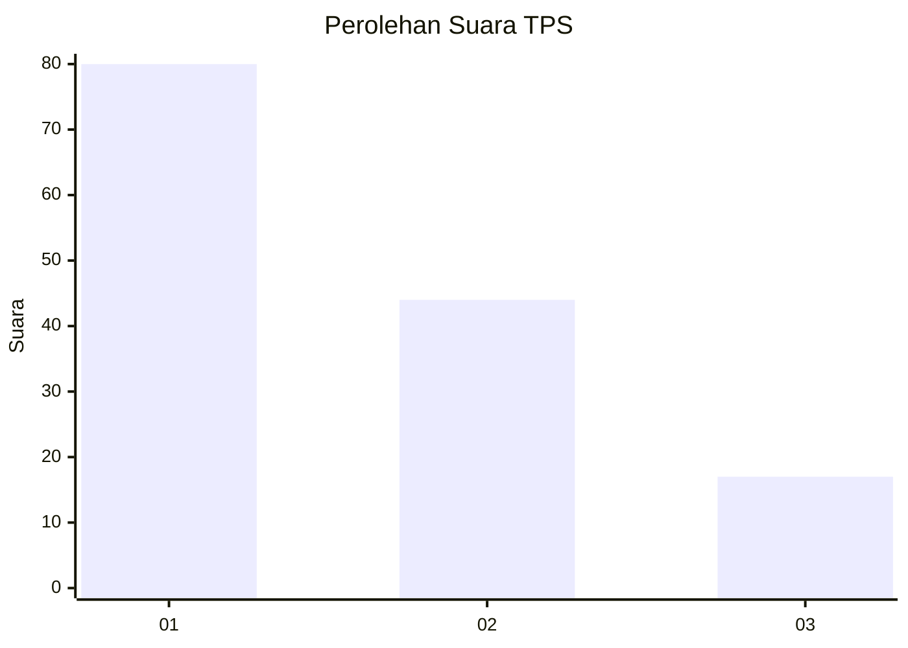
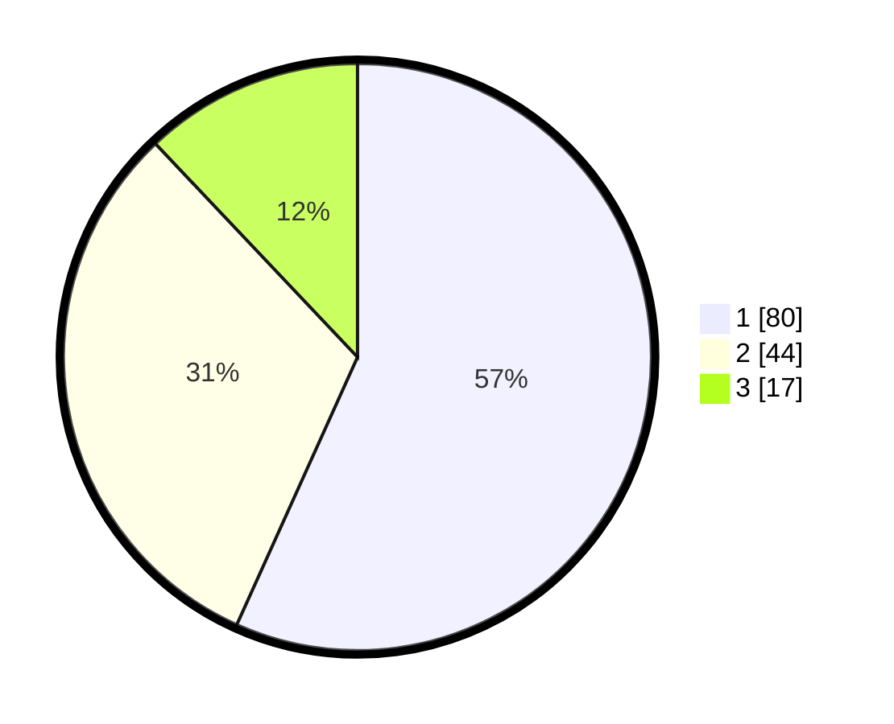

# Hasil

## Grafik

## Tabel

| No. | Nama Paslon    | Suara | Suara (raw) | Persentase |
|:--- |:-------------- | -----:| -----------:| ----------:|
| 1   | ANIES MUHAIMIN | 80    | [80][p-1]   | 56,74      |
| 2   | PRABOWO GIBRAN | 44    | [44][p-2]   | 31,21      |
| 3   | GANJAR MAHFUD  | 17    | [17][p-3]   | 12,06      |

[p-1]: https://github.com/gigit-pemilu/pemilu-2024-35-jawa-timur/blob/main/pilpres/hitung-suara/sub/35-jawa-timur/sub/07-malang/sub/33-pagelaran/sub/2005-kanigoro/sub/011-tps/sub/paslon-1.txt
[p-2]: https://github.com/gigit-pemilu/pemilu-2024-35-jawa-timur/blob/main/pilpres/hitung-suara/sub/35-jawa-timur/sub/07-malang/sub/33-pagelaran/sub/2005-kanigoro/sub/011-tps/sub/paslon-2.txt
[p-3]: https://github.com/gigit-pemilu/pemilu-2024-35-jawa-timur/blob/main/pilpres/hitung-suara/sub/35-jawa-timur/sub/07-malang/sub/33-pagelaran/sub/2005-kanigoro/sub/011-tps/sub/paslon-3.txt

## Foto C Plano

https://sirekap-obj-formc.kpu.go.id/8a31/pemilu/ppwp/35/07/33/20/05/3507332005011-20240221-151630--f76353f5-fcae-4a73-96c5-8e96d52bb8b5.jpg

https://sirekap-obj-formc.kpu.go.id/8a31/pemilu/ppwp/35/07/33/20/05/3507332005011-20240221-151503--063c3ab4-bf98-4e7d-a5c9-c8836f4761cb.jpg

https://sirekap-obj-formc.kpu.go.id/8a31/pemilu/ppwp/35/07/33/20/05/3507332005011-20240221-151534--87107c4b-5148-48c0-a802-5f7f21016aad.jpg

## Metadata

| Key        | Value               |
| ---------- | ------------------- |
| Time Stamp | 2024-02-21 16:00:00 |

## DATA PEMILIH TETAP

Jumlah pemilih dalam DPT: **244**.
 * L: **144**.
 * P: **177**.

## DATA PENGGUNA HAK PILIH

Jumlah pengguna hak pilih dalam DPT: **777**.
 * L: **777**.
 * P: **777**.

Jumlah pengguna hak pilih dalam DPTb: **0**.
 * L: **0**.
 * P: **0**.

Jumlah pengguna hak pilih dalam DPK: **8**.
 * L: **774**.
 * P: **0**.

Jumlah pengguna hak pilih: **32**.
 * L: **424**.
 * P: **222**.

## JUMLAH SUARA SAH DAN TIDAK SAH

JUMLAH SELURUH SUARA SAH: **245**.

JUMLAH SUARA TIDAK SAH: **7**.

JUMLAH SELURUH SUARA SAH DAN SUARA TIDAK SAH: **44**.

