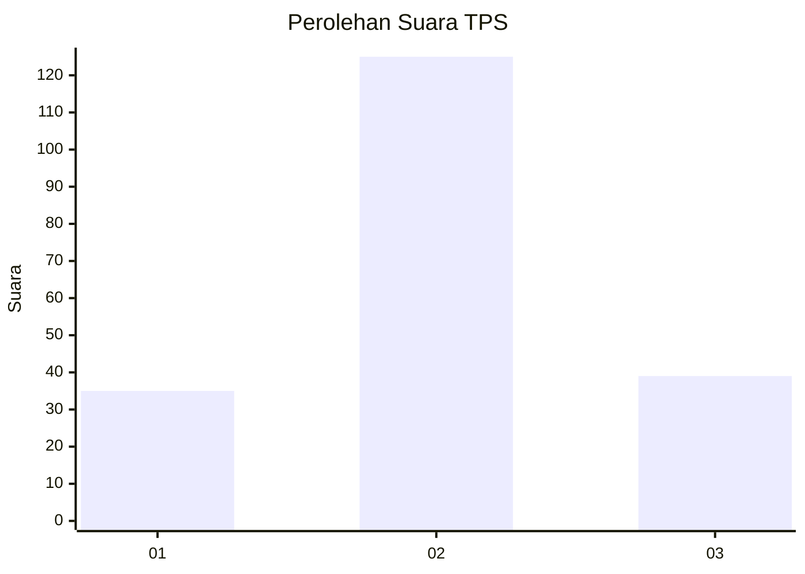
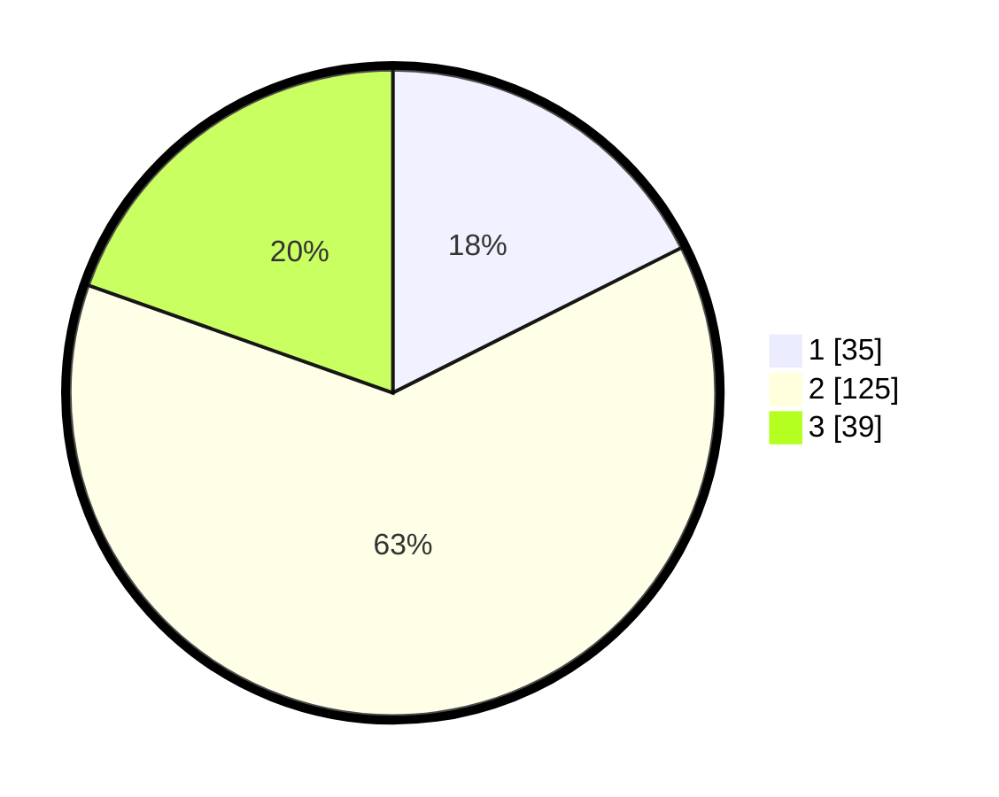

# Hasil

## Grafik

## Tabel

| No. | Nama Paslon    | Suara | Suara (raw) | Persentase |
|:--- |:-------------- | -----:| -----------:| ----------:|
| 1   | ANIES MUHAIMIN | 35    | [35][p-1]   | 17,59      |
| 2   | PRABOWO GIBRAN | 125   | [125][p-2]  | 62,81      |
| 3   | GANJAR MAHFUD  | 39    | [39][p-3]   | 19,60      |

[p-1]: https://github.com/gigit-pemilu/pemilu-2024/blob/main/pilpres/hitung-suara/sub/35-jawa-timur/sub/07-malang/sub/33-pagelaran/sub/2005-kanigoro/sub/019-tps/sub/paslon-1.txt
[p-2]: https://github.com/gigit-pemilu/pemilu-2024/blob/main/pilpres/hitung-suara/sub/35-jawa-timur/sub/07-malang/sub/33-pagelaran/sub/2005-kanigoro/sub/019-tps/sub/paslon-2.txt
[p-3]: https://github.com/gigit-pemilu/pemilu-2024/blob/main/pilpres/hitung-suara/sub/35-jawa-timur/sub/07-malang/sub/33-pagelaran/sub/2005-kanigoro/sub/019-tps/sub/paslon-3.txt

## Foto C Plano

https://sirekap-obj-formc.kpu.go.id/0476/pemilu/ppwp/35/07/33/20/05/3507332005019-20240218-143158--fd4dd8d3-126f-4f5a-8cd8-51ef580d9e0d.jpg

https://sirekap-obj-formc.kpu.go.id/0476/pemilu/ppwp/35/07/33/20/05/3507332005019-20240218-183015--2a51e29b-502e-4ee4-947e-d4ac702e8d01.jpg

https://sirekap-obj-formc.kpu.go.id/0476/pemilu/ppwp/35/07/33/20/05/3507332005019-20240218-144451--423a316b-ca03-4636-b3a8-0722fab28c22.jpg

## Metadata

| Key        | Value               |
| ---------- | ------------------- |
| Time Stamp | 2024-02-21 12:00:00 |

