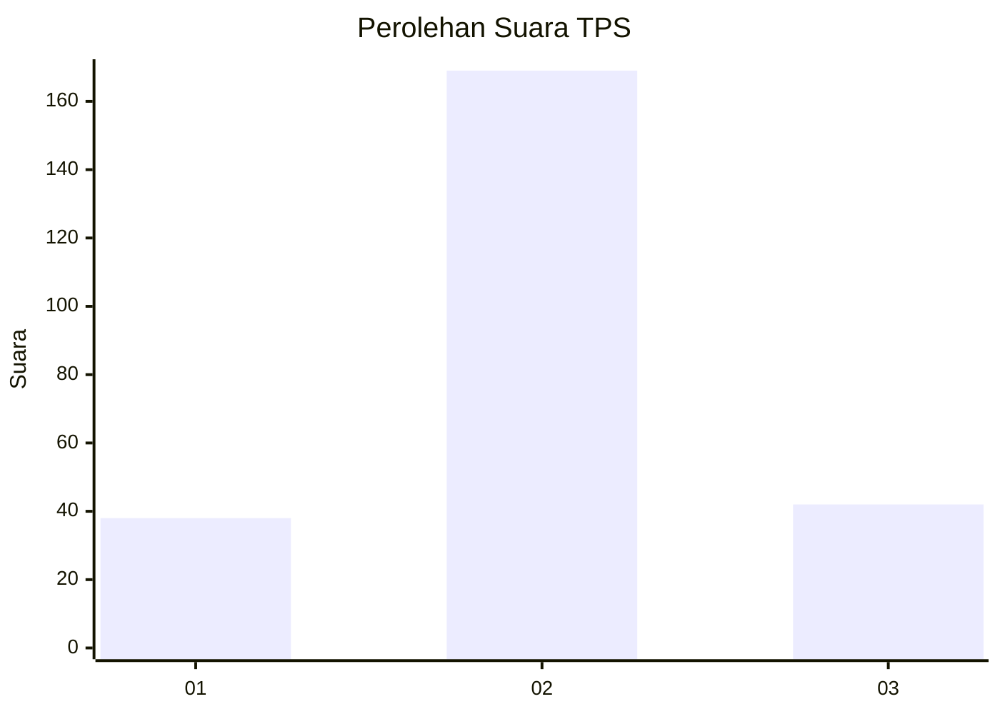
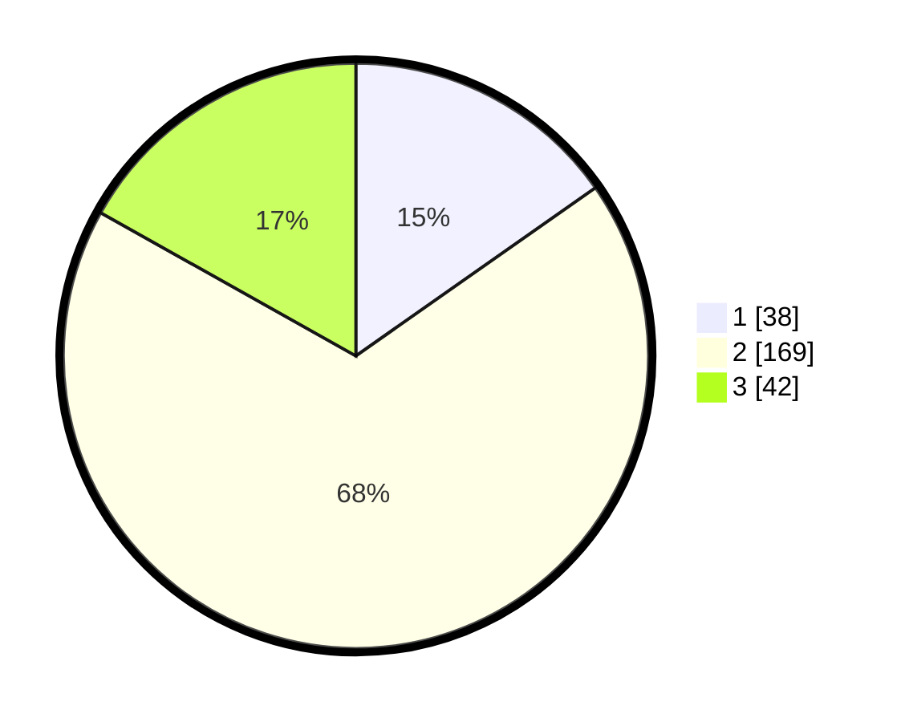

# Hasil

## Grafik

## Tabel

| No. | Nama Paslon    | Suara | Suara (raw) | Persentase |
|:--- |:-------------- | -----:| -----------:| ----------:|
| 1   | ANIES MUHAIMIN | 38    | [38][p-1]   | 15,26      |
| 2   | PRABOWO GIBRAN | 169   | [169][p-2]  | 67,87      |
| 3   | GANJAR MAHFUD  | 42    | [42][p-3]   | 16,87      |

[p-1]: https://github.com/gigit-pemilu/pemilu-2024/blob/main/pilpres/hitung-suara/sub/35-jawa-timur/sub/07-malang/sub/33-pagelaran/sub/2008-banjarejo/sub/003-tps/sub/paslon-1.txt
[p-2]: https://github.com/gigit-pemilu/pemilu-2024/blob/main/pilpres/hitung-suara/sub/35-jawa-timur/sub/07-malang/sub/33-pagelaran/sub/2008-banjarejo/sub/003-tps/sub/paslon-2.txt
[p-3]: https://github.com/gigit-pemilu/pemilu-2024/blob/main/pilpres/hitung-suara/sub/35-jawa-timur/sub/07-malang/sub/33-pagelaran/sub/2008-banjarejo/sub/003-tps/sub/paslon-3.txt

## Foto C Plano

https://sirekap-obj-formc.kpu.go.id/8535/pemilu/ppwp/35/07/33/20/08/3507332008003-20240219-153017--706f7d9c-c38b-4c5e-93d0-4c03fa02383d.jpg

https://sirekap-obj-formc.kpu.go.id/8535/pemilu/ppwp/35/07/33/20/08/3507332008003-20240217-202649--0dcfa88f-8e82-4006-9ffa-f5cfbad47bdb.jpg

https://sirekap-obj-formc.kpu.go.id/8535/pemilu/ppwp/35/07/33/20/08/3507332008003-20240217-202725--73b1f940-b473-40b4-ba85-11f1599ae350.jpg

## Metadata

| Key        | Value               |
| ---------- | ------------------- |
| Time Stamp | 2024-02-19 16:00:00 |

