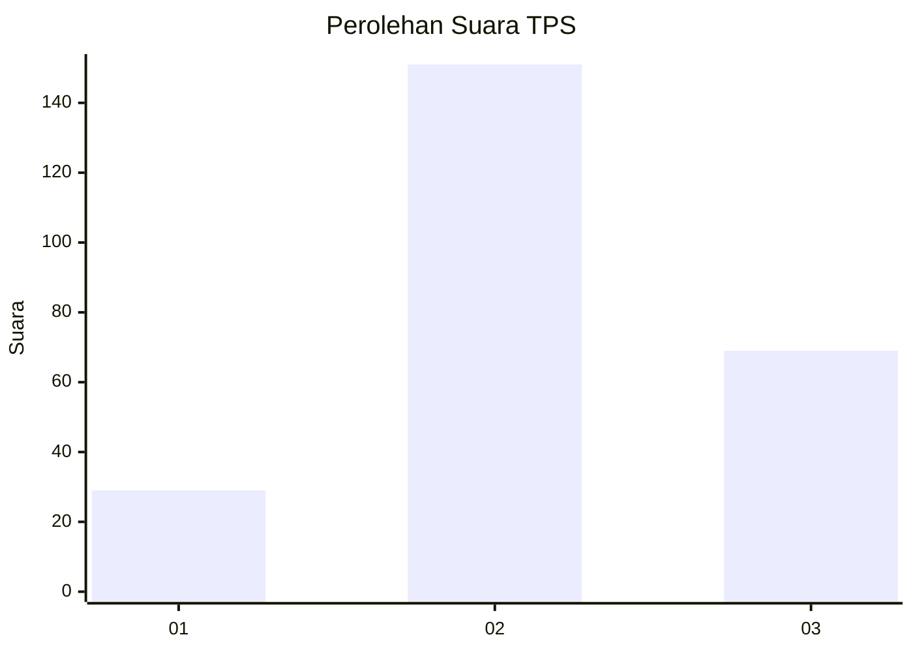
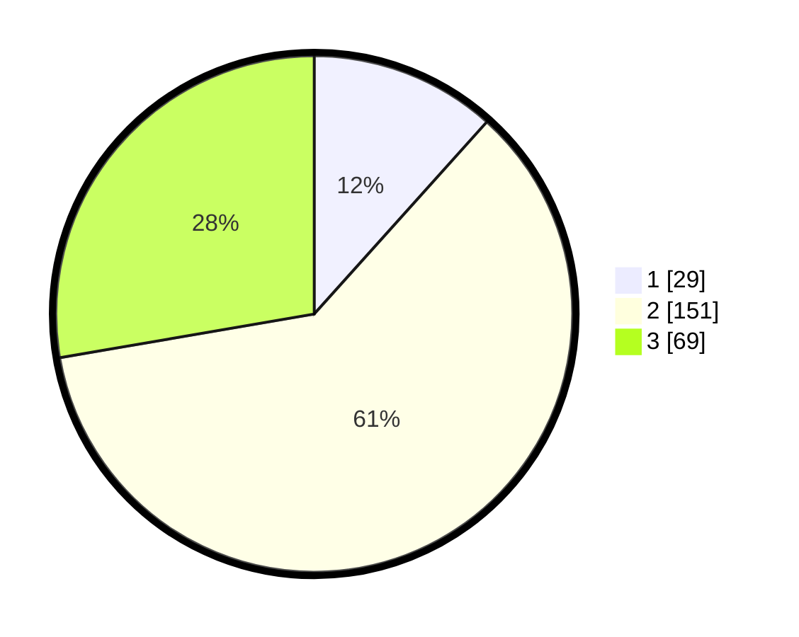

# Hasil

## Grafik

## Tabel

| No. | Nama Paslon    | Suara | Suara (raw) | Persentase |
|:--- |:-------------- | -----:| -----------:| ----------:|
| 1   | ANIES MUHAIMIN | 29    | [29][p-1]   | 11,65      |
| 2   | PRABOWO GIBRAN | 151   | [151][p-2]  | 60,64      |
| 3   | GANJAR MAHFUD  | 69    | [69][p-3]   | 27,71      |

[p-1]: https://github.com/gigit-pemilu/pemilu-2024-35-jawa-timur/blob/main/pilpres/hitung-suara/sub/35-jawa-timur/sub/07-malang/sub/33-pagelaran/sub/2008-banjarejo/sub/012-tps/sub/paslon-1.txt
[p-2]: https://github.com/gigit-pemilu/pemilu-2024-35-jawa-timur/blob/main/pilpres/hitung-suara/sub/35-jawa-timur/sub/07-malang/sub/33-pagelaran/sub/2008-banjarejo/sub/012-tps/sub/paslon-2.txt
[p-3]: https://github.com/gigit-pemilu/pemilu-2024-35-jawa-timur/blob/main/pilpres/hitung-suara/sub/35-jawa-timur/sub/07-malang/sub/33-pagelaran/sub/2008-banjarejo/sub/012-tps/sub/paslon-3.txt

## Foto C Plano

https://sirekap-obj-formc.kpu.go.id/c49d/pemilu/ppwp/35/07/33/20/08/3507332008012-20240214-205842--a5ba0e7b-e650-4e8f-81c0-f3ae7a90971c.jpg

https://sirekap-obj-formc.kpu.go.id/c49d/pemilu/ppwp/35/07/33/20/08/3507332008012-20240214-221121--cfe3d7da-2d8c-450d-9ff7-c9287ec3d90f.jpg

https://sirekap-obj-formc.kpu.go.id/c49d/pemilu/ppwp/35/07/33/20/08/3507332008012-20240214-221726--b0c876c8-e959-4d94-ac41-b1ecf2bfc46e.jpg

## Metadata

| Key        | Value               |
| ---------- | ------------------- |
| Time Stamp | 2024-02-19 06:16:00 |

