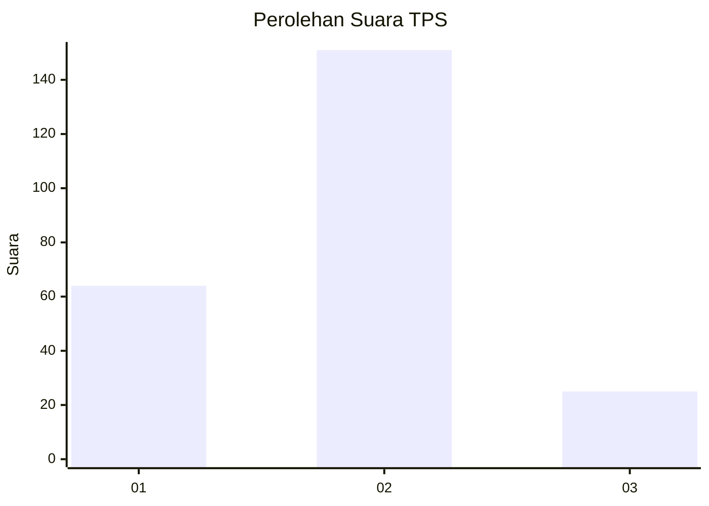
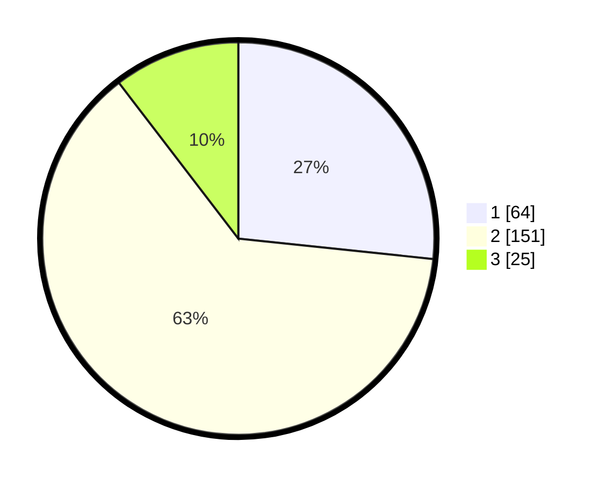

# Hasil

## Grafik

## Tabel

| No. | Nama Paslon    | Suara | Suara (raw) | Persentase |
|:--- |:-------------- | -----:| -----------:| ----------:|
| 1   | ANIES MUHAIMIN | 64    | [64][p-1]   | 26,67      |
| 2   | PRABOWO GIBRAN | 151   | [151][p-2]  | 62,92      |
| 3   | GANJAR MAHFUD  | 25    | [25][p-3]   | 10,42      |

[p-1]: https://github.com/gigit-pemilu/pemilu-2024-35-jawa-timur/blob/main/pilpres/hitung-suara/sub/35-jawa-timur/sub/07-malang/sub/33-pagelaran/sub/2008-banjarejo/sub/017-tps/sub/paslon-1.txt
[p-2]: https://github.com/gigit-pemilu/pemilu-2024-35-jawa-timur/blob/main/pilpres/hitung-suara/sub/35-jawa-timur/sub/07-malang/sub/33-pagelaran/sub/2008-banjarejo/sub/017-tps/sub/paslon-2.txt
[p-3]: https://github.com/gigit-pemilu/pemilu-2024-35-jawa-timur/blob/main/pilpres/hitung-suara/sub/35-jawa-timur/sub/07-malang/sub/33-pagelaran/sub/2008-banjarejo/sub/017-tps/sub/paslon-3.txt

## Foto C Plano

https://sirekap-obj-formc.kpu.go.id/1dac/pemilu/ppwp/35/07/33/20/08/3507332008017-20240216-161730--f824212e-caee-4a0e-955c-a340d3ac07c0.jpg

https://sirekap-obj-formc.kpu.go.id/1dac/pemilu/ppwp/35/07/33/20/08/3507332008017-20240214-204549--5ffdcc10-2007-464f-ba66-2d8d65abae9c.jpg

https://sirekap-obj-formc.kpu.go.id/1dac/pemilu/ppwp/35/07/33/20/08/3507332008017-20240216-165339--a4e51764-7dee-4919-9205-b5c285b20ccd.jpg

## Metadata

| Key        | Value               |
| ---------- | ------------------- |
| Time Stamp | 2024-02-16 17:00:00 |

