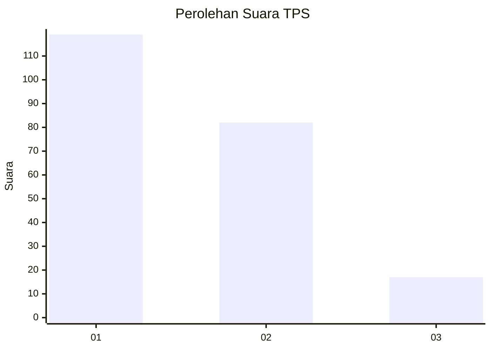
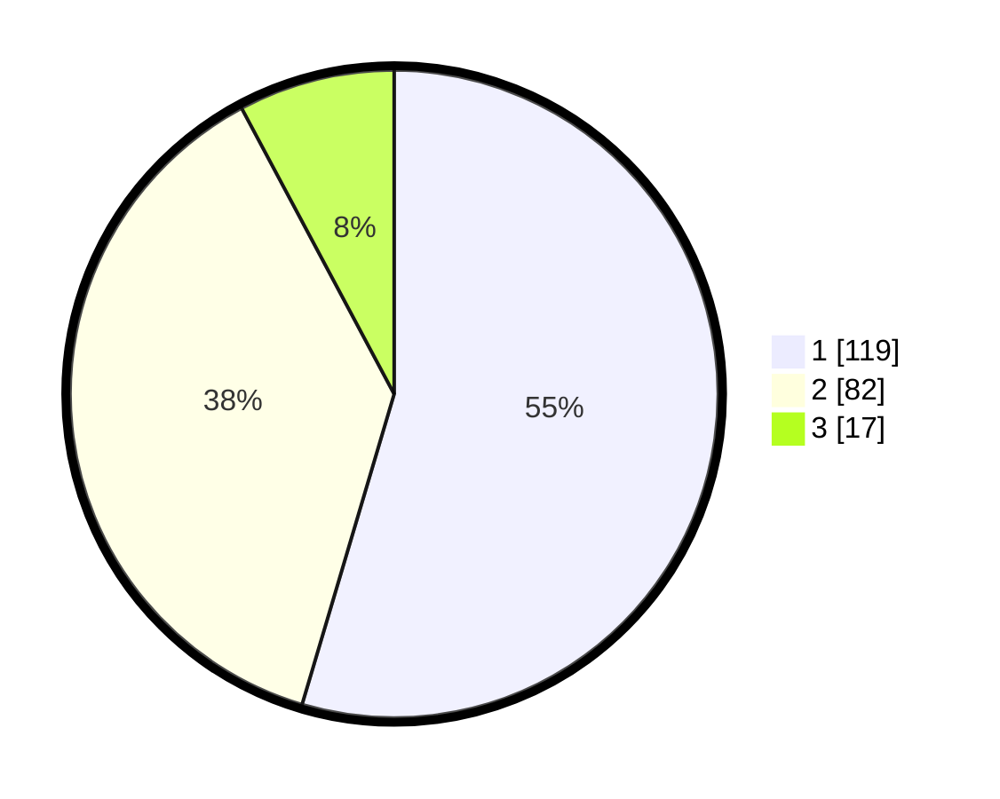

# Hasil

## Grafik

## Tabel

| No. | Nama Paslon    | Suara | Suara (raw) | Persentase |
|:--- |:-------------- | -----:| -----------:| ----------:|
| 1   | ANIES MUHAIMIN | 119   | [119][p-1]  | 54,59      |
| 2   | PRABOWO GIBRAN | 82    | [82][p-2]   | 37,61      |
| 3   | GANJAR MAHFUD  | 17    | [17][p-3]   | 7,80       |

[p-1]: https://github.com/gigit-pemilu/pemilu-2024/blob/main/pilpres/hitung-suara/sub/35-jawa-timur/sub/07-malang/sub/33-pagelaran/sub/2009-karangsuko/sub/001-tps/sub/paslon-1.txt
[p-2]: https://github.com/gigit-pemilu/pemilu-2024/blob/main/pilpres/hitung-suara/sub/35-jawa-timur/sub/07-malang/sub/33-pagelaran/sub/2009-karangsuko/sub/001-tps/sub/paslon-2.txt
[p-3]: https://github.com/gigit-pemilu/pemilu-2024/blob/main/pilpres/hitung-suara/sub/35-jawa-timur/sub/07-malang/sub/33-pagelaran/sub/2009-karangsuko/sub/001-tps/sub/paslon-3.txt

## Foto C Plano

https://sirekap-obj-formc.kpu.go.id/36db/pemilu/ppwp/35/07/33/20/09/3507332009001-20240220-162015--52e59d23-0601-40b1-98fd-3b112d0a357f.jpg

https://sirekap-obj-formc.kpu.go.id/36db/pemilu/ppwp/35/07/33/20/09/3507332009001-20240220-161255--e10a9b7a-2d9b-4b18-adf7-637644055904.jpg

https://sirekap-obj-formc.kpu.go.id/36db/pemilu/ppwp/35/07/33/20/09/3507332009001-20240220-161725--106047a9-2b11-48b8-ad78-c27360e30e34.jpg

## Metadata

| Key        | Value               |
| ---------- | ------------------- |
| Time Stamp | 2024-02-20 17:00:00 |

