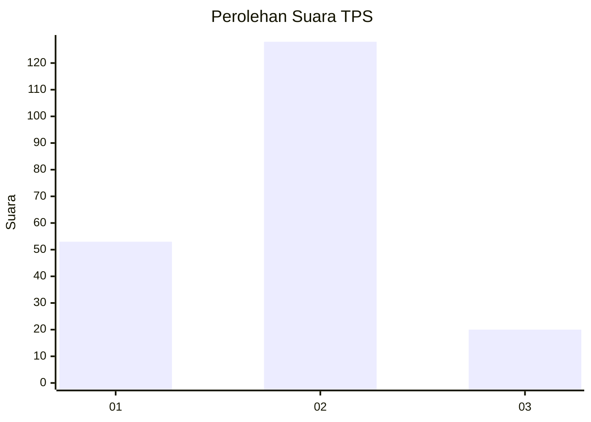
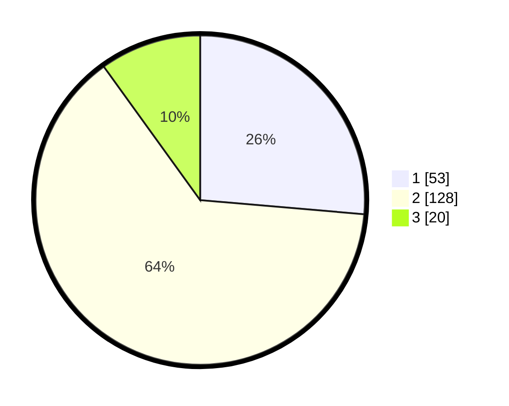

# Hasil

## Grafik

## Tabel

| No. | Nama Paslon    | Suara | Suara (raw) | Persentase |
|:--- |:-------------- | -----:| -----------:| ----------:|
| 1   | ANIES MUHAIMIN | 53    | [53][p-1]   | 26,37      |
| 2   | PRABOWO GIBRAN | 128   | [128][p-2]  | 63,68      |
| 3   | GANJAR MAHFUD  | 20    | [20][p-3]   | 9,95       |

[p-1]: https://github.com/gigit-pemilu/pemilu-2024/blob/main/pilpres/hitung-suara/sub/35-jawa-timur/sub/07-malang/sub/33-pagelaran/sub/2009-karangsuko/sub/002-tps/sub/paslon-1.txt
[p-2]: https://github.com/gigit-pemilu/pemilu-2024/blob/main/pilpres/hitung-suara/sub/35-jawa-timur/sub/07-malang/sub/33-pagelaran/sub/2009-karangsuko/sub/002-tps/sub/paslon-2.txt
[p-3]: https://github.com/gigit-pemilu/pemilu-2024/blob/main/pilpres/hitung-suara/sub/35-jawa-timur/sub/07-malang/sub/33-pagelaran/sub/2009-karangsuko/sub/002-tps/sub/paslon-3.txt

## Foto C Plano

https://sirekap-obj-formc.kpu.go.id/5435/pemilu/ppwp/35/07/33/20/09/3507332009002-20240215-021608--e20bbbe7-2cc0-4af0-a171-d96a6fb0bd6e.jpg

https://sirekap-obj-formc.kpu.go.id/5435/pemilu/ppwp/35/07/33/20/09/3507332009002-20240215-021709--a65f6a88-4c62-436d-9158-e722e57de037.jpg

https://sirekap-obj-formc.kpu.go.id/5435/pemilu/ppwp/35/07/33/20/09/3507332009002-20240215-023843--ad61f843-2ac4-4bcc-a9b6-c7b09ea2bab4.jpg

## Metadata

| Key        | Value               |
| ---------- | ------------------- |
| Time Stamp | 2024-02-19 06:16:00 |

