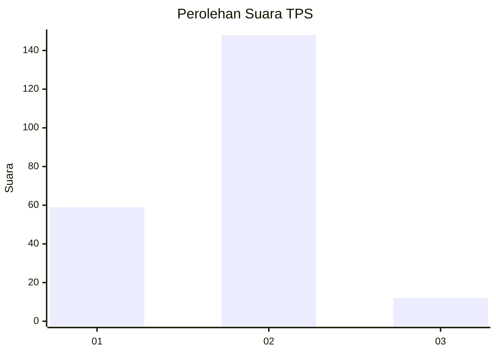
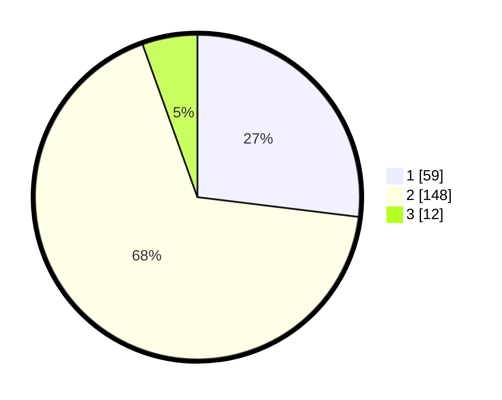

# Hasil

## Grafik

## Tabel

| No. | Nama Paslon    | Suara | Suara (raw) | Persentase |
|:--- |:-------------- | -----:| -----------:| ----------:|
| 1   | ANIES MUHAIMIN | 59    | [59][p-1]   | 26,94      |
| 2   | PRABOWO GIBRAN | 148   | [148][p-2]  | 67,58      |
| 3   | GANJAR MAHFUD  | 12    | [12][p-3]   | 5,48       |

[p-1]: https://github.com/gigit-pemilu/pemilu-2024/blob/main/pilpres/hitung-suara/sub/35-jawa-timur/sub/07-malang/sub/33-pagelaran/sub/2009-karangsuko/sub/009-tps/sub/paslon-1.txt
[p-2]: https://github.com/gigit-pemilu/pemilu-2024/blob/main/pilpres/hitung-suara/sub/35-jawa-timur/sub/07-malang/sub/33-pagelaran/sub/2009-karangsuko/sub/009-tps/sub/paslon-2.txt
[p-3]: https://github.com/gigit-pemilu/pemilu-2024/blob/main/pilpres/hitung-suara/sub/35-jawa-timur/sub/07-malang/sub/33-pagelaran/sub/2009-karangsuko/sub/009-tps/sub/paslon-3.txt

## Foto C Plano

https://sirekap-obj-formc.kpu.go.id/9a1b/pemilu/ppwp/35/07/33/20/09/3507332009009-20240219-191421--72ab4f81-837e-4b77-88bd-26cd6aa52365.jpg

https://sirekap-obj-formc.kpu.go.id/9a1b/pemilu/ppwp/35/07/33/20/09/3507332009009-20240214-220127--32658292-6fc8-4f96-a47b-bb412085a6c3.jpg

https://sirekap-obj-formc.kpu.go.id/9a1b/pemilu/ppwp/35/07/33/20/09/3507332009009-20240214-220213--e9f38e1b-a24d-40e6-ac93-5315dec6ea4b.jpg

## Metadata

| Key        | Value               |
| ---------- | ------------------- |
| Time Stamp | 2024-02-19 20:00:00 |

