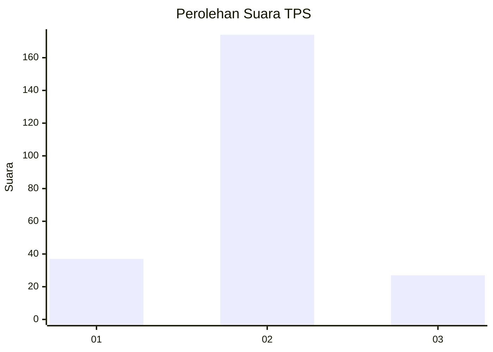
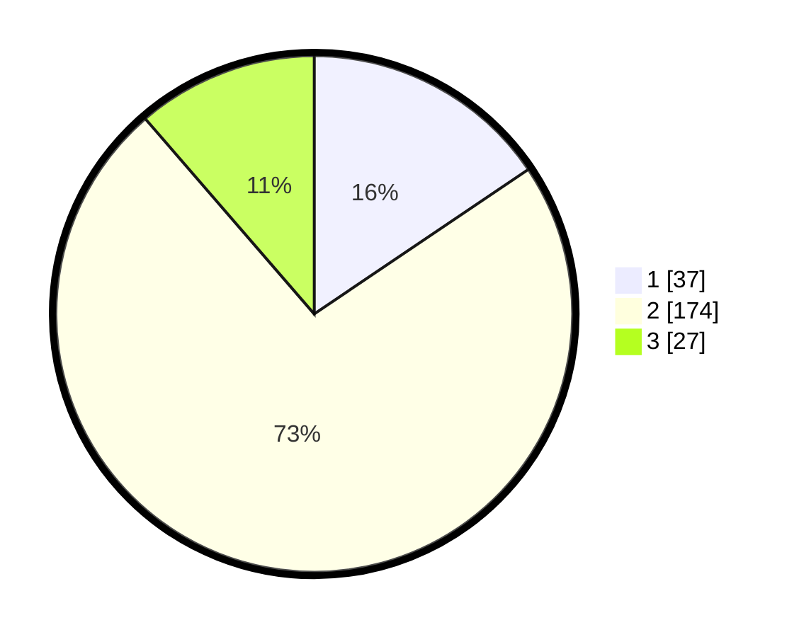

# Hasil

## Grafik

## Tabel

| No. | Nama Paslon    | Suara | Suara (raw) | Persentase |
|:--- |:-------------- | -----:| -----------:| ----------:|
| 1   | ANIES MUHAIMIN | 37    | [37][p-1]   | 15,55      |
| 2   | PRABOWO GIBRAN | 174   | [174][p-2]  | 73,11      |
| 3   | GANJAR MAHFUD  | 27    | [27][p-3]   | 11,34      |

[p-1]: https://github.com/gigit-pemilu/pemilu-2024/blob/main/pilpres/hitung-suara/sub/35-jawa-timur/sub/07-malang/sub/33-pagelaran/sub/2010-sidorejo/sub/003-tps/sub/paslon-1.txt
[p-2]: https://github.com/gigit-pemilu/pemilu-2024/blob/main/pilpres/hitung-suara/sub/35-jawa-timur/sub/07-malang/sub/33-pagelaran/sub/2010-sidorejo/sub/003-tps/sub/paslon-2.txt
[p-3]: https://github.com/gigit-pemilu/pemilu-2024/blob/main/pilpres/hitung-suara/sub/35-jawa-timur/sub/07-malang/sub/33-pagelaran/sub/2010-sidorejo/sub/003-tps/sub/paslon-3.txt

## Foto C Plano

https://sirekap-obj-formc.kpu.go.id/33d3/pemilu/ppwp/35/07/33/20/10/3507332010003-20240218-124118--8c2a9492-3d5a-497e-9ede-857301a39841.jpg

https://sirekap-obj-formc.kpu.go.id/33d3/pemilu/ppwp/35/07/33/20/10/3507332010003-20240218-124439--e9268016-f817-478b-aac9-1935756e4e13.jpg

https://sirekap-obj-formc.kpu.go.id/33d3/pemilu/ppwp/35/07/33/20/10/3507332010003-20240219-085500--25cf5ce8-b4f2-4b10-94a9-082e3ea66604.jpg

## Metadata

| Key        | Value               |
| ---------- | ------------------- |
| Time Stamp | 2024-02-19 09:00:00 |

