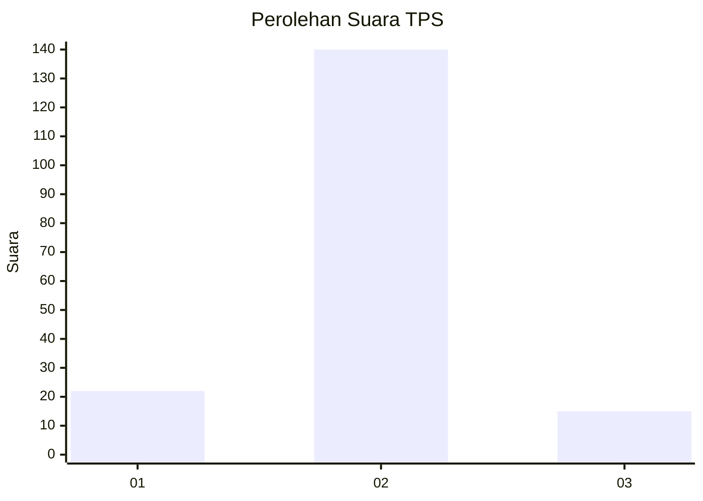
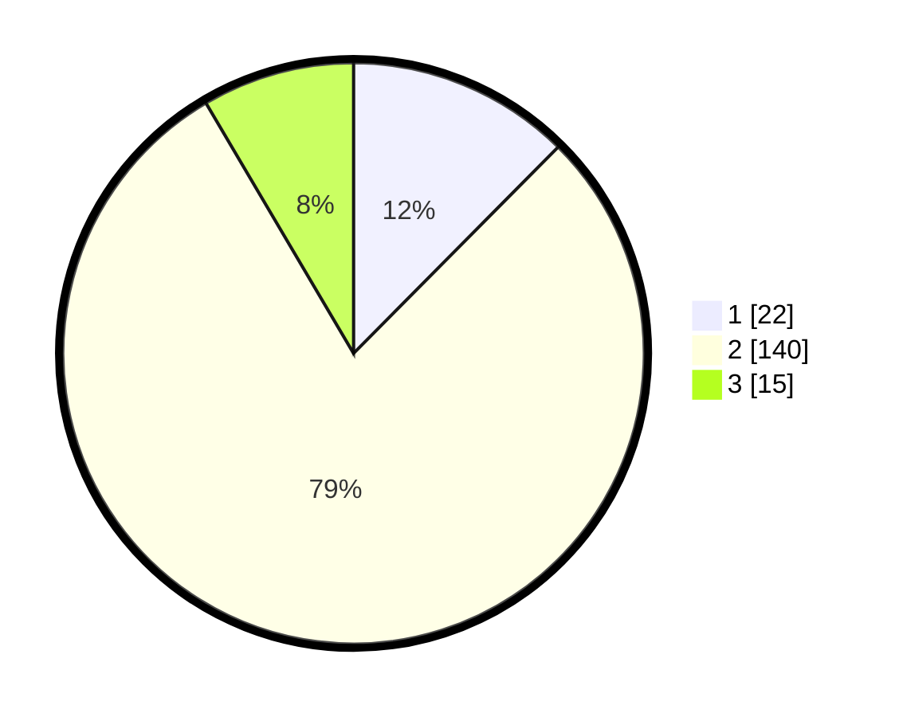

# Hasil

## Grafik

## Tabel

| No. | Nama Paslon    | Suara | Suara (raw) | Persentase |
|:--- |:-------------- | -----:| -----------:| ----------:|
| 1   | ANIES MUHAIMIN | 22    | [22][p-1]   | 12,43      |
| 2   | PRABOWO GIBRAN | 140   | [140][p-2]  | 79,10      |
| 3   | GANJAR MAHFUD  | 15    | [15][p-3]   | 8,47       |

[p-1]: https://github.com/gigit-pemilu/pemilu-2024-35-jawa-timur/blob/main/pilpres/hitung-suara/sub/35-jawa-timur/sub/08-lumajang/sub/01-tempursari/sub/2001-tegalrejo/sub/001-tps/sub/paslon-1.txt
[p-2]: https://github.com/gigit-pemilu/pemilu-2024-35-jawa-timur/blob/main/pilpres/hitung-suara/sub/35-jawa-timur/sub/08-lumajang/sub/01-tempursari/sub/2001-tegalrejo/sub/001-tps/sub/paslon-2.txt
[p-3]: https://github.com/gigit-pemilu/pemilu-2024-35-jawa-timur/blob/main/pilpres/hitung-suara/sub/35-jawa-timur/sub/08-lumajang/sub/01-tempursari/sub/2001-tegalrejo/sub/001-tps/sub/paslon-3.txt

## Foto C Plano

https://sirekap-obj-formc.kpu.go.id/b623/pemilu/ppwp/35/08/01/20/01/3508012001001-20240217-064645--c9e3479d-93ba-4279-8f4f-d4639590cc2d.jpg

https://sirekap-obj-formc.kpu.go.id/b623/pemilu/ppwp/35/08/01/20/01/3508012001001-20240217-071353--610755f3-15cb-4bfb-9cae-23134162626f.jpg

https://sirekap-obj-formc.kpu.go.id/b623/pemilu/ppwp/35/08/01/20/01/3508012001001-20240217-071320--45e6d551-899e-4e14-b8a0-0c6b78969d28.jpg

## Metadata

| Key        | Value               |
| ---------- | ------------------- |
| Time Stamp | 2024-02-17 09:30:03 |

## DATA PEMILIH TETAP

Jumlah pemilih dalam DPT: **251**.
 * L: **119**.
 * P: **132**.

## DATA PENGGUNA HAK PILIH

Jumlah pengguna hak pilih dalam DPT: **184**.
 * L: **83**.
 * P: **101**.

Jumlah pengguna hak pilih dalam DPTb: **2**.
 * L: **1**.
 * P: **1**.

Jumlah pengguna hak pilih dalam DPK: **1**.
 * L: **1**.
 * P: **0**.

Jumlah pengguna hak pilih: **187**.
 * L: **85**.
 * P: **102**.

## JUMLAH SUARA SAH DAN TIDAK SAH

JUMLAH SELURUH SUARA SAH: **177**.

JUMLAH SUARA TIDAK SAH: **10**.

JUMLAH SELURUH SUARA SAH DAN SUARA TIDAK SAH: **187**.

