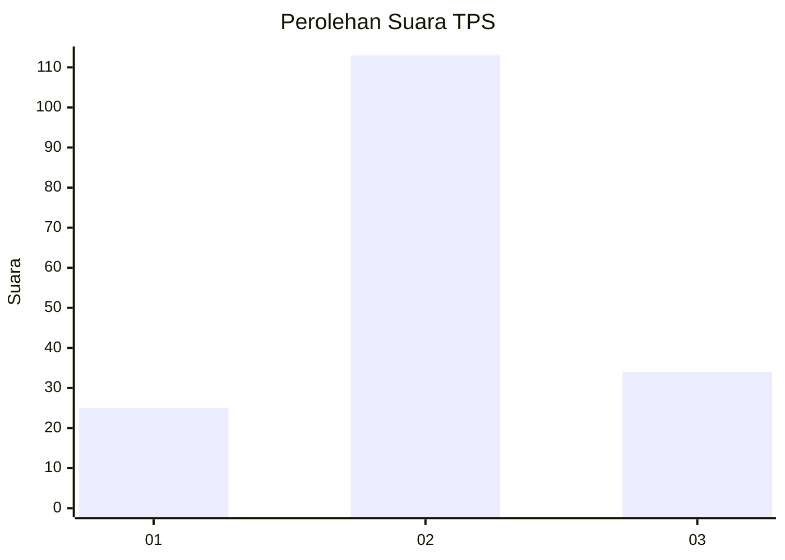
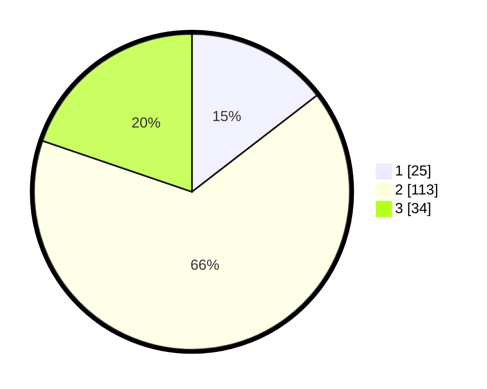

# Hasil

## Grafik

## Tabel

| No. | Nama Paslon    | Suara | Suara (raw) | Persentase |
|:--- |:-------------- | -----:| -----------:| ----------:|
| 1   | ANIES MUHAIMIN | 25    | [25][p-1]   | 14,53      |
| 2   | PRABOWO GIBRAN | 113   | [113][p-2]  | 65,70      |
| 3   | GANJAR MAHFUD  | 34    | [34][p-3]   | 19,77      |

[p-1]: https://github.com/gigit-pemilu/pemilu-2024-35-jawa-timur/blob/main/pilpres/hitung-suara/sub/35-jawa-timur/sub/08-lumajang/sub/01-tempursari/sub/2001-tegalrejo/sub/002-tps/sub/paslon-1.txt
[p-2]: https://github.com/gigit-pemilu/pemilu-2024-35-jawa-timur/blob/main/pilpres/hitung-suara/sub/35-jawa-timur/sub/08-lumajang/sub/01-tempursari/sub/2001-tegalrejo/sub/002-tps/sub/paslon-2.txt
[p-3]: https://github.com/gigit-pemilu/pemilu-2024-35-jawa-timur/blob/main/pilpres/hitung-suara/sub/35-jawa-timur/sub/08-lumajang/sub/01-tempursari/sub/2001-tegalrejo/sub/002-tps/sub/paslon-3.txt

## Foto C Plano

https://sirekap-obj-formc.kpu.go.id/5e95/pemilu/ppwp/35/08/01/20/01/3508012001002-20240214-141608--895336af-3025-45df-84b6-6a1fb48af9f1.jpg

https://sirekap-obj-formc.kpu.go.id/5e95/pemilu/ppwp/35/08/01/20/01/3508012001002-20240214-141359--1a311192-8b95-43c9-a1ab-07f74ea75bbe.jpg

https://sirekap-obj-formc.kpu.go.id/5e95/pemilu/ppwp/35/08/01/20/01/3508012001002-20240215-074318--627d7101-19b1-4147-9a8e-e57e528856be.jpg

## Metadata

| Key        | Value               |
| ---------- | ------------------- |
| Time Stamp | 2024-02-15 09:00:24 |

## DATA PEMILIH TETAP

Jumlah pemilih dalam DPT: **252**.
 * L: **132**.
 * P: **120**.

## DATA PENGGUNA HAK PILIH

Jumlah pengguna hak pilih dalam DPT: **175**.
 * L: **87**.
 * P: **88**.

Jumlah pengguna hak pilih dalam DPTb: **1**.
 * L: **0**.
 * P: **1**.

Jumlah pengguna hak pilih dalam DPK: **0**.
 * L: **0**.
 * P: **0**.

Jumlah pengguna hak pilih: **176**.
 * L: **87**.
 * P: **89**.

## JUMLAH SUARA SAH DAN TIDAK SAH

JUMLAH SELURUH SUARA SAH: **172**.

JUMLAH SUARA TIDAK SAH: **4**.

JUMLAH SELURUH SUARA SAH DAN SUARA TIDAK SAH: **176**.

