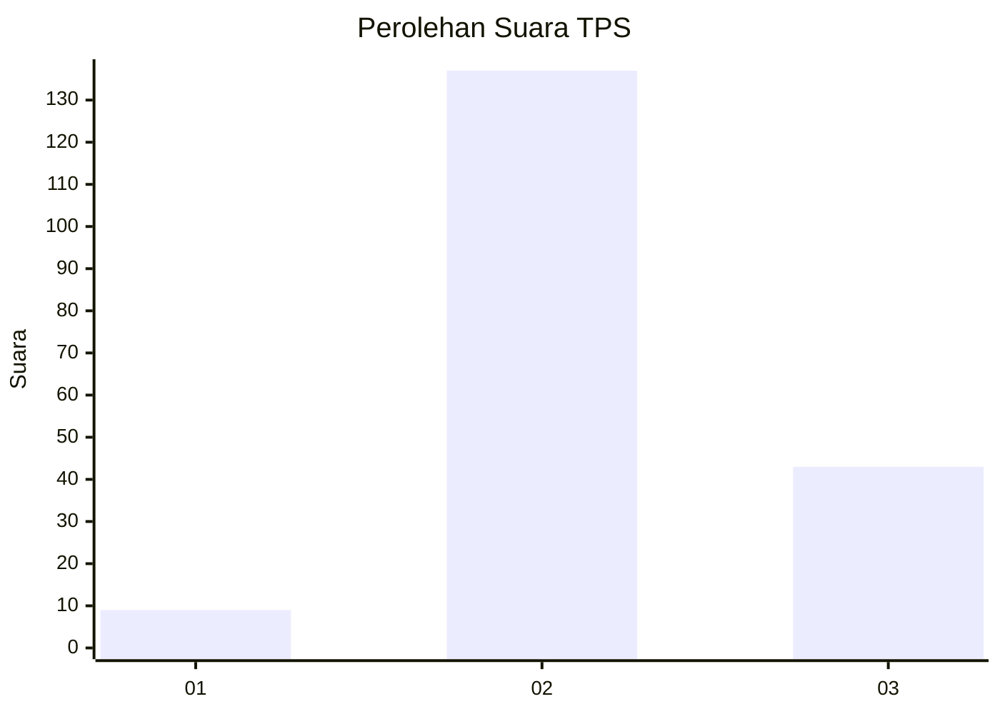
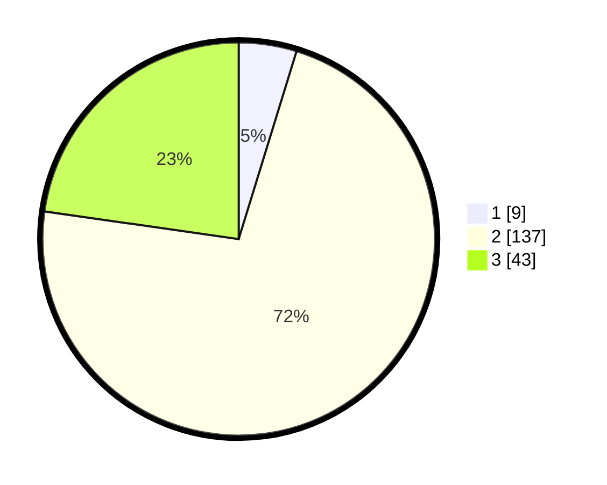

# Hasil

## Grafik

## Tabel

| No. | Nama Paslon    | Suara | Suara (raw) | Persentase |
|:--- |:-------------- | -----:| -----------:| ----------:|
| 1   | ANIES MUHAIMIN | 9     | [9][p-1]    | 4,76       |
| 2   | PRABOWO GIBRAN | 137   | [137][p-2]  | 72,49      |
| 3   | GANJAR MAHFUD  | 43    | [43][p-3]   | 22,75      |

[p-1]: https://github.com/gigit-pemilu/pemilu-2024/blob/main/pilpres/hitung-suara/sub/35-jawa-timur/sub/08-lumajang/sub/01-tempursari/sub/2004-tempurejo/sub/005-tps/sub/paslon-1.txt
[p-2]: https://github.com/gigit-pemilu/pemilu-2024/blob/main/pilpres/hitung-suara/sub/35-jawa-timur/sub/08-lumajang/sub/01-tempursari/sub/2004-tempurejo/sub/005-tps/sub/paslon-2.txt
[p-3]: https://github.com/gigit-pemilu/pemilu-2024/blob/main/pilpres/hitung-suara/sub/35-jawa-timur/sub/08-lumajang/sub/01-tempursari/sub/2004-tempurejo/sub/005-tps/sub/paslon-3.txt

## Foto C Plano

https://sirekap-obj-formc.kpu.go.id/d605/pemilu/ppwp/35/08/01/20/04/3508012004005-20240214-225043--b3b868d4-f3c1-46a2-bbe2-8b72cb8caf29.jpg

https://sirekap-obj-formc.kpu.go.id/d605/pemilu/ppwp/35/08/01/20/04/3508012004005-20240214-225058--148222b9-b8d1-4a18-b2c0-20529f54fd75.jpg

https://sirekap-obj-formc.kpu.go.id/d605/pemilu/ppwp/35/08/01/20/04/3508012004005-20240214-225121--bf0ca4a5-fe0f-4215-9d60-70ac74928adf.jpg

## Metadata

| Key        | Value               |
| ---------- | ------------------- |
| Time Stamp | 2024-02-15 15:30:25 |

