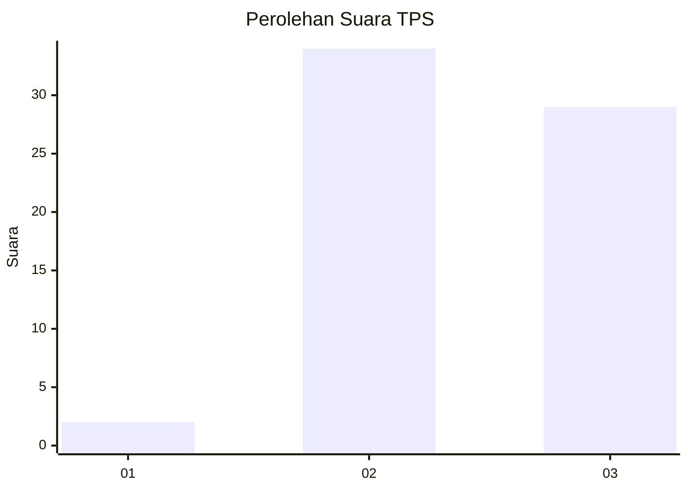
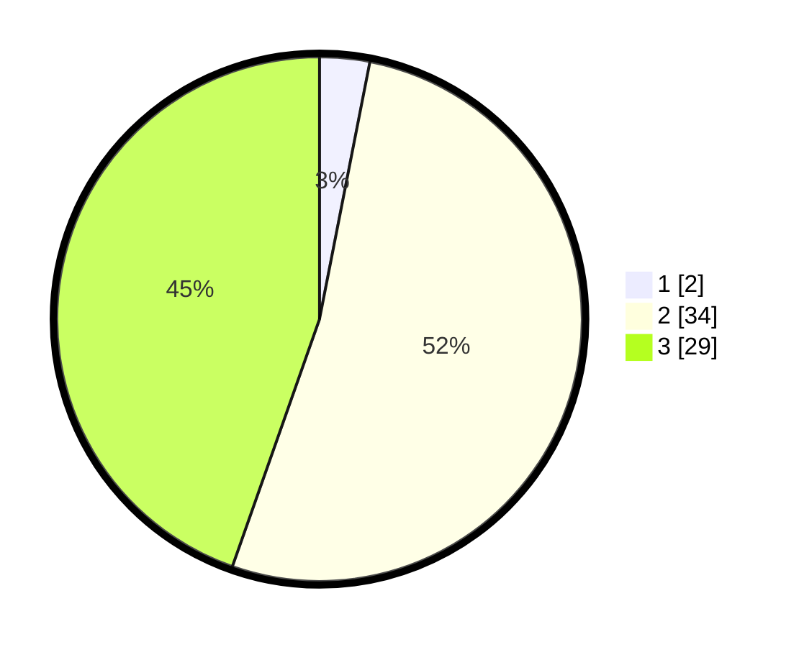

# Hasil

## Grafik

## Tabel

| No. | Nama Paslon    | Suara | Suara (raw) | Persentase |
|:--- |:-------------- | -----:| -----------:| ----------:|
| 1   | ANIES MUHAIMIN | 2     | [2][p-1]    | 3,08       |
| 2   | PRABOWO GIBRAN | 34    | [34][p-2]   | 52,31      |
| 3   | GANJAR MAHFUD  | 29    | [29][p-3]   | 44,62      |

[p-1]: https://github.com/gigit-pemilu/pemilu-2024/blob/main/pilpres/hitung-suara/sub/35-jawa-timur/sub/08-lumajang/sub/01-tempursari/sub/2005-tempursari/sub/004-tps/sub/paslon-1.txt
[p-2]: https://github.com/gigit-pemilu/pemilu-2024/blob/main/pilpres/hitung-suara/sub/35-jawa-timur/sub/08-lumajang/sub/01-tempursari/sub/2005-tempursari/sub/004-tps/sub/paslon-2.txt
[p-3]: https://github.com/gigit-pemilu/pemilu-2024/blob/main/pilpres/hitung-suara/sub/35-jawa-timur/sub/08-lumajang/sub/01-tempursari/sub/2005-tempursari/sub/004-tps/sub/paslon-3.txt

## Foto C Plano

https://sirekap-obj-formc.kpu.go.id/61dc/pemilu/ppwp/35/08/01/20/05/3508012005004-20240217-221748--209bd86a-64b2-4407-b2a7-cd1706a07127.jpg

https://sirekap-obj-formc.kpu.go.id/61dc/pemilu/ppwp/35/08/01/20/05/3508012005004-20240217-221750--9a2b8a45-55d5-4c2f-92fa-de1a3277428c.jpg

https://sirekap-obj-formc.kpu.go.id/61dc/pemilu/ppwp/35/08/01/20/05/3508012005004-20240217-221749--7273e8e9-8f51-43e6-ab9d-f3eb71e40d6e.jpg

## Metadata

| Key        | Value               |
| ---------- | ------------------- |
| Time Stamp | 2024-02-19 06:16:00 |

## DATA PEMILIH TETAP

Jumlah pemilih dalam DPT: **76**.
 * L: **42**.
 * P: **34**.

## DATA PENGGUNA HAK PILIH

Jumlah pengguna hak pilih dalam DPT: **57**.
 * L: **31**.
 * P: **26**.

Jumlah pengguna hak pilih dalam DPTb: **7**.
 * L: **7**.
 * P: **0**.

Jumlah pengguna hak pilih dalam DPK: **1**.
 * L: **0**.
 * P: **1**.

Jumlah pengguna hak pilih: **65**.
 * L: **38**.
 * P: **27**.

## JUMLAH SUARA SAH DAN TIDAK SAH

JUMLAH SELURUH SUARA SAH: **65**.

JUMLAH SUARA TIDAK SAH: **0**.

JUMLAH SELURUH SUARA SAH DAN SUARA TIDAK SAH: **65**.

