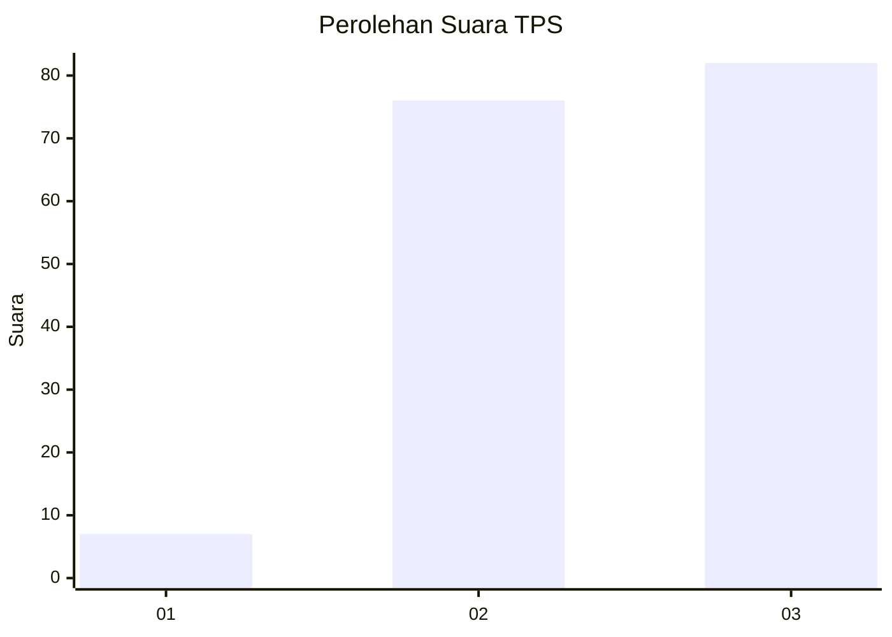
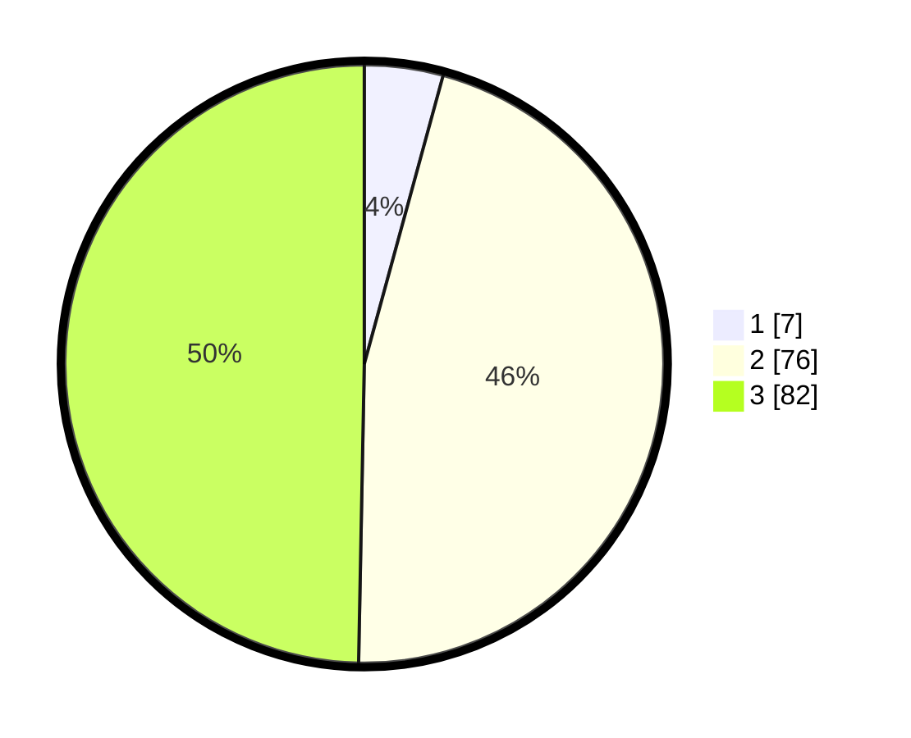

# Hasil

## Grafik

## Tabel

| No. | Nama Paslon    | Suara | Suara (raw) | Persentase |
|:--- |:-------------- | -----:| -----------:| ----------:|
| 1   | ANIES MUHAIMIN | 7     | [7][p-1]    | 4,24       |
| 2   | PRABOWO GIBRAN | 76    | [76][p-2]   | 46,06      |
| 3   | GANJAR MAHFUD  | 82    | [82][p-3]   | 49,70      |

[p-1]: https://github.com/gigit-pemilu/pemilu-2024-35-jawa-timur/blob/main/pilpres/hitung-suara/sub/35-jawa-timur/sub/08-lumajang/sub/01-tempursari/sub/2005-tempursari/sub/018-tps/sub/paslon-1.txt
[p-2]: https://github.com/gigit-pemilu/pemilu-2024-35-jawa-timur/blob/main/pilpres/hitung-suara/sub/35-jawa-timur/sub/08-lumajang/sub/01-tempursari/sub/2005-tempursari/sub/018-tps/sub/paslon-2.txt
[p-3]: https://github.com/gigit-pemilu/pemilu-2024-35-jawa-timur/blob/main/pilpres/hitung-suara/sub/35-jawa-timur/sub/08-lumajang/sub/01-tempursari/sub/2005-tempursari/sub/018-tps/sub/paslon-3.txt

## Foto C Plano

https://sirekap-obj-formc.kpu.go.id/0c85/pemilu/ppwp/35/08/01/20/05/3508012005018-20240215-024358--deeb8dc4-e002-4274-862a-08484341210d.jpg

https://sirekap-obj-formc.kpu.go.id/0c85/pemilu/ppwp/35/08/01/20/05/3508012005018-20240215-024649--09be0db2-b638-4894-949d-4b14e974552f.jpg

https://sirekap-obj-formc.kpu.go.id/0c85/pemilu/ppwp/35/08/01/20/05/3508012005018-20240215-024908--b3af917b-ddb8-45c1-83c7-a0066e67cdf8.jpg

## Metadata

| Key        | Value               |
| ---------- | ------------------- |
| Time Stamp | 2024-02-15 15:00:29 |

