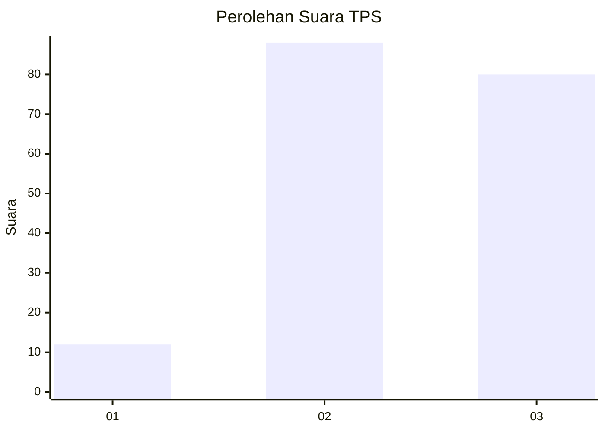
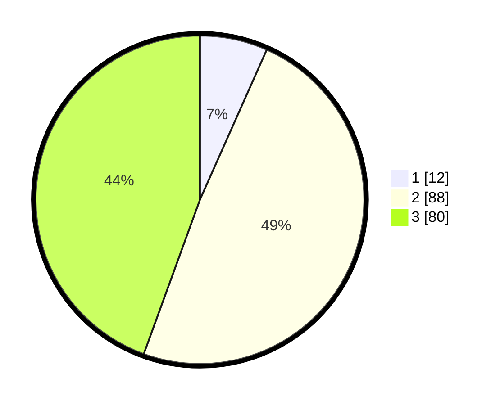

# Hasil

## Grafik

## Tabel

| No. | Nama Paslon    | Suara | Suara (raw) | Persentase |
|:--- |:-------------- | -----:| -----------:| ----------:|
| 1   | ANIES MUHAIMIN | 12    | [12][p-1]   | 6,67       |
| 2   | PRABOWO GIBRAN | 88    | [88][p-2]   | 48,89      |
| 3   | GANJAR MAHFUD  | 80    | [80][p-3]   | 44,44      |

[p-1]: https://github.com/gigit-pemilu/pemilu-2024/blob/main/pilpres/hitung-suara/sub/35-jawa-timur/sub/08-lumajang/sub/01-tempursari/sub/2006-pundungsari/sub/006-tps/sub/paslon-1.txt
[p-2]: https://github.com/gigit-pemilu/pemilu-2024/blob/main/pilpres/hitung-suara/sub/35-jawa-timur/sub/08-lumajang/sub/01-tempursari/sub/2006-pundungsari/sub/006-tps/sub/paslon-2.txt
[p-3]: https://github.com/gigit-pemilu/pemilu-2024/blob/main/pilpres/hitung-suara/sub/35-jawa-timur/sub/08-lumajang/sub/01-tempursari/sub/2006-pundungsari/sub/006-tps/sub/paslon-3.txt

## Foto C Plano

https://sirekap-obj-formc.kpu.go.id/219a/pemilu/ppwp/35/08/01/20/06/3508012006006-20240215-131927--47936080-7cf3-4ae9-afd8-7c82731c88bc.jpg

https://sirekap-obj-formc.kpu.go.id/219a/pemilu/ppwp/35/08/01/20/06/3508012006006-20240215-123210--36a27c2c-c7be-4aa2-b60b-5603a1bdf11e.jpg

https://sirekap-obj-formc.kpu.go.id/219a/pemilu/ppwp/35/08/01/20/06/3508012006006-20240215-123301--ac20729b-fd11-480a-9864-b5387fa1d8c0.jpg

## Metadata

| Key        | Value               |
| ---------- | ------------------- |
| Time Stamp | 2024-02-17 16:36:25 |

