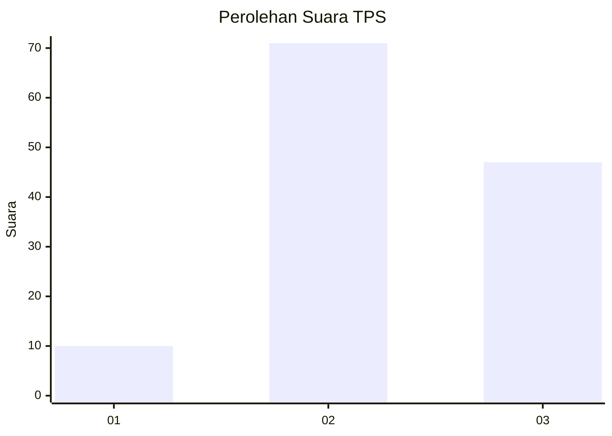
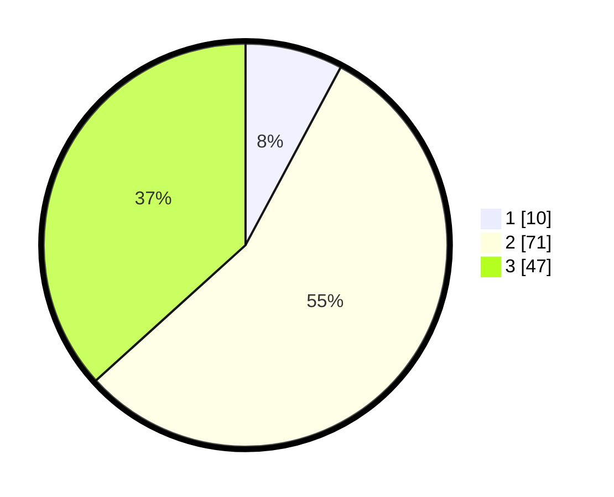

# Hasil

## Grafik

## Tabel

| No. | Nama Paslon    | Suara | Suara (raw) | Persentase |
|:--- |:-------------- | -----:| -----------:| ----------:|
| 1   | ANIES MUHAIMIN | 10    | [10][p-1]   | 7,81       |
| 2   | PRABOWO GIBRAN | 71    | [71][p-2]   | 55,47      |
| 3   | GANJAR MAHFUD  | 47    | [47][p-3]   | 36,72      |

[p-1]: https://github.com/gigit-pemilu/pemilu-2024/blob/main/pilpres/hitung-suara/sub/35-jawa-timur/sub/08-lumajang/sub/01-tempursari/sub/2006-pundungsari/sub/011-tps/sub/paslon-1.txt
[p-2]: https://github.com/gigit-pemilu/pemilu-2024/blob/main/pilpres/hitung-suara/sub/35-jawa-timur/sub/08-lumajang/sub/01-tempursari/sub/2006-pundungsari/sub/011-tps/sub/paslon-2.txt
[p-3]: https://github.com/gigit-pemilu/pemilu-2024/blob/main/pilpres/hitung-suara/sub/35-jawa-timur/sub/08-lumajang/sub/01-tempursari/sub/2006-pundungsari/sub/011-tps/sub/paslon-3.txt

## Foto C Plano

https://sirekap-obj-formc.kpu.go.id/8a57/pemilu/ppwp/35/08/01/20/06/3508012006011-20240214-141655--7f6c7081-7624-4503-b41a-cc884319438d.jpg

https://sirekap-obj-formc.kpu.go.id/8a57/pemilu/ppwp/35/08/01/20/06/3508012006011-20240214-141806--76272eb8-06a1-43e1-a0ed-9e2d0531a0b5.jpg

https://sirekap-obj-formc.kpu.go.id/8a57/pemilu/ppwp/35/08/01/20/06/3508012006011-20240214-224223--c7262ab9-7e9d-4048-8d56-66722c23a9c6.jpg

## Metadata

| Key        | Value               |
| ---------- | ------------------- |
| Time Stamp | 2024-02-15 15:00:29 |

