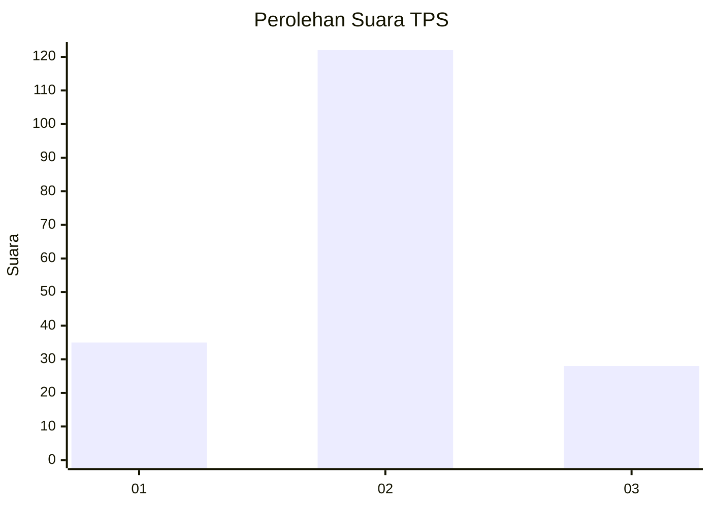
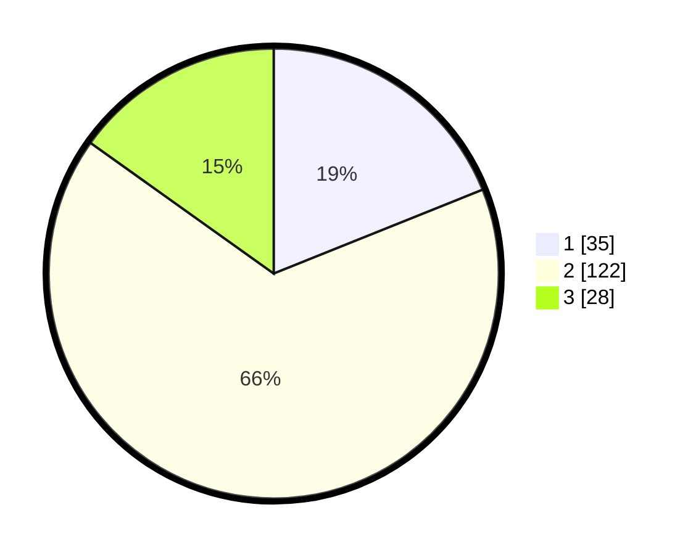

# Hasil

## Grafik

## Tabel

| No. | Nama Paslon    | Suara | Suara (raw) | Persentase |
|:--- |:-------------- | -----:| -----------:| ----------:|
| 1   | ANIES MUHAIMIN | 35    | [35][p-1]   | 18,92      |
| 2   | PRABOWO GIBRAN | 122   | [122][p-2]  | 65,95      |
| 3   | GANJAR MAHFUD  | 28    | [28][p-3]   | 15,14      |

[p-1]: https://github.com/gigit-pemilu/pemilu-2024/blob/main/pilpres/hitung-suara/sub/35-jawa-timur/sub/08-lumajang/sub/03-candipuro/sub/2003-candipuro/sub/006-tps/sub/paslon-1.txt
[p-2]: https://github.com/gigit-pemilu/pemilu-2024/blob/main/pilpres/hitung-suara/sub/35-jawa-timur/sub/08-lumajang/sub/03-candipuro/sub/2003-candipuro/sub/006-tps/sub/paslon-2.txt
[p-3]: https://github.com/gigit-pemilu/pemilu-2024/blob/main/pilpres/hitung-suara/sub/35-jawa-timur/sub/08-lumajang/sub/03-candipuro/sub/2003-candipuro/sub/006-tps/sub/paslon-3.txt

## Foto C Plano

https://sirekap-obj-formc.kpu.go.id/ff28/pemilu/ppwp/35/08/03/20/03/3508032003006-20240214-232619--dfaabfbd-5bed-4c2d-b452-d66346e00083.jpg

https://sirekap-obj-formc.kpu.go.id/ff28/pemilu/ppwp/35/08/03/20/03/3508032003006-20240214-232622--ce8aa4ad-8039-4980-9651-4356a937f2e0.jpg

https://sirekap-obj-formc.kpu.go.id/ff28/pemilu/ppwp/35/08/03/20/03/3508032003006-20240214-232627--de5eec3e-4d53-46b0-8d60-f560b35f34b2.jpg

## Metadata

| Key        | Value               |
| ---------- | ------------------- |
| Time Stamp | 2024-02-15 16:30:25 |

