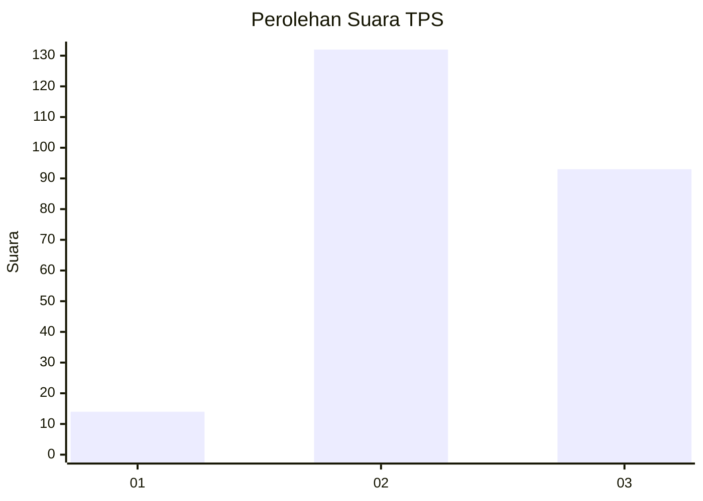
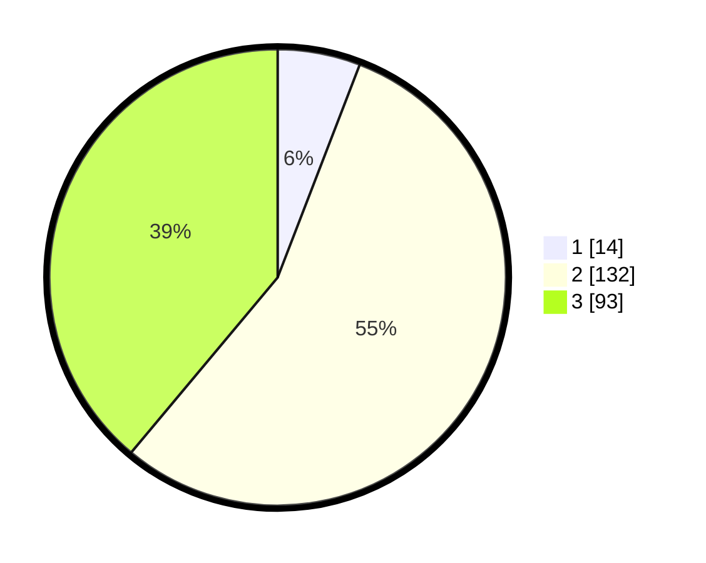

# Hasil

## Grafik

## Tabel

| No. | Nama Paslon    | Suara | Suara (raw) | Persentase |
|:--- |:-------------- | -----:| -----------:| ----------:|
| 1   | ANIES MUHAIMIN | 14    | [14][p-1]   | 5,86       |
| 2   | PRABOWO GIBRAN | 132   | [132][p-2]  | 55,23      |
| 3   | GANJAR MAHFUD  | 93    | [93][p-3]   | 38,91      |

[p-1]: https://github.com/gigit-pemilu/pemilu-2024/blob/main/pilpres/hitung-suara/sub/35-jawa-timur/sub/08-lumajang/sub/03-candipuro/sub/2004-sumberejo/sub/009-tps/sub/paslon-1.txt
[p-2]: https://github.com/gigit-pemilu/pemilu-2024/blob/main/pilpres/hitung-suara/sub/35-jawa-timur/sub/08-lumajang/sub/03-candipuro/sub/2004-sumberejo/sub/009-tps/sub/paslon-2.txt
[p-3]: https://github.com/gigit-pemilu/pemilu-2024/blob/main/pilpres/hitung-suara/sub/35-jawa-timur/sub/08-lumajang/sub/03-candipuro/sub/2004-sumberejo/sub/009-tps/sub/paslon-3.txt

## Foto C Plano

https://sirekap-obj-formc.kpu.go.id/9ef2/pemilu/ppwp/35/08/03/20/04/3508032004009-20240222-191829--72aa61ec-77ea-4c14-a617-e94e5ccca675.jpg

https://sirekap-obj-formc.kpu.go.id/9ef2/pemilu/ppwp/35/08/03/20/04/3508032004009-20240215-005320--0be09ee5-3110-4448-8e20-47df188c2777.jpg

https://sirekap-obj-formc.kpu.go.id/9ef2/pemilu/ppwp/35/08/03/20/04/3508032004009-20240215-005427--da1907f7-17d8-4f3b-bdf8-91f02bb5397a.jpg

## Metadata

| Key        | Value               |
| ---------- | ------------------- |
| Time Stamp | 2024-02-22 20:00:00 |

