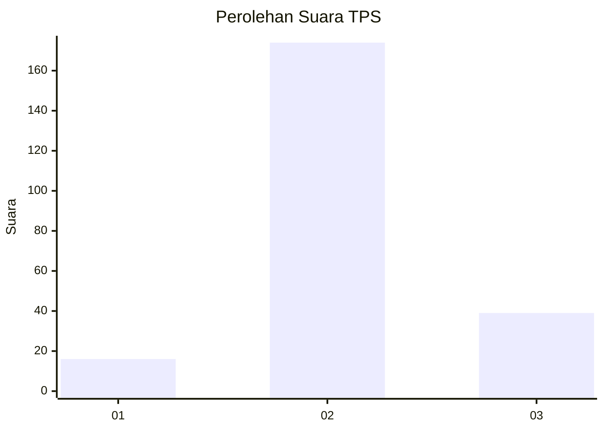

# Hasil

## Grafik

## Tabel

| No. | Nama Paslon    | Suara | Suara (raw) | Persentase |
|:--- |:-------------- | -----:| -----------:| ----------:|
| 1   | ANIES MUHAIMIN | 16    | [16][p-1]   | 6,99       |
| 2   | PRABOWO GIBRAN | 174   | [174][p-2]  | 75,98      |
| 3   | GANJAR MAHFUD  | 39    | [39][p-3]   | 17,03      |

[p-1]: https://github.com/gigit-pemilu/pemilu-2024-35-jawa-timur/blob/main/pilpres/hitung-suara/sub/35-jawa-timur/sub/08-lumajang/sub/03-candipuro/sub/2004-sumberejo/sub/016-tps/sub/paslon-1.txt
[p-2]: https://github.com/gigit-pemilu/pemilu-2024-35-jawa-timur/blob/main/pilpres/hitung-suara/sub/35-jawa-timur/sub/08-lumajang/sub/03-candipuro/sub/2004-sumberejo/sub/016-tps/sub/paslon-2.txt
[p-3]: https://github.com/gigit-pemilu/pemilu-2024-35-jawa-timur/blob/main/pilpres/hitung-suara/sub/35-jawa-timur/sub/08-lumajang/sub/03-candipuro/sub/2004-sumberejo/sub/016-tps/sub/paslon-3.txt

## Foto C Plano

https://sirekap-obj-formc.kpu.go.id/fece/pemilu/ppwp/35/08/03/20/04/3508032004016-20240215-022552--7b66b0ed-a132-4e85-b99d-6137030f3342.jpg

https://sirekap-obj-formc.kpu.go.id/fece/pemilu/ppwp/35/08/03/20/04/3508032004016-20240215-021228--8145aa03-8e75-4ccf-a2a1-50d592255479.jpg

https://sirekap-obj-formc.kpu.go.id/fece/pemilu/ppwp/35/08/03/20/04/3508032004016-20240215-021615--ba5cd95d-d966-4230-b9cf-8e65bb9b9c37.jpg

## Metadata

| Key        | Value               |
| ---------- | ------------------- |
| Time Stamp | 2024-02-15 16:30:25 |

