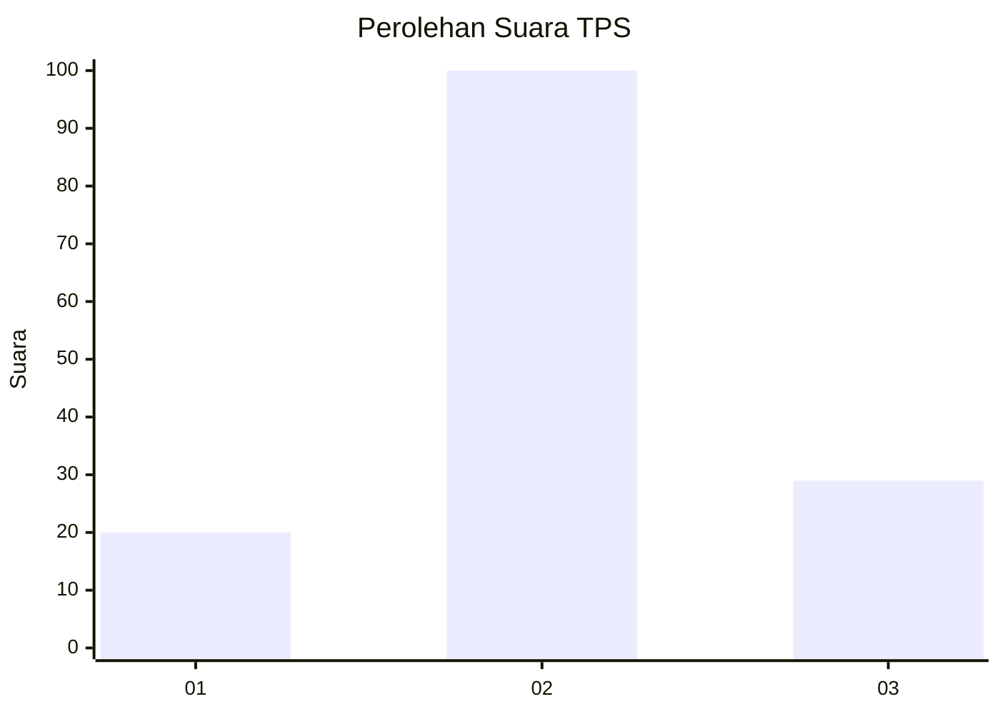
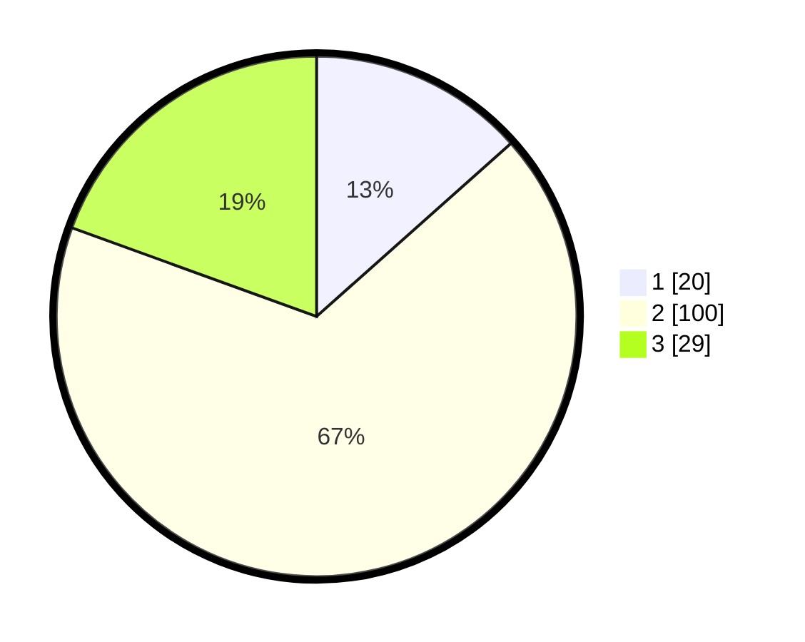

# Hasil

## Grafik

## Tabel

| No. | Nama Paslon    | Suara | Suara (raw) | Persentase |
|:--- |:-------------- | -----:| -----------:| ----------:|
| 1   | ANIES MUHAIMIN | 20    | [20][p-1]   | 13,42      |
| 2   | PRABOWO GIBRAN | 100   | [100][p-2]  | 67,11      |
| 3   | GANJAR MAHFUD  | 29    | [29][p-3]   | 19,46      |

[p-1]: https://github.com/gigit-pemilu/pemilu-2024-35-jawa-timur/blob/main/pilpres/hitung-suara/sub/35-jawa-timur/sub/08-lumajang/sub/03-candipuro/sub/2007-penanggal/sub/010-tps/sub/paslon-1.txt
[p-2]: https://github.com/gigit-pemilu/pemilu-2024-35-jawa-timur/blob/main/pilpres/hitung-suara/sub/35-jawa-timur/sub/08-lumajang/sub/03-candipuro/sub/2007-penanggal/sub/010-tps/sub/paslon-2.txt
[p-3]: https://github.com/gigit-pemilu/pemilu-2024-35-jawa-timur/blob/main/pilpres/hitung-suara/sub/35-jawa-timur/sub/08-lumajang/sub/03-candipuro/sub/2007-penanggal/sub/010-tps/sub/paslon-3.txt

## Foto C Plano

https://sirekap-obj-formc.kpu.go.id/989f/pemilu/ppwp/35/08/03/20/07/3508032007010-20240215-010231--3006825d-b839-4394-949f-f8fec7844140.jpg

https://sirekap-obj-formc.kpu.go.id/989f/pemilu/ppwp/35/08/03/20/07/3508032007010-20240215-010749--2ff1913a-bf91-4acf-8ee0-bca76f8ce98c.jpg

https://sirekap-obj-formc.kpu.go.id/989f/pemilu/ppwp/35/08/03/20/07/3508032007010-20240215-010404--b7f3bc5f-539e-4860-9261-85bf083ed4de.jpg

## Metadata

| Key        | Value               |
| ---------- | ------------------- |
| Time Stamp | 2024-02-15 17:00:25 |

