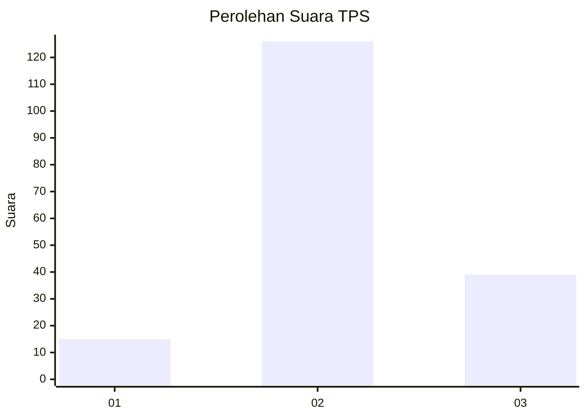
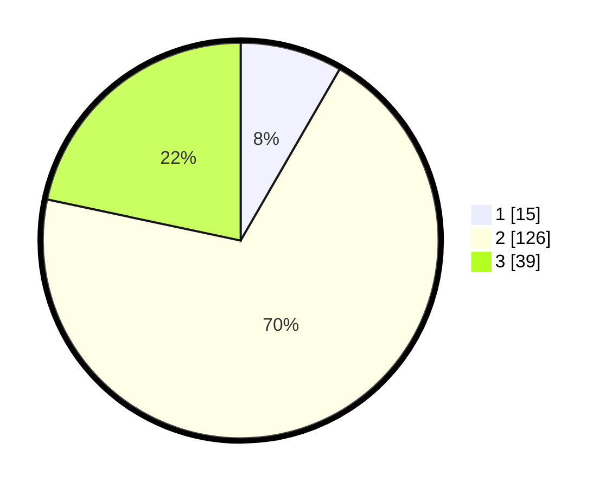

# Hasil

## Grafik

## Tabel

| No. | Nama Paslon    | Suara | Suara (raw) | Persentase |
|:--- |:-------------- | -----:| -----------:| ----------:|
| 1   | ANIES MUHAIMIN | 15    | [15][p-1]   | 8,33       |
| 2   | PRABOWO GIBRAN | 126   | [126][p-2]  | 70,00      |
| 3   | GANJAR MAHFUD  | 39    | [39][p-3]   | 21,67      |

[p-1]: https://github.com/gigit-pemilu/pemilu-2024-35-jawa-timur/blob/main/pilpres/hitung-suara/sub/35-jawa-timur/sub/08-lumajang/sub/03-candipuro/sub/2008-tambahrejo/sub/002-tps/sub/paslon-1.txt
[p-2]: https://github.com/gigit-pemilu/pemilu-2024-35-jawa-timur/blob/main/pilpres/hitung-suara/sub/35-jawa-timur/sub/08-lumajang/sub/03-candipuro/sub/2008-tambahrejo/sub/002-tps/sub/paslon-2.txt
[p-3]: https://github.com/gigit-pemilu/pemilu-2024-35-jawa-timur/blob/main/pilpres/hitung-suara/sub/35-jawa-timur/sub/08-lumajang/sub/03-candipuro/sub/2008-tambahrejo/sub/002-tps/sub/paslon-3.txt

## Foto C Plano

https://sirekap-obj-formc.kpu.go.id/8c36/pemilu/ppwp/35/08/03/20/08/3508032008002-20240214-223052--141f282f-57e6-4672-9aca-19cac72a78be.jpg

https://sirekap-obj-formc.kpu.go.id/8c36/pemilu/ppwp/35/08/03/20/08/3508032008002-20240214-223232--9b3a2a13-76a6-4ad6-a488-9c2547210cdb.jpg

https://sirekap-obj-formc.kpu.go.id/8c36/pemilu/ppwp/35/08/03/20/08/3508032008002-20240214-223421--98ac1ef7-c560-4ff6-a6ab-9e4c83cb18a6.jpg

## Metadata

| Key        | Value               |
| ---------- | ------------------- |
| Time Stamp | 2024-02-15 17:00:25 |

