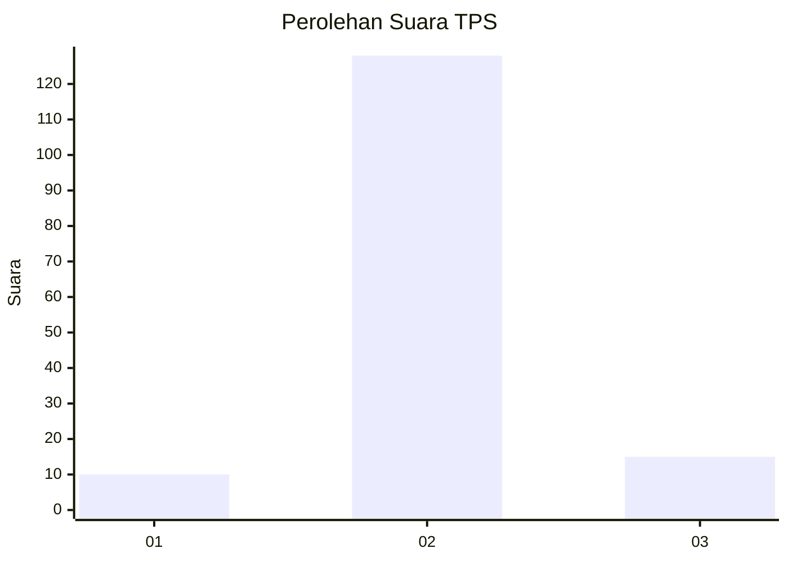
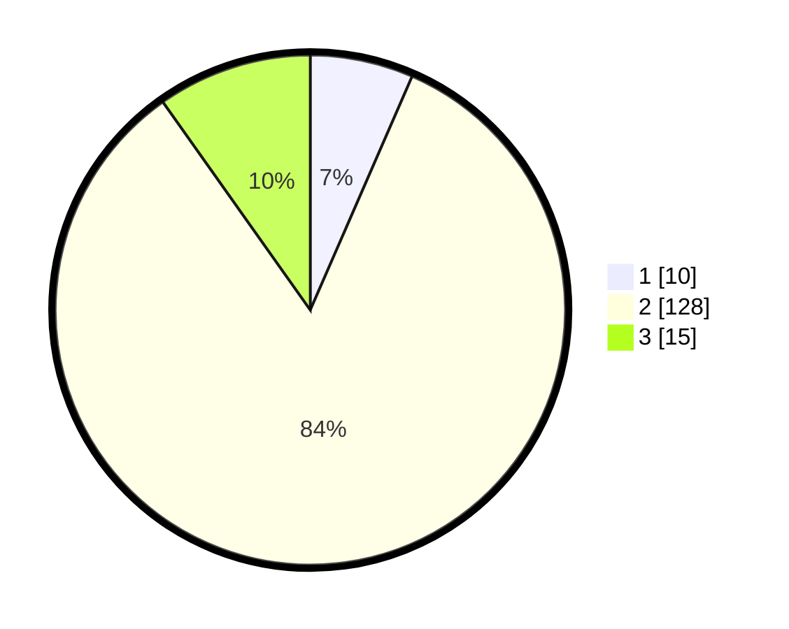

# Hasil

## Grafik

## Tabel

| No. | Nama Paslon    | Suara | Suara (raw) | Persentase |
|:--- |:-------------- | -----:| -----------:| ----------:|
| 1   | ANIES MUHAIMIN | 10    | [10][p-1]   | 6,54       |
| 2   | PRABOWO GIBRAN | 128   | [128][p-2]  | 83,66      |
| 3   | GANJAR MAHFUD  | 15    | [15][p-3]   | 9,80       |

[p-1]: https://github.com/gigit-pemilu/pemilu-2024/blob/main/pilpres/hitung-suara/sub/35-jawa-timur/sub/08-lumajang/sub/03-candipuro/sub/2008-tambahrejo/sub/003-tps/sub/paslon-1.txt
[p-2]: https://github.com/gigit-pemilu/pemilu-2024/blob/main/pilpres/hitung-suara/sub/35-jawa-timur/sub/08-lumajang/sub/03-candipuro/sub/2008-tambahrejo/sub/003-tps/sub/paslon-2.txt
[p-3]: https://github.com/gigit-pemilu/pemilu-2024/blob/main/pilpres/hitung-suara/sub/35-jawa-timur/sub/08-lumajang/sub/03-candipuro/sub/2008-tambahrejo/sub/003-tps/sub/paslon-3.txt

## Foto C Plano

https://sirekap-obj-formc.kpu.go.id/dbb1/pemilu/ppwp/35/08/03/20/08/3508032008003-20240215-001358--fe436c96-8f5a-4f66-a0fe-8c44e3480a2a.jpg

https://sirekap-obj-formc.kpu.go.id/dbb1/pemilu/ppwp/35/08/03/20/08/3508032008003-20240215-001556--d858e99d-9d9f-4e43-8711-38c386112e66.jpg

https://sirekap-obj-formc.kpu.go.id/dbb1/pemilu/ppwp/35/08/03/20/08/3508032008003-20240215-001816--0c4c99d0-4227-4fd0-b746-45df24cd3574.jpg

## Metadata

| Key        | Value               |
| ---------- | ------------------- |
| Time Stamp | 2024-02-15 17:00:25 |

