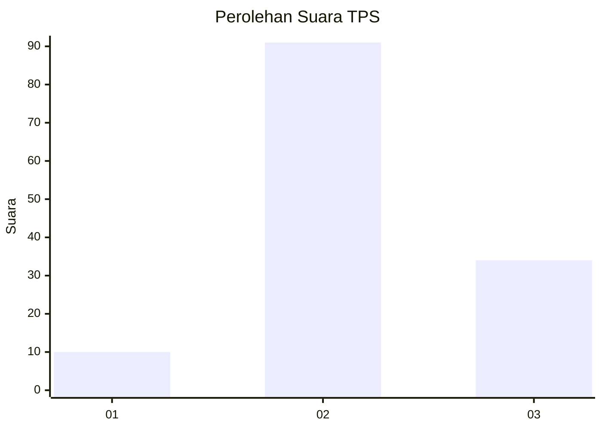
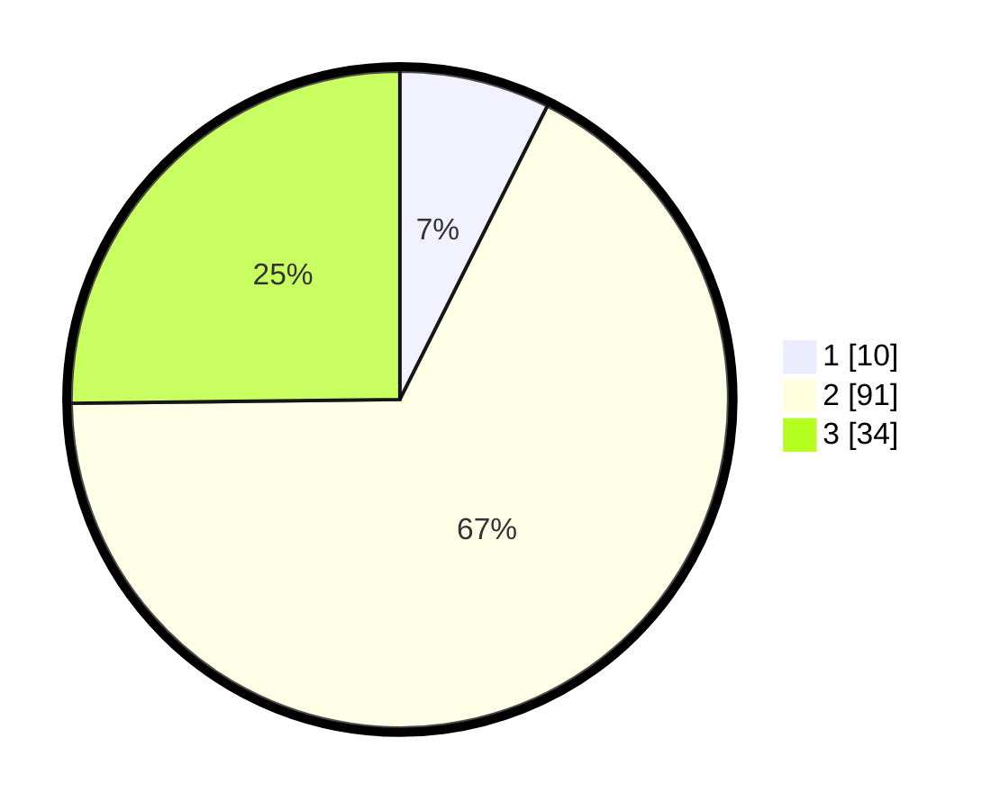

# Hasil

## Grafik

## Tabel

| No. | Nama Paslon    | Suara | Suara (raw) | Persentase |
|:--- |:-------------- | -----:| -----------:| ----------:|
| 1   | ANIES MUHAIMIN | 10    | [10][p-1]   | 7,41       |
| 2   | PRABOWO GIBRAN | 91    | [91][p-2]   | 67,41      |
| 3   | GANJAR MAHFUD  | 34    | [34][p-3]   | 25,19      |

[p-1]: https://github.com/gigit-pemilu/pemilu-2024/blob/main/pilpres/hitung-suara/sub/35-jawa-timur/sub/08-lumajang/sub/03-candipuro/sub/2008-tambahrejo/sub/005-tps/sub/paslon-1.txt
[p-2]: https://github.com/gigit-pemilu/pemilu-2024/blob/main/pilpres/hitung-suara/sub/35-jawa-timur/sub/08-lumajang/sub/03-candipuro/sub/2008-tambahrejo/sub/005-tps/sub/paslon-2.txt
[p-3]: https://github.com/gigit-pemilu/pemilu-2024/blob/main/pilpres/hitung-suara/sub/35-jawa-timur/sub/08-lumajang/sub/03-candipuro/sub/2008-tambahrejo/sub/005-tps/sub/paslon-3.txt

## Foto C Plano

https://sirekap-obj-formc.kpu.go.id/9f4e/pemilu/ppwp/35/08/03/20/08/3508032008005-20240218-103808--ad066f80-4c1e-450f-80db-8a49362d8bed.jpg

https://sirekap-obj-formc.kpu.go.id/9f4e/pemilu/ppwp/35/08/03/20/08/3508032008005-20240218-103918--7bd7489c-886d-408b-8e1a-62f4b9840914.jpg

## Metadata

| Key        | Value               |
| ---------- | ------------------- |
| Time Stamp | 2024-02-19 06:16:00 |

