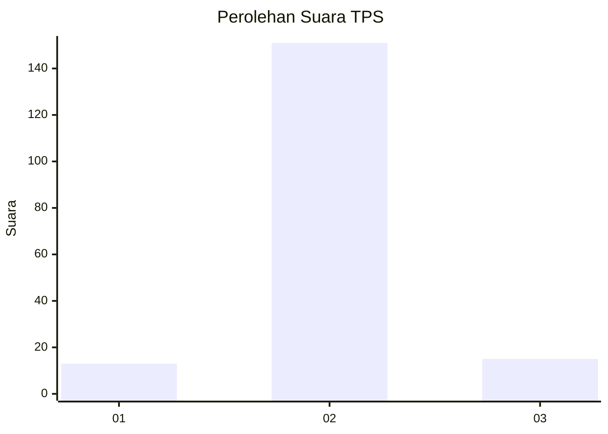
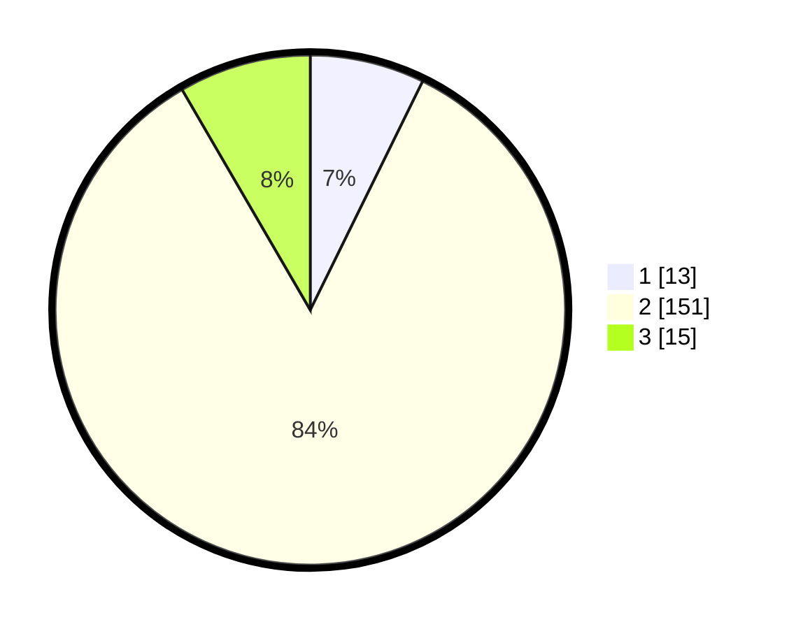

# Hasil

## Grafik

## Tabel

| No. | Nama Paslon    | Suara | Suara (raw) | Persentase |
|:--- |:-------------- | -----:| -----------:| ----------:|
| 1   | ANIES MUHAIMIN | 13    | [13][p-1]   | 7,26       |
| 2   | PRABOWO GIBRAN | 151   | [151][p-2]  | 84,36      |
| 3   | GANJAR MAHFUD  | 15    | [15][p-3]   | 8,38       |

[p-1]: https://github.com/gigit-pemilu/pemilu-2024-35-jawa-timur/blob/main/pilpres/hitung-suara/sub/35-jawa-timur/sub/08-lumajang/sub/03-candipuro/sub/2008-tambahrejo/sub/007-tps/sub/paslon-1.txt
[p-2]: https://github.com/gigit-pemilu/pemilu-2024-35-jawa-timur/blob/main/pilpres/hitung-suara/sub/35-jawa-timur/sub/08-lumajang/sub/03-candipuro/sub/2008-tambahrejo/sub/007-tps/sub/paslon-2.txt
[p-3]: https://github.com/gigit-pemilu/pemilu-2024-35-jawa-timur/blob/main/pilpres/hitung-suara/sub/35-jawa-timur/sub/08-lumajang/sub/03-candipuro/sub/2008-tambahrejo/sub/007-tps/sub/paslon-3.txt

## Foto C Plano

https://sirekap-obj-formc.kpu.go.id/26fb/pemilu/ppwp/35/08/03/20/08/3508032008007-20240214-221040--4e0d6ab6-97ab-45ab-b5c3-046dced5ff66.jpg

https://sirekap-obj-formc.kpu.go.id/26fb/pemilu/ppwp/35/08/03/20/08/3508032008007-20240214-221311--2f842935-aefd-49c7-8ee8-c9ff0eade3d4.jpg

https://sirekap-obj-formc.kpu.go.id/26fb/pemilu/ppwp/35/08/03/20/08/3508032008007-20240214-221456--59aca916-f33b-48b7-9e0b-69e6f433da64.jpg

## Metadata

| Key        | Value               |
| ---------- | ------------------- |
| Time Stamp | 2024-02-15 17:00:25 |

