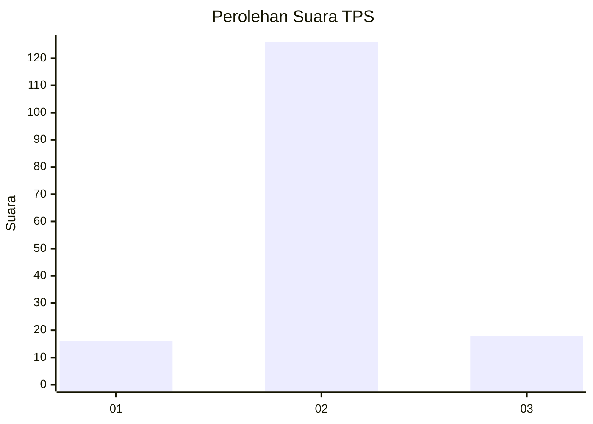
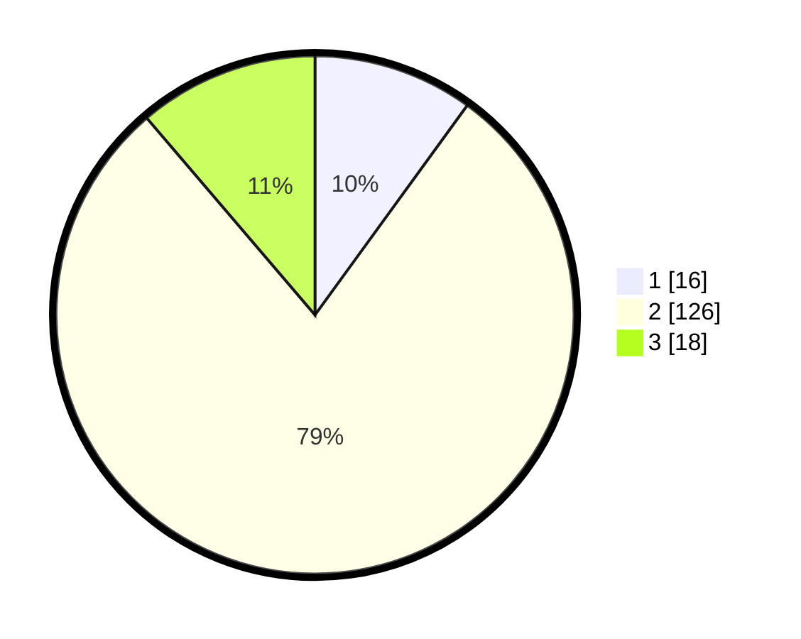

# Hasil

## Grafik

## Tabel

| No. | Nama Paslon    | Suara | Suara (raw) | Persentase |
|:--- |:-------------- | -----:| -----------:| ----------:|
| 1   | ANIES MUHAIMIN | 16    | [16][p-1]   | 10,00      |
| 2   | PRABOWO GIBRAN | 126   | [126][p-2]  | 78,75      |
| 3   | GANJAR MAHFUD  | 18    | [18][p-3]   | 11,25      |

[p-1]: https://github.com/gigit-pemilu/pemilu-2024-35-jawa-timur/blob/main/pilpres/hitung-suara/sub/35-jawa-timur/sub/08-lumajang/sub/03-candipuro/sub/2008-tambahrejo/sub/008-tps/sub/paslon-1.txt
[p-2]: https://github.com/gigit-pemilu/pemilu-2024-35-jawa-timur/blob/main/pilpres/hitung-suara/sub/35-jawa-timur/sub/08-lumajang/sub/03-candipuro/sub/2008-tambahrejo/sub/008-tps/sub/paslon-2.txt
[p-3]: https://github.com/gigit-pemilu/pemilu-2024-35-jawa-timur/blob/main/pilpres/hitung-suara/sub/35-jawa-timur/sub/08-lumajang/sub/03-candipuro/sub/2008-tambahrejo/sub/008-tps/sub/paslon-3.txt

## Foto C Plano

https://sirekap-obj-formc.kpu.go.id/a0a8/pemilu/ppwp/35/08/03/20/08/3508032008008-20240222-202637--d5a6d484-e613-4978-a991-22795175e893.jpg

https://sirekap-obj-formc.kpu.go.id/a0a8/pemilu/ppwp/35/08/03/20/08/3508032008008-20240214-141248--2d886549-e10b-4f02-b323-9cbb9d819bf9.jpg

https://sirekap-obj-formc.kpu.go.id/a0a8/pemilu/ppwp/35/08/03/20/08/3508032008008-20240214-141602--dbab176f-14bd-464f-b551-98ed7a657341.jpg

## Metadata

| Key        | Value               |
| ---------- | ------------------- |
| Time Stamp | 2024-02-22 21:00:00 |

