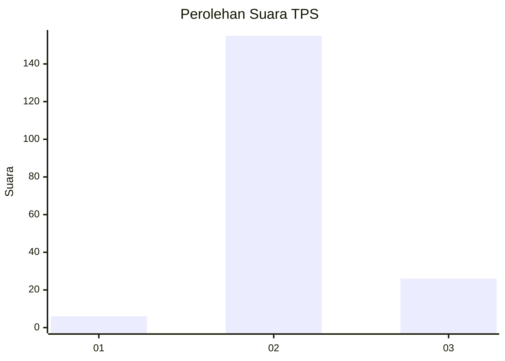
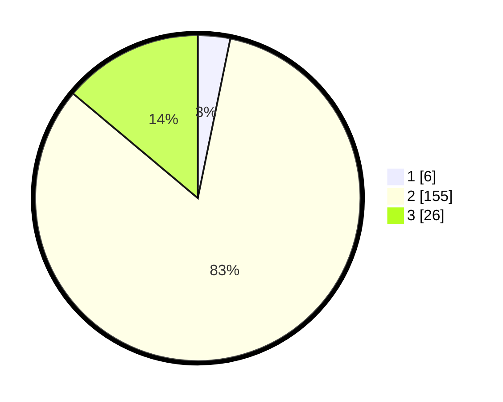

# Hasil

## Grafik

## Tabel

| No. | Nama Paslon    | Suara | Suara (raw) | Persentase |
|:--- |:-------------- | -----:| -----------:| ----------:|
| 1   | ANIES MUHAIMIN | 6     | [6][p-1]    | 3,21       |
| 2   | PRABOWO GIBRAN | 155   | [155][p-2]  | 82,89      |
| 3   | GANJAR MAHFUD  | 26    | [26][p-3]   | 13,90      |

[p-1]: https://github.com/gigit-pemilu/pemilu-2024-35-jawa-timur/blob/main/pilpres/hitung-suara/sub/35-jawa-timur/sub/08-lumajang/sub/03-candipuro/sub/2008-tambahrejo/sub/012-tps/sub/paslon-1.txt
[p-2]: https://github.com/gigit-pemilu/pemilu-2024-35-jawa-timur/blob/main/pilpres/hitung-suara/sub/35-jawa-timur/sub/08-lumajang/sub/03-candipuro/sub/2008-tambahrejo/sub/012-tps/sub/paslon-2.txt
[p-3]: https://github.com/gigit-pemilu/pemilu-2024-35-jawa-timur/blob/main/pilpres/hitung-suara/sub/35-jawa-timur/sub/08-lumajang/sub/03-candipuro/sub/2008-tambahrejo/sub/012-tps/sub/paslon-3.txt

## Foto C Plano

https://sirekap-obj-formc.kpu.go.id/c6df/pemilu/ppwp/35/08/03/20/08/3508032008012-20240215-033014--a9dcd223-45a1-4f13-abe0-f8fc36c5132f.jpg

https://sirekap-obj-formc.kpu.go.id/c6df/pemilu/ppwp/35/08/03/20/08/3508032008012-20240215-033237--80be76af-3a24-471c-9042-4ad0fd7ee39d.jpg

https://sirekap-obj-formc.kpu.go.id/c6df/pemilu/ppwp/35/08/03/20/08/3508032008012-20240214-221043--72bb8600-f1c7-4349-b7b2-e10c625e5083.jpg

## Metadata

| Key        | Value               |
| ---------- | ------------------- |
| Time Stamp | 2024-02-16 16:25:10 |

