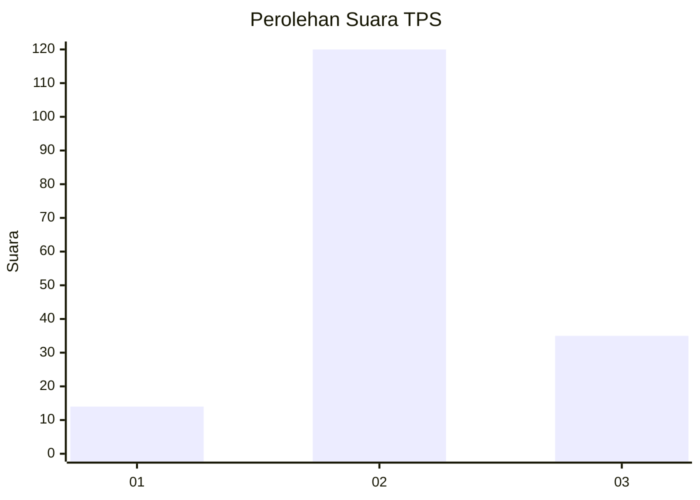
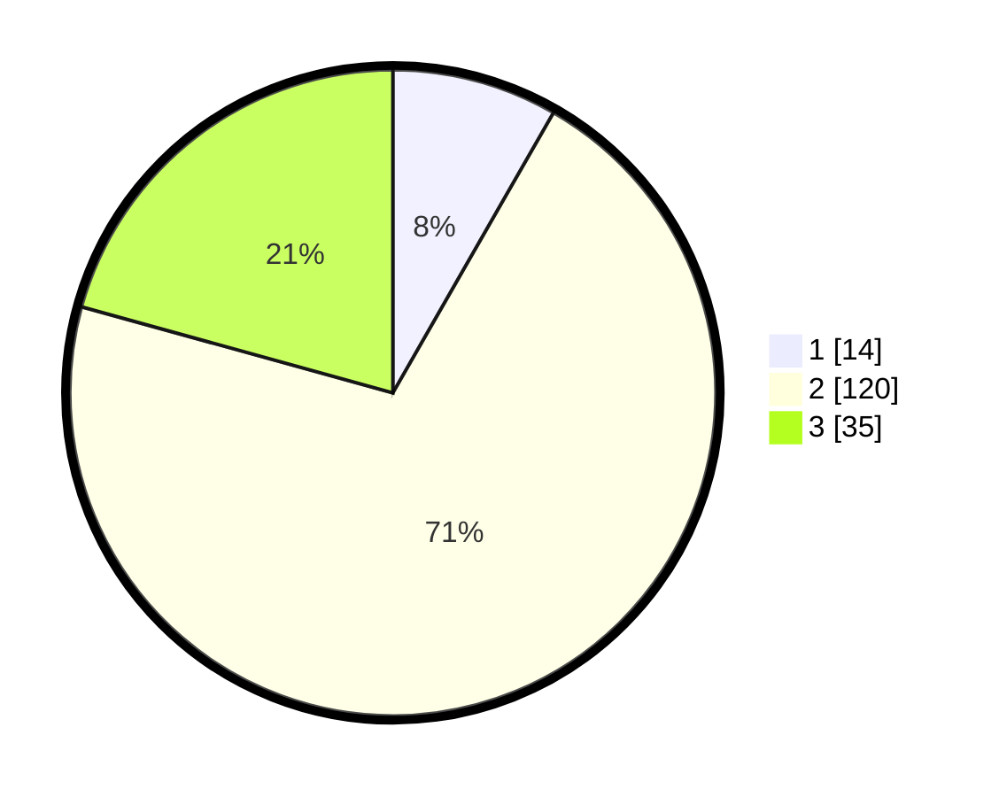

# Hasil

## Grafik

## Tabel

| No. | Nama Paslon    | Suara | Suara (raw) | Persentase |
|:--- |:-------------- | -----:| -----------:| ----------:|
| 1   | ANIES MUHAIMIN | 14    | [14][p-1]   | 8,28       |
| 2   | PRABOWO GIBRAN | 120   | [120][p-2]  | 71,01      |
| 3   | GANJAR MAHFUD  | 35    | [35][p-3]   | 20,71      |

[p-1]: https://github.com/gigit-pemilu/pemilu-2024-35-jawa-timur/blob/main/pilpres/hitung-suara/sub/35-jawa-timur/sub/08-lumajang/sub/03-candipuro/sub/2008-tambahrejo/sub/013-tps/sub/paslon-1.txt
[p-2]: https://github.com/gigit-pemilu/pemilu-2024-35-jawa-timur/blob/main/pilpres/hitung-suara/sub/35-jawa-timur/sub/08-lumajang/sub/03-candipuro/sub/2008-tambahrejo/sub/013-tps/sub/paslon-2.txt
[p-3]: https://github.com/gigit-pemilu/pemilu-2024-35-jawa-timur/blob/main/pilpres/hitung-suara/sub/35-jawa-timur/sub/08-lumajang/sub/03-candipuro/sub/2008-tambahrejo/sub/013-tps/sub/paslon-3.txt

## Foto C Plano

https://sirekap-obj-formc.kpu.go.id/0cf6/pemilu/ppwp/35/08/03/20/08/3508032008013-20240215-052159--04cd55d8-481f-4c1b-860b-162a9b5abd50.jpg

https://sirekap-obj-formc.kpu.go.id/0cf6/pemilu/ppwp/35/08/03/20/08/3508032008013-20240215-052635--0d779547-e195-41df-9e5c-04564d55ee1d.jpg

https://sirekap-obj-formc.kpu.go.id/0cf6/pemilu/ppwp/35/08/03/20/08/3508032008013-20240215-052354--84e67197-9bb7-4169-8680-9b5874cb0608.jpg

## Metadata

| Key        | Value               |
| ---------- | ------------------- |
| Time Stamp | 2024-02-15 17:00:25 |

