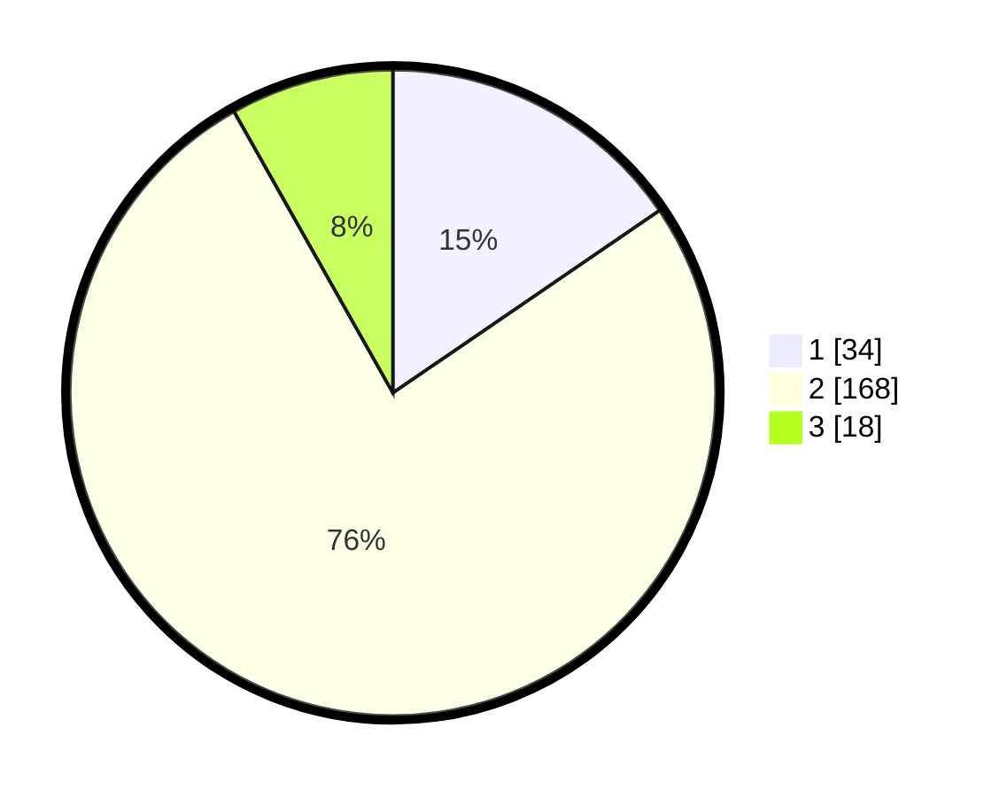

# Hasil

## Grafik

## Tabel

| No. | Nama Paslon    | Suara | Suara (raw) | Persentase |
|:--- |:-------------- | -----:| -----------:| ----------:|
| 1   | ANIES MUHAIMIN | 34    | [34][p-1]   | 15,45      |
| 2   | PRABOWO GIBRAN | 168   | [168][p-2]  | 76,36      |
| 3   | GANJAR MAHFUD  | 18    | [18][p-3]   | 8,18       |

[p-1]: https://github.com/gigit-pemilu/pemilu-2024-35-jawa-timur/blob/main/pilpres/hitung-suara/sub/35-jawa-timur/sub/08-lumajang/sub/03-candipuro/sub/2009-kloposawit/sub/001-tps/sub/paslon-1.txt
[p-2]: https://github.com/gigit-pemilu/pemilu-2024-35-jawa-timur/blob/main/pilpres/hitung-suara/sub/35-jawa-timur/sub/08-lumajang/sub/03-candipuro/sub/2009-kloposawit/sub/001-tps/sub/paslon-2.txt
[p-3]: https://github.com/gigit-pemilu/pemilu-2024-35-jawa-timur/blob/main/pilpres/hitung-suara/sub/35-jawa-timur/sub/08-lumajang/sub/03-candipuro/sub/2009-kloposawit/sub/001-tps/sub/paslon-3.txt

## Foto C Plano

https://sirekap-obj-formc.kpu.go.id/e00a/pemilu/ppwp/35/08/03/20/09/3508032009001-20240223-092045--0cc99ec7-5a2f-48f2-a3c0-29d0a426e80b.jpg

https://sirekap-obj-formc.kpu.go.id/e00a/pemilu/ppwp/35/08/03/20/09/3508032009001-20240223-092235--7ea9ae3c-a5fd-4e19-be17-ab8dcc4ae750.jpg

https://sirekap-obj-formc.kpu.go.id/e00a/pemilu/ppwp/35/08/03/20/09/3508032009001-20240223-092302--0034f77f-e7df-43bf-8510-2e7516e649bf.jpg

## Metadata

| Key        | Value               |
| ---------- | ------------------- |
| Time Stamp | 2024-02-24 22:31:28 |

## DATA PEMILIH TETAP

Jumlah pemilih dalam DPT: **264**.
 * L: **742**.
 * P: **442**.

## DATA PENGGUNA HAK PILIH

Jumlah pengguna hak pilih dalam DPT: **223**.
 * L: **473**.
 * P: **440**.

Jumlah pengguna hak pilih dalam DPTb: **3**.
 * L: **0**.
 * P: **4**.

Jumlah pengguna hak pilih dalam DPK: **3**.
 * L: **0**.
 * P: **3**.

Jumlah pengguna hak pilih: **227**.
 * L: **473**.
 * P: **414**.

## JUMLAH SUARA SAH DAN TIDAK SAH

JUMLAH SELURUH SUARA SAH: **220**.

JUMLAH SUARA TIDAK SAH: **7**.

JUMLAH SELURUH SUARA SAH DAN SUARA TIDAK SAH: **222**.

